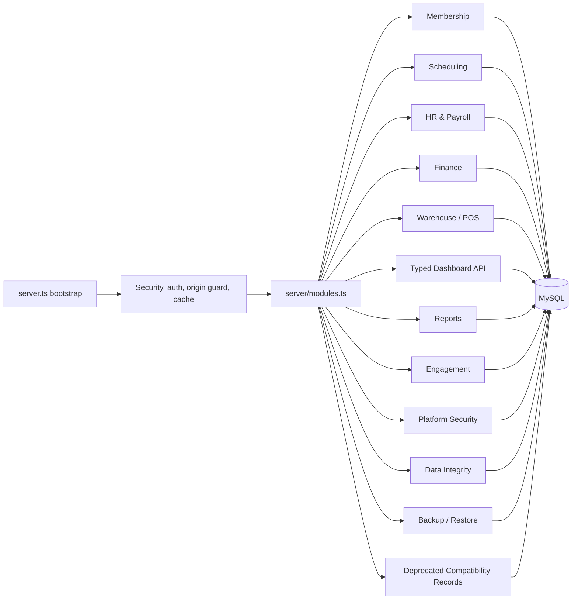

# Phase 4 Architecture Modularization

## Objective

Phase 4 starts the structural refactor recommended in the technical review by reducing the size and responsibility of `server.ts`, isolating legacy compatibility code, and creating a formal backend module registry.

This phase is intentionally low-risk: it does not change business behavior, routes, permissions, database schemas, or response shapes. It improves maintainability so later typed-domain migrations can be delivered module by module.

## Implemented changes

### 1. Central route module registry

A new backend registry was added at:

- `server/modules.ts`

It defines the route modules that compose the API server:

| Module | Area | Responsibility |
|---|---|---|
| `membership` | Domain | Plans, members, subscriptions, invoices, receipts and e-card access |
| `scheduling` | Domain | Resources, class sessions, bookings and private training |
| `hr-payroll` | Domain | Employees, attendance and payroll workflows |
| `finance` | Domain | Accounting, approvals, budgets, rentals, loans and recurring processing |
| `platform-security` | Platform | Security telemetry, cache controls and operational endpoints |
| `data-integrity` | Platform | Integrity checks and repair workflows |
| `backup-restore` | Platform | Backup restore workflows |
| `engagement` | Domain | Support tickets, notifications and deployment readiness |
| `warehouse-pos` | Domain | Inventory, purchasing, POS and warehouse reports |
| `dashboard` | Domain | Typed dashboard summary and trainer utilization APIs |
| `reports` | Reporting | Operational reports |
| `compatibility-records` | Compatibility | Deprecated Firestore-style records API during migration |

`server.ts` now calls:

```ts
registerApplicationRouteModules(app, () => pool, { apiCache });
```

This keeps route composition centralized and makes future modules easier to add, remove, test and document.

### 2. Legacy compatibility API extraction

The deprecated `/api/records/*` compatibility routes were moved out of `server.ts` into:

- `server/compatRecordsRoutes.ts`

This keeps the compatibility layer isolated from the core bootstrap code and makes it clearer that this API is a temporary migration bridge.

The extracted module keeps the Phase 1 controls:

- production opt-in through `ENABLE_COMPAT_RECORDS_API=true`
- explicit disable through `DISABLE_COMPAT_RECORDS_API=true`
- deprecation response headers
- bounded pagination
- table allow-list
- route-level permission checks

### 3. Swagger source expansion

Swagger scanning was expanded to include modular route files:

```ts
apis: ["server.ts", "./server.ts", "server/**/*.ts", "./server/**/*.ts"]
```

This prepares the codebase for route documentation to live beside each domain module instead of only inside `server.ts`.

### 4. Architecture tests

A new Phase 4 test was added:

- `tests/phase4Architecture.test.ts`

The test validates:

- application route modules are registered once and in expected order
- module summaries are documentation-safe and do not expose registration functions
- compatibility table permissions exist in RBAC
- compatibility table normalization rejects unsafe table names

## Backend module connection diagram



## Route registration order

The route order remains compatible with the previous implementation:

1. global middleware and health/auth exclusions
2. password reset routes
3. audit middleware
4. JWT authentication
5. origin guard
6. API cache
7. centralized application module registration
8. legacy admin, database health, backup and audit endpoints still hosted in `server.ts`
9. API 404 handler
10. Vite/static frontend handler
11. global error handler

## Why this matters

The original `server.ts` mixed bootstrapping, database setup, auth, scheduled jobs, Swagger, generic compatibility CRUD, typed routes, backup actions and health checks. That structure made each change risky because unrelated responsibilities lived in one large file.

Phase 4 establishes a clearer direction:

- each domain owns its API module
- legacy compatibility code is visibly isolated
- future typed migrations can remove compatibility consumers without touching bootstrap code
- module inventory is machine-readable and testable
- route documentation can move beside route implementations

## Remaining architecture work for later phases

1. Extract legacy admin setup, database health and manual backup endpoints from `server.ts` into platform modules.
2. Move bootstrap database table creation into migrations only, leaving runtime boot free from schema creation.
3. Create domain service layers between route handlers and SQL access.
4. Standardize repository/query modules per domain.
5. Replace remaining compatibility API consumers with typed APIs.
6. Create OpenAPI schemas from shared DTO contracts.
7. Split cron/maintenance jobs into dedicated worker modules.
