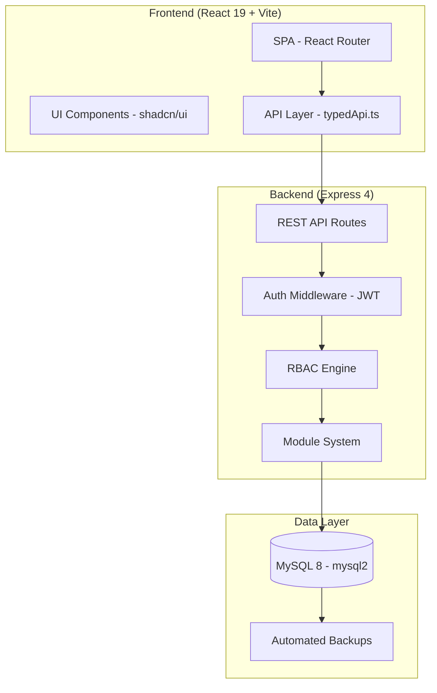
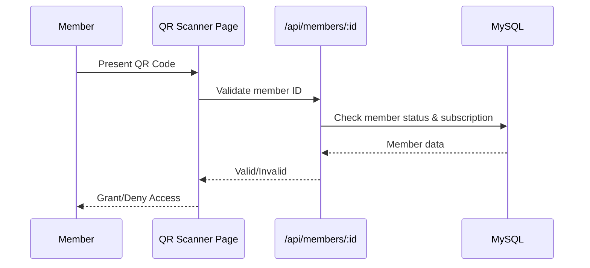

# 02 — Current System Analysis

## Overview

PowerGym Management (PwrGymMgnt) is a monolithic full-stack application serving gym operations including membership management, scheduling, HR/payroll, warehouse, and access control.

## Architecture

## Technology Stack

| Layer | Technology | Version |
|-------|-----------|---------|
| Frontend | React + TypeScript | 19.x |
| Bundler | Vite | 6.x |
| Backend | Express.js | 4.x |
| Database | MySQL | 8.x (mysql2 driver) |
| Auth | JWT (jsonwebtoken) | 9.x |
| Styling | Tailwind CSS 4 + shadcn/ui | Latest |
| Charts | Recharts + D3 | 3.x / 7.x |
| PDF | jsPDF + AutoTable | 4.x |
| QR | qrcode.react | 4.x |
| Runtime | Node.js | ≥22.0 |

## Current Modules

| Module | Functionality |
|--------|--------------|
| Members | CRUD, subscriptions, QR e-card |
| Plans | Plan catalog (simple) |
| Classes | Scheduling, enrollment, capacity |
| Staff | Employee management |
| HR | Payroll, attendance |
| Accounting | Transactions, categories |
| Warehouse | Inventory, stock |
| Reports | Filtered screen reports, PDF export |
| QR Scanner | Access control via QR code |
| Settings | System configuration |
| Dashboard | KPIs, engagement metrics |

## Authentication & Authorization

- **Method**: JWT tokens stored in HTTP-only cookies (`SESSION_COOKIE_NAME`)
- **Session Duration**: 8 hours with refresh capability
- **Password Storage**: scrypt (64-byte hash, 16-byte salt) with legacy plaintext auto-upgrade
- **RBAC Roles**: `super_admin`, `admin`, `manager`, `trainer`, `receptionist`, `staff`, `client`
- **Rate Limiting**: 300 req/15min (production), 15 auth attempts/15min
- **OAuth**: Google OAuth2 (popup flow)

## Access Control (Current)

Current access is QR-code only, validated against `members` table status field. No turnstile integration, no session tracking, no facial recognition.

## Database Schema (Core Tables)

| Table | Purpose | Key Fields |
|-------|---------|-----------|
| `members` | Member profiles | id, status, plan, data (JSON) |
| `staff` | Staff profiles | id, role, status |
| `admin_users` | System users | id, email, password_hash, role, status |
| `classes` | Class scheduling | id, instructor_id, capacity |
| `accounting` | Financial transactions | id, type, amount, date |
| `hr` | HR records | id, employee_id, type, amount |
| `audit_logs` | System audit trail | id, action, performed_by |
| `users` | Legacy user table | id, email, role |

## Current Limitations

1. **Single-user plans only** — no family, group, or corporate plans
2. **No session tracking** — QR grants access but no entry/exit ledger
3. **No biometric access** — QR code only
4. **No multi-affiliation** — a person can belong to only one plan
5. **No cycle/billing management** — plan periods are not formally tracked
6. **Monolithic coupling** — all modules in a single server.ts with module registration
7. **No concurrency control** — no explicit locking or idempotency mechanisms
8. **No turnstile/device integration** — QR is UI-only, no hardware protocol

## Deployment

- **Platform**: Render (render.yaml)
- **Build**: `build-render-lite.mjs` (memory-optimized esbuild)
- **CI/CD**: GitHub Actions (`.github/workflows/ci.yml`)
- **Backups**: Daily automated mysqldump (cron at 00:00, 30-day retention)

## Integration Points for Evolution

| Current Component | Evolution Target |
|-------------------|-----------------|
| `members` table | → `persons` + `affiliations` + `subscriptions` |
| `Plans` page | → Plan versioning + configuration engine |
| QR Scanner | → Unified access motor (QR + facial + manual) |
| Simple status check | → Session ledger + balance engine |
| No device protocol | → Turnstile/gate command protocol |
| Flat RBAC | → Subscription roles (holder/admin/beneficiary) |
