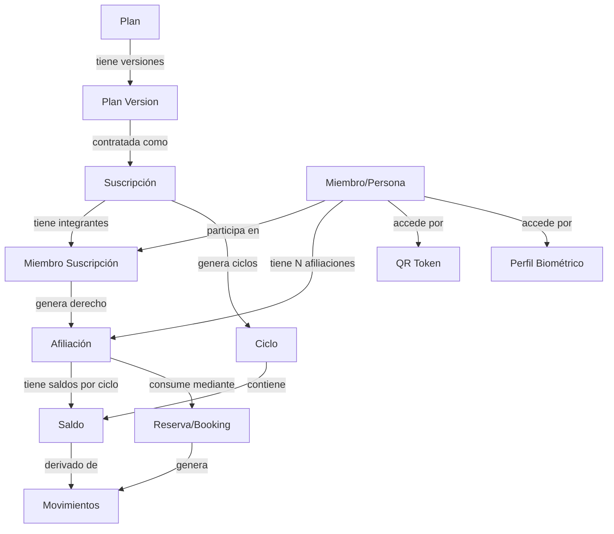

# 04 — Modelo Conceptual

## Entidades fundamentales

### Plan (subscription_plans + plan_versions)
Definición comercial reutilizable. Contiene las condiciones que un cliente puede contratar.
Un plan puede tener múltiples versiones; solo la versión activa se ofrece a nuevos contratantes.

### Versión de Plan (plan_versions)
Instantánea inmutable de las condiciones comerciales de un plan en un momento dado.
Una vez que una suscripción referencia una versión, ésta no puede modificarse.

### Suscripción (subscriptions)
Contratación concreta de una versión de plan por un titular. Contiene fechas, estado de pago y el grupo de personas autorizadas.

### Miembro de Suscripción (subscription_members)
Relación administrativa de una persona con una suscripción multiusuario. Define quién pertenece al grupo, su rol dentro del grupo (titular, administrador, beneficiario) y fechas de alta/baja.

### Afiliación (affiliations)
Derecho individual y temporal de una persona a consumir beneficios derivados de una suscripción. Es la fuente independiente de:
- Beneficios accesibles
- Restricciones aplicables
- Ciclos de sesiones
- Saldos
- Movimientos

**Diferencia clave con subscription_members**: Un integrante puede estar administrativamente activo en el grupo pero tener su afiliación suspendida (congelada, impago, sanción). Esto permite gestionar cada ciclo de vida de forma independiente.

### Ciclo (subscription_cycles)
Periodo de asignación, reserva y consumo de sesiones. Se define por la frecuencia configurada en la versión del plan (mensual, semanal, trimestral, etc.).

### Saldo (session_balances)
Proyección transaccional materializada del estado de sesiones para un contexto dado (afiliación + ciclo, o suscripción + ciclo para bolsa compartida).

```
sesiones_disponibles =
    sesiones_incluidas
  + sesiones_acumuladas
  + sesiones_adicionales
  + ajustes_positivos
  + devoluciones
  - sesiones_reservadas
  - sesiones_consumidas
  - sesiones_caducadas
  - ajustes_negativos
```

> Esta fórmula es una PROYECCIÓN. La fuente auditable es el libro de movimientos.

### Movimiento (session_movements)
Operación inmutable que registra un cambio en el estado de sesiones. Tipos:
- `allocation` — Asignación inicial al abrir ciclo
- `reservation` — Reserva provisional
- `release` — Liberación de reserva
- `consumption` — Consumo confirmado
- `refund` — Devolución
- `purchase` — Compra adicional
- `carryover` — Acumulación desde ciclo anterior
- `expiration` — Caducidad de sesiones no usadas
- `adjustment_positive` — Ajuste a favor (con motivo obligatorio)
- `adjustment_negative` — Ajuste en contra (con motivo obligatorio)
- `compensation` — Corrección compensatoria (referencia al movimiento original)

Los movimientos confirmados **nunca se modifican ni eliminan**. Los errores se corrigen con movimientos compensatorios.

---

## Diagrama de relaciones conceptuales



---

## Relación con el modelo actual

| Entidad actual | Evolución |
|----------------|-----------|
| `subscription_plans` | Se mantiene + se añade `plan_versions` |
| `member_subscriptions` | Se migra a `subscriptions` + `subscription_members` + `affiliations` |
| `members` | Se mantiene sin cambios |
| `class_bookings` | Se mantiene + se vincula con `session_movements` |
| `access_tokens` | Se mantiene para QR; el motor unificado los consulta |

---

## Justificación de la coexistencia subscription_members / affiliations

| Aspecto | subscription_members | affiliations |
|---------|---------------------|--------------|
| Propósito | Quién pertenece al grupo | Quién puede consumir qué |
| Ciclo de vida | Alta/baja del grupo | Activa/suspendida/congelada/vencida |
| Independencia | Compartido con la suscripción | Individual por persona |
| Saldo | No tiene saldo propio | Tiene saldos y movimientos |
| Ejemplo | "Juan es beneficiario del plan familiar" | "Juan puede usar 20 sesiones/mes en zona fitness" |

Un integrante retirado del grupo (`subscription_members.status = 'removed'`) pierde automáticamente su afiliación. Pero una afiliación puede congelarse sin retirar al integrante del grupo (ej: impago individual en plan corporativo).
