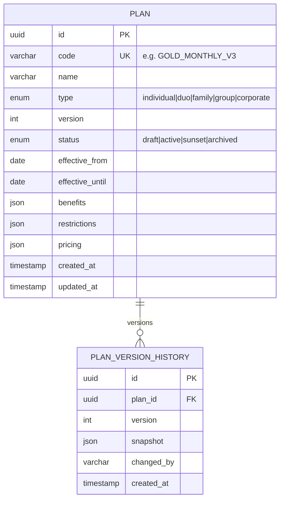
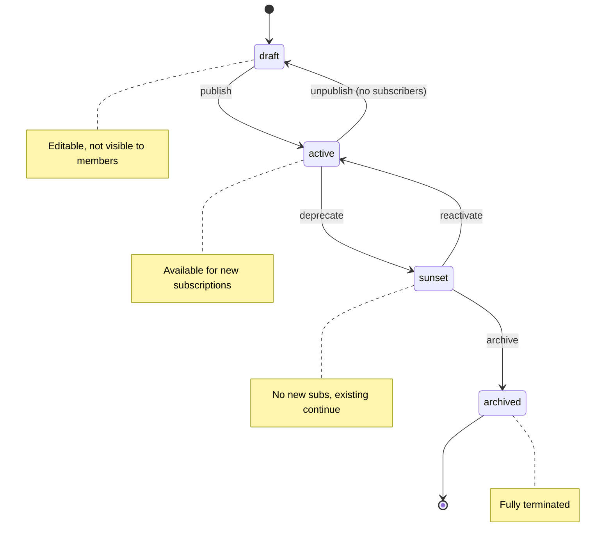

# 05 — Plans Configuration

## Overview

Plans define what a gym offers: session quotas, allowed time slots, included services, and pricing tiers. The plan engine supports versioning so existing subscribers stay on their contracted terms while new sign-ups get updated configurations.

## Plan Types

| Type | Description | Max Beneficiaries | Example |
|------|-------------|-------------------|---------|
| `individual` | Single person | 1 | "Gold Monthly" |
| `duo` | Two people (couple/friends) | 2 | "Duo Unlimited" |
| `family` | Family members | 2–6 (configurable) | "Family Pack 4" |
| `group` | Social/sports group | 5–20 | "Team 10" |
| `corporate` | Company-sponsored | Unlimited (quota-based) | "Empresa Premium" |

## Plan Entity Model



## Benefits Configuration

```json
{
  "sessions_per_cycle": 20,
  "session_duration_minutes": 90,
  "allowed_time_slots": ["morning", "afternoon", "evening", "all"],
  "included_services": ["gym", "pool", "sauna", "classes"],
  "guest_passes_per_cycle": 2,
  "freeze_days_per_year": 30,
  "priority_booking": true,
  "locker_included": false,
  "personal_trainer_sessions": 0
}
```

## Restrictions Configuration

```json
{
  "min_age": 16,
  "max_age": null,
  "max_beneficiaries": 4,
  "allowed_branches": ["branch-001", "branch-002"],
  "blackout_dates": [],
  "max_concurrent_bookings": 3,
  "cancellation_notice_hours": 4,
  "transfer_allowed": false,
  "downgrade_cooldown_days": 30
}
```

## Pricing Configuration

```json
{
  "currency": "BRL",
  "cycle_price": 199.90,
  "enrollment_fee": 99.00,
  "per_extra_beneficiary": 79.90,
  "per_extra_session": 15.00,
  "annual_discount_pct": 15,
  "early_renewal_discount_pct": 5
}
```

## Plan Lifecycle (State Machine)



## Versioning Rules

| Rule | Description |
|------|-------------|
| Immutable active version | Once active, a plan version cannot be edited |
| New version inherits | Creating v(N+1) copies v(N) as base |
| Subscriber binding | Subscribers are bound to the version at sign-up |
| Grace upgrade | Holders can opt-in to newer version mid-cycle |
| Sunset window | Minimum 30 days between sunset and archive |
| Rollback | A sunset plan can reactivate within the window |

## Plan Code Convention

```
{TYPE}_{TIER}_{VARIANT}_V{VERSION}
```

Examples:
- `IND_GOLD_MONTHLY_V3` — Individual Gold Monthly version 3
- `FAM_SILVER_QUARTERLY_V1` — Family Silver Quarterly version 1
- `CORP_PREMIUM_ANNUAL_V2` — Corporate Premium Annual version 2

## Distribution Models (Session Allocation)

| Model | Description | Use Case |
|-------|-------------|----------|
| `shared_pool` | All beneficiaries share N sessions | Family/group casual |
| `per_capita` | Each beneficiary gets N sessions | Corporate standard |
| `hybrid` | Base pool + per-capita bonus | Premium family |
| `unlimited` | No session cap (time-slot restricted) | VIP plans |

## API Summary

| Endpoint | Method | Description |
|----------|--------|-------------|
| `/api/v2/plans` | GET | List active plans (public) |
| `/api/v2/plans/:id` | GET | Plan detail with benefits |
| `/api/v2/plans` | POST | Create draft plan |
| `/api/v2/plans/:id` | PATCH | Update draft plan |
| `/api/v2/plans/:id/publish` | POST | Activate plan |
| `/api/v2/plans/:id/sunset` | POST | Deprecate plan |
| `/api/v2/plans/:id/version` | POST | Create new version |
| `/api/v2/plans/:id/versions` | GET | Version history |

## Validation Rules

1. A plan must have at least one benefit defined before publishing
2. `sessions_per_cycle` must be > 0 unless type is `unlimited`
3. `max_beneficiaries` must be ≥ 1 for individual, ≥ 2 for duo/family/group
4. `effective_from` must be future date for new plans
5. Price must be > 0 for all non-promotional plans
6. Branch restrictions must reference valid branch IDs
7. Only one active version per plan code at a time
