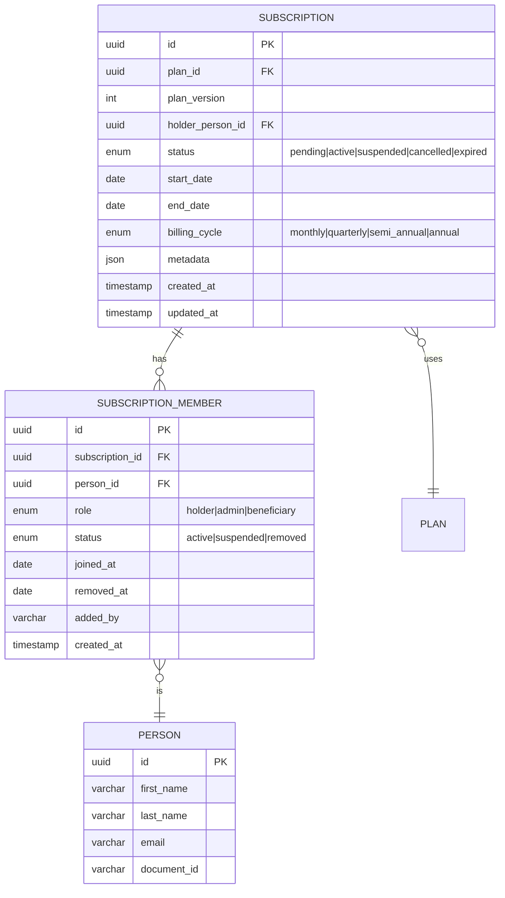
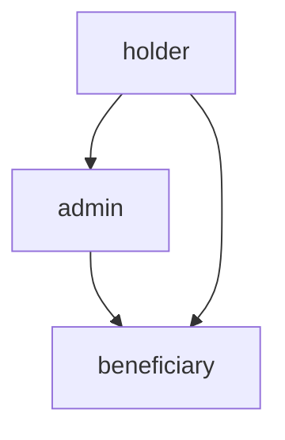
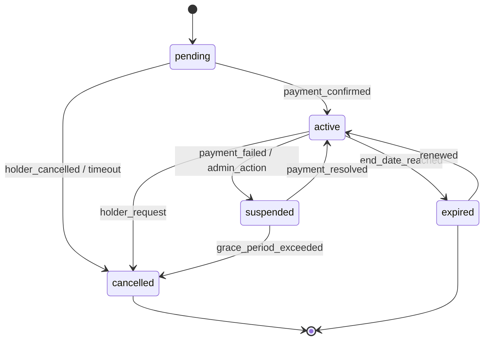
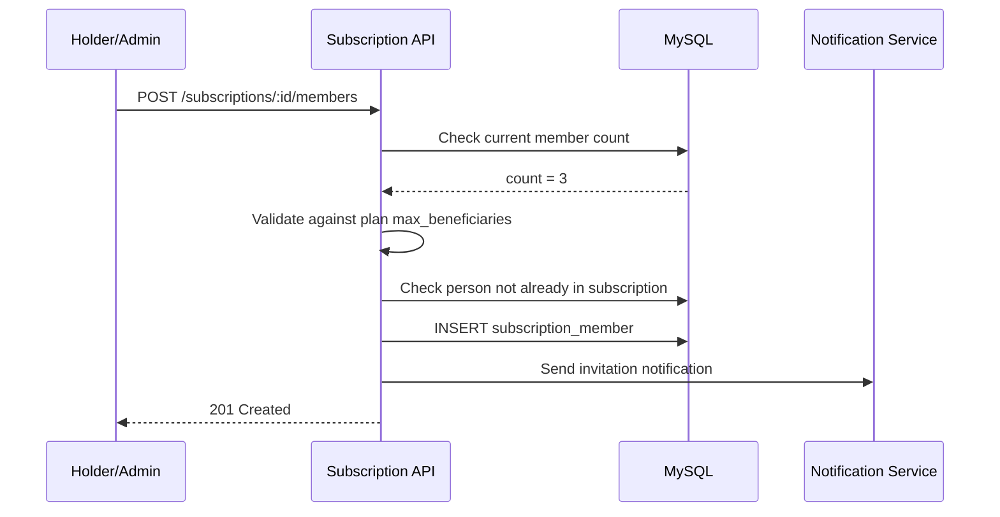

# 06 — Subscriptions

## Overview

A subscription is the contract binding a plan to one or more persons. It introduces multi-user support with explicit roles, lifecycle management, and session entitlements.

## Subscription Entity Model

## Subscription Roles

| Role | Permissions | Limit per Subscription |
|------|------------|----------------------|
| `holder` | Full control, billing responsibility, can add/remove members | Exactly 1 |
| `admin` | Can add/remove beneficiaries, manage bookings | 0–2 |
| `beneficiary` | Can use sessions, book classes | Based on plan |

### Role Hierarchy

- A **holder** can do everything an admin and beneficiary can do
- An **admin** can manage beneficiaries but cannot change billing or cancel
- A **beneficiary** can only consume sessions and make personal bookings

## Multi-User Subscription Limits

| Plan Type | Holder | Admins | Beneficiaries | Total Max |
|-----------|--------|--------|---------------|-----------|
| Individual | 1 | 0 | 0 | 1 |
| Duo | 1 | 0 | 1 | 2 |
| Family | 1 | 1 | 2–5 | 3–6 |
| Group | 1 | 2 | 4–19 | 5–20 |
| Corporate | 1 | 2+ | Quota-based | Plan limit |

## Subscription Lifecycle

## Member Management Operations

### Adding a Beneficiary

### Removing a Beneficiary

| Condition | Behavior |
|-----------|----------|
| Holder removes beneficiary | Immediate removal, sessions forfeited |
| Admin removes beneficiary | Immediate removal, sessions forfeited |
| Beneficiary leaves voluntarily | Effective end-of-cycle |
| Holder cannot be removed | Must cancel subscription |
| Last admin removed | Holder auto-becomes sole admin |

## Subscription Constraints

1. A person can be **holder** of at most 3 subscriptions simultaneously
2. A person can be **beneficiary** in at most 5 subscriptions simultaneously  
3. A person cannot appear twice in the same subscription
4. Removing the holder requires subscription cancellation
5. Subscription cannot exceed plan's `max_beneficiaries` limit
6. Adding members mid-cycle prorates session allocation
7. Corporate subscriptions require company verification
8. Suspended subscriptions freeze all member access
9. Grace period for payment failure: 7 days (configurable)
10. Renewal creates a new cycle, not a new subscription

## Billing Integration Points

| Event | Action |
|-------|--------|
| Subscription created | Generate first invoice |
| Beneficiary added mid-cycle | Prorate and invoice delta |
| Beneficiary removed mid-cycle | Credit remaining (if policy allows) |
| Cycle renewal | Generate renewal invoice |
| Payment failed | Suspend after grace period |
| Payment recovered | Reactivate subscription |

## API Endpoints

| Endpoint | Method | Permission | Description |
|----------|--------|-----------|-------------|
| `/api/v2/subscriptions` | POST | `admin+` | Create subscription |
| `/api/v2/subscriptions/:id` | GET | `member_of` | Get subscription detail |
| `/api/v2/subscriptions/:id/members` | GET | `member_of` | List members |
| `/api/v2/subscriptions/:id/members` | POST | `holder\|admin` | Add member |
| `/api/v2/subscriptions/:id/members/:mid` | DELETE | `holder\|admin` | Remove member |
| `/api/v2/subscriptions/:id/suspend` | POST | `admin+` | Suspend subscription |
| `/api/v2/subscriptions/:id/cancel` | POST | `holder\|admin+` | Cancel subscription |
| `/api/v2/subscriptions/:id/renew` | POST | `holder` | Renew subscription |
| `/api/v2/persons/:pid/subscriptions` | GET | `self\|admin+` | Person's subscriptions |
