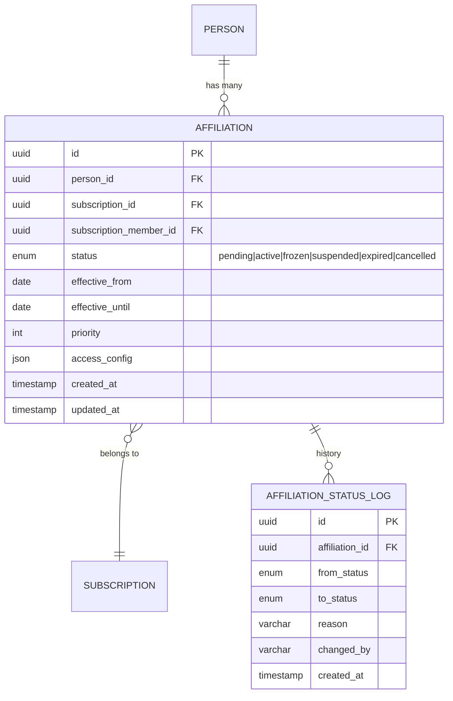
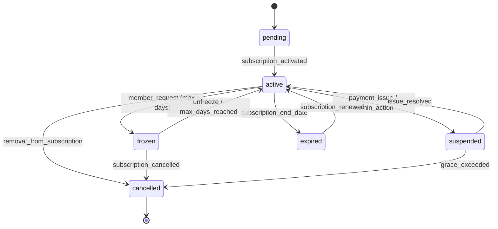
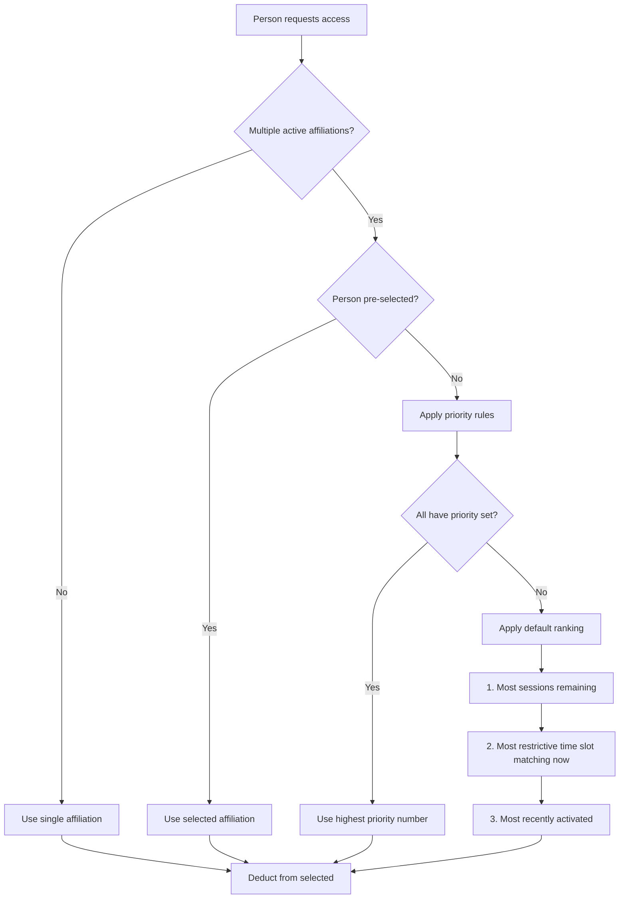

# 07 — Affiliations

## Overview

An affiliation is the link between a person and a subscription that grants access rights. A person can hold multiple affiliations simultaneously (e.g., personal gym plan + corporate wellness plan), each operating independently with its own session balance, status, and lifecycle.

## Affiliation Entity Model

## Multiple Affiliations per Person

A person may simultaneously have:
- An individual gym membership (personal)
- A corporate wellness plan (employer-sponsored)
- A family plan (as beneficiary of spouse's plan)

Each affiliation is **independent**:

| Property | Independence |
|----------|-------------|
| Status | Each can be active/frozen/suspended separately |
| Sessions | Each has its own balance from its subscription |
| Billing | Each follows its own subscription's billing |
| Access rules | Each grants specific time slots and services |
| Freezing | Freezing one does not affect others |

## Affiliation States

### State Descriptions

| State | Access | Sessions | Billing |
|-------|--------|----------|---------|
| `pending` | ❌ No | Not allocated | Not started |
| `active` | ✅ Yes | Consuming | Active |
| `frozen` | ❌ No | Paused (preserved) | Paused |
| `suspended` | ❌ No | Frozen | Overdue |
| `expired` | ❌ No | Zeroed | Ended |
| `cancelled` | ❌ No | Forfeited | Terminated |

## Priority & Selection

When a person presents at access control with multiple active affiliations, the system must determine which affiliation to use.

### Priority Resolution Algorithm

### Priority Configuration

| Field | Type | Description |
|-------|------|-------------|
| `priority` | int | Manual priority (higher = preferred). Default: 0 |
| `access_config.auto_select` | bool | Allow system to auto-select this affiliation |
| `access_config.preferred_for` | string[] | Services this affiliation prefers (gym, pool, classes) |
| `access_config.time_slot_override` | string | Override time slot for this affiliation |

### Member Self-Selection

Members can configure which affiliation to use by default or select at the access point:
- **App pre-selection**: Before arriving, member selects affiliation in mobile app
- **Kiosk selection**: At the turnstile kiosk, choose which plan to use
- **Default rule**: If no selection, system uses priority algorithm

## Independence Guarantees

| Scenario | Behavior |
|----------|----------|
| Subscription A suspended | Affiliation A suspended, Affiliation B unaffected |
| Freeze Affiliation B | B frozen, A still active, person can still access via A |
| Cancel Subscription A | Affiliation A cancelled, B remains |
| Person blocked (global) | ALL affiliations suspended (admin override) |
| Branch restriction | Only affiliations valid for that branch grant access |

## Affiliation Limits

| Constraint | Value | Rationale |
|-----------|-------|-----------|
| Max active affiliations per person | 5 | Prevent abuse |
| Max frozen affiliations simultaneously | 2 | Fair freeze usage |
| Max pending affiliations | 3 | Prevent zombie subs |
| Freeze duration per affiliation | Plan-defined (default 30 days) | Contractual |
| Freeze cooldown between freezes | 60 days | Prevent cycling |

## API Endpoints

| Endpoint | Method | Permission | Description |
|----------|--------|-----------|-------------|
| `/api/v2/persons/:pid/affiliations` | GET | `self\|admin+` | List person's affiliations |
| `/api/v2/affiliations/:id` | GET | `self\|admin+` | Affiliation detail |
| `/api/v2/affiliations/:id/freeze` | POST | `self\|admin+` | Freeze affiliation |
| `/api/v2/affiliations/:id/unfreeze` | POST | `self\|admin+` | Unfreeze affiliation |
| `/api/v2/affiliations/:id/priority` | PATCH | `self` | Set priority |
| `/api/v2/affiliations/:id/select` | POST | `self` | Pre-select for next access |
| `/api/v2/persons/:pid/active-affiliation` | GET | `system` | Resolve current affiliation |

## Events Emitted

| Event | Trigger | Payload |
|-------|---------|---------|
| `affiliation.activated` | Subscription activates | affiliation_id, person_id |
| `affiliation.frozen` | Member requests freeze | affiliation_id, until_date |
| `affiliation.unfrozen` | Freeze ends | affiliation_id |
| `affiliation.suspended` | Payment/admin issue | affiliation_id, reason |
| `affiliation.expired` | Subscription ended | affiliation_id |
| `affiliation.cancelled` | Removed from sub | affiliation_id, reason |
