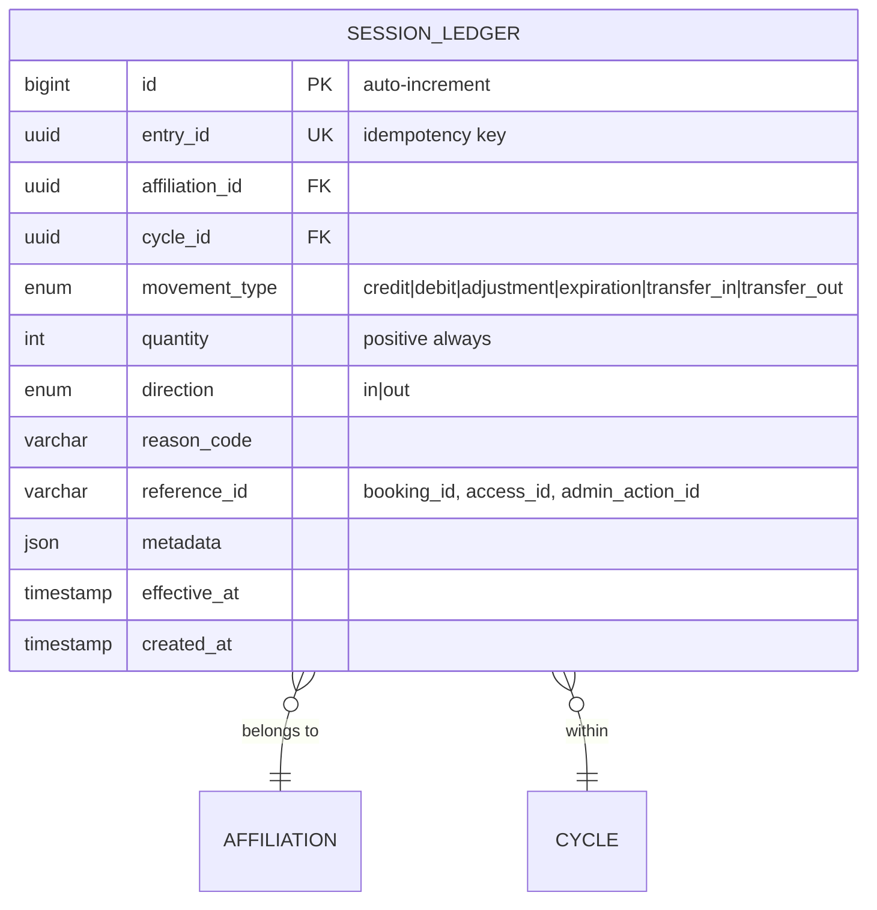
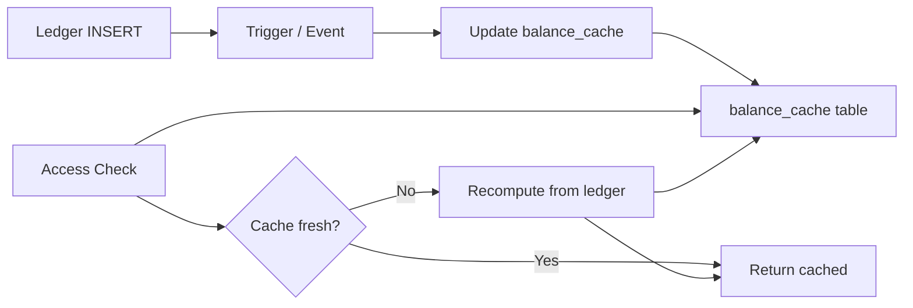
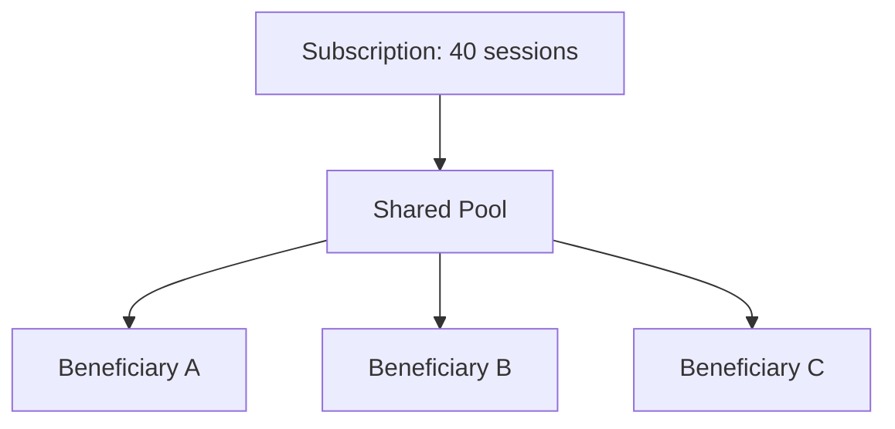
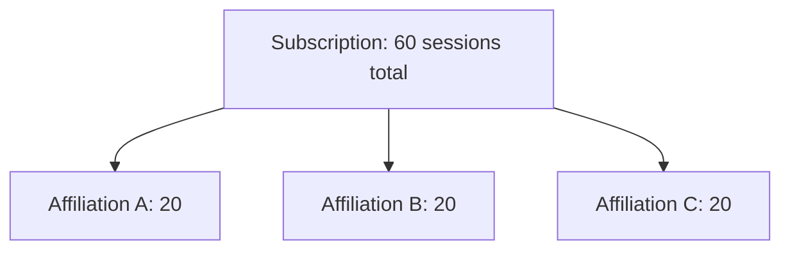

# 08 — Session Ledger

## Overview

The session ledger is an **immutable, append-only** record of all session movements (credits and debits) for every affiliation. Balance is never stored as a mutable field — it is always computed from the ledger entries.

## Design Principles

1. **Immutability** — ledger entries are never updated or deleted
2. **Auditability** — every balance change has a traceable cause
3. **Eventual consistency** — balance is derived, not stored
4. **Correction via compensation** — errors are fixed by adding counter-entries, not editing

## Ledger Entity Model



## Movement Types

| Type | Direction | Trigger | Example |
|------|-----------|---------|---------|
| `credit` | in | Cycle start, purchase | +20 sessions at cycle renewal |
| `debit` | out | Access granted, booking consumed | -1 session on gym entry |
| `adjustment` | in/out | Admin correction | +2 sessions (compensation) |
| `expiration` | out | Cycle end, unused sessions | -5 expired sessions |
| `transfer_in` | in | Sessions received from another affiliation | +3 transferred from spouse |
| `transfer_out` | out | Sessions given to another affiliation | -3 transferred to spouse |

## Reason Codes

| Code | Description |
|------|-------------|
| `CYCLE_CREDIT` | Standard cycle allocation |
| `PURCHASE_EXTRA` | Additional sessions purchased |
| `PROMO_BONUS` | Promotional credit |
| `ACCESS_ENTRY` | Consumed on physical entry |
| `CLASS_BOOKING` | Consumed for class reservation |
| `NO_SHOW_PENALTY` | Penalty for no-show |
| `ADMIN_ADJUSTMENT` | Manual admin correction |
| `CYCLE_EXPIRATION` | Unused sessions expired |
| `CARRYOVER_CREDIT` | Carried from previous cycle |
| `TRANSFER_FAMILY` | Family plan transfer |
| `FREEZE_RETURN` | Sessions returned after early unfreeze |
| `CANCELLATION_FORFEIT` | Forfeited on cancellation |

## Balance Calculation

```sql
-- Real-time balance for an affiliation in current cycle
SELECT 
    a.id AS affiliation_id,
    COALESCE(SUM(
        CASE WHEN sl.direction = 'in' THEN sl.quantity
             WHEN sl.direction = 'out' THEN -sl.quantity
        END
    ), 0) AS current_balance
FROM affiliations a
LEFT JOIN session_ledger sl ON sl.affiliation_id = a.id
    AND sl.cycle_id = :current_cycle_id
WHERE a.id = :affiliation_id
GROUP BY a.id;
```

### Cached Balance (Materialized View)

For performance, a `balance_cache` table is updated asynchronously:



| Table: `balance_cache` | |
|---|---|
| affiliation_id | FK |
| cycle_id | FK |
| balance | int |
| last_entry_id | bigint |
| computed_at | timestamp |

## Distribution Models

### Shared Pool

All beneficiaries in a subscription draw from a single pool.



- Each access deducts from the pool regardless of who consumed
- Holder can set per-person soft limits (advisory, not enforced)

### Per Capita

Each beneficiary gets an independent allocation.



- Sessions are non-transferable between affiliations
- Each balance is independent

### Hybrid

Base pool + individual bonus.

```
Total = shared_pool + (per_person_bonus × member_count)
Example: 20 shared + 5 per person × 4 = 40 total
         20 go to shared pool, 5 per individual
```

## Ledger Operations

### Credit on Cycle Start

```json
{
  "entry_id": "uuid-v4",
  "affiliation_id": "aff-123",
  "cycle_id": "cycle-456",
  "movement_type": "credit",
  "quantity": 20,
  "direction": "in",
  "reason_code": "CYCLE_CREDIT",
  "reference_id": "cycle-456",
  "effective_at": "2025-08-01T00:00:00Z"
}
```

### Debit on Access

```json
{
  "entry_id": "uuid-v4",
  "affiliation_id": "aff-123",
  "cycle_id": "cycle-456",
  "movement_type": "debit",
  "quantity": 1,
  "direction": "out",
  "reason_code": "ACCESS_ENTRY",
  "reference_id": "access-789",
  "effective_at": "2025-08-15T08:30:00Z"
}
```

### Admin Correction (Compensation)

```json
{
  "entry_id": "uuid-v4",
  "affiliation_id": "aff-123",
  "cycle_id": "cycle-456",
  "movement_type": "adjustment",
  "quantity": 2,
  "direction": "in",
  "reason_code": "ADMIN_ADJUSTMENT",
  "reference_id": "admin-action-012",
  "metadata": { "note": "System error double-deducted on 2025-08-14", "approved_by": "admin-user-5" },
  "effective_at": "2025-08-15T10:00:00Z"
}
```

## Concurrency Considerations

- Ledger INSERT uses the `entry_id` as idempotency key (UNIQUE constraint)
- Balance queries use `SELECT ... FOR UPDATE` on the affiliation row for debit operations
- Shared pool debits lock at the subscription level
- See [09-CONCURRENCY.md](./09-CONCURRENCY.md) for full transaction patterns

## API Endpoints

| Endpoint | Method | Description |
|----------|--------|-------------|
| `/api/v2/affiliations/:id/balance` | GET | Current balance |
| `/api/v2/affiliations/:id/ledger` | GET | Ledger history (paginated) |
| `/api/v2/affiliations/:id/ledger` | POST | Add entry (admin) |
| `/api/v2/subscriptions/:id/pool-balance` | GET | Shared pool balance |
| `/api/v2/cycles/:id/ledger-summary` | GET | Cycle summary stats |
