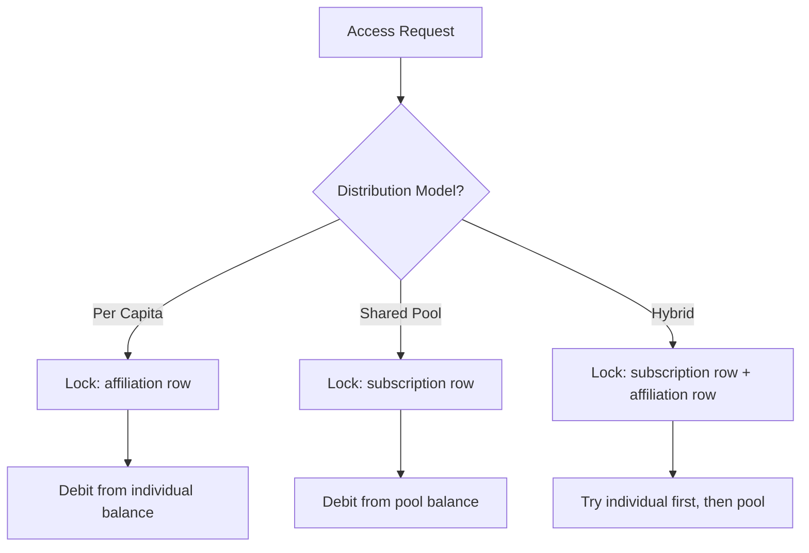
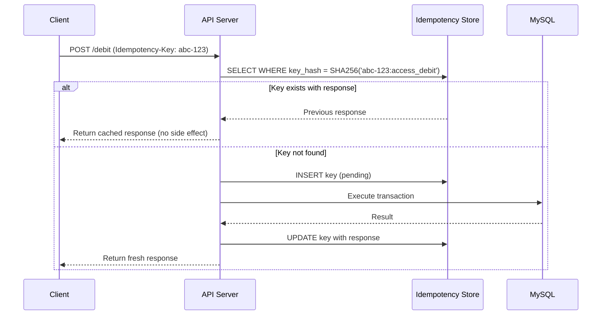
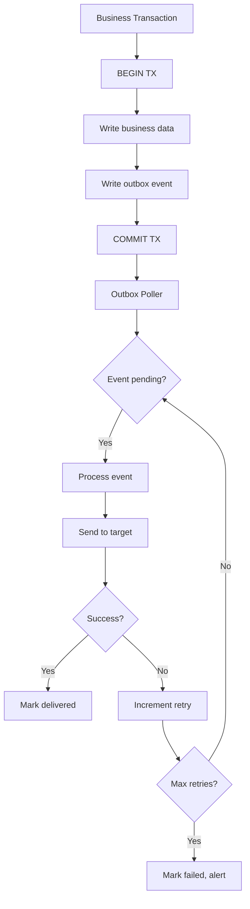

# 09 — Concurrency Control

## Overview

The session ledger and access control system require strict concurrency guarantees to prevent double-deductions, race conditions on shared pools, and duplicate operations. This document defines the MySQL transaction patterns, locking strategy, idempotency mechanisms, and outbox pattern used.

## Transaction Isolation

| Operation | Isolation Level | Rationale |
|-----------|----------------|-----------|
| Session debit | `SERIALIZABLE` on affiliation lock row | Prevent double-debit |
| Shared pool debit | `SERIALIZABLE` on subscription lock row | Prevent over-consumption |
| Ledger credit | `READ COMMITTED` + unique constraint | Idempotent by entry_id |
| Access attempt write | `READ COMMITTED` | Append-only, no conflict |
| Balance cache update | `READ COMMITTED` | Eventually consistent |

## Locking Strategy

### SELECT FOR UPDATE Pattern

```sql
-- Step 1: Acquire lock on affiliation row
START TRANSACTION;

SELECT id, status 
FROM affiliations 
WHERE id = :affiliation_id 
FOR UPDATE;

-- Step 2: Compute current balance
SELECT COALESCE(SUM(
    CASE WHEN direction = 'in' THEN quantity ELSE -quantity END
), 0) AS balance
FROM session_ledger
WHERE affiliation_id = :affiliation_id 
  AND cycle_id = :current_cycle_id;

-- Step 3: Validate sufficient balance
-- (application layer check: balance >= debit_amount)

-- Step 4: Insert ledger entry
INSERT INTO session_ledger (entry_id, affiliation_id, cycle_id, ...)
VALUES (:entry_id, :affiliation_id, :cycle_id, ...);

-- Step 5: Update cache
UPDATE balance_cache 
SET balance = balance - :quantity, 
    last_entry_id = :new_entry_id,
    computed_at = NOW()
WHERE affiliation_id = :affiliation_id 
  AND cycle_id = :cycle_id;

COMMIT;
```

### Lock Granularity



## Idempotency Keys

Every state-changing operation carries an idempotency key to prevent duplicate processing.

### Key Generation

```typescript
interface IdempotencyKey {
  key: string;        // UUID v4 generated by client
  scope: string;      // e.g., "access_debit", "cycle_credit"
  created_at: Date;
  expires_at: Date;   // Key valid for 24 hours
}
```

### Idempotency Table

```sql
CREATE TABLE idempotency_keys (
    key_hash CHAR(64) PRIMARY KEY,  -- SHA-256 of key+scope
    scope VARCHAR(50) NOT NULL,
    response_status INT,
    response_body JSON,
    created_at TIMESTAMP DEFAULT CURRENT_TIMESTAMP,
    expires_at TIMESTAMP NOT NULL,
    INDEX idx_expires (expires_at)
) ENGINE=InnoDB;
```

### Processing Flow



## Outbox Pattern

For operations that must trigger external effects (notifications, device commands), we use the transactional outbox pattern.

### Outbox Table

```sql
CREATE TABLE outbox_events (
    id BIGINT AUTO_INCREMENT PRIMARY KEY,
    event_type VARCHAR(100) NOT NULL,
    aggregate_type VARCHAR(50) NOT NULL,
    aggregate_id VARCHAR(255) NOT NULL,
    payload JSON NOT NULL,
    status ENUM('pending', 'processing', 'delivered', 'failed') DEFAULT 'pending',
    retry_count INT DEFAULT 0,
    max_retries INT DEFAULT 5,
    scheduled_at TIMESTAMP DEFAULT CURRENT_TIMESTAMP,
    processed_at TIMESTAMP NULL,
    created_at TIMESTAMP DEFAULT CURRENT_TIMESTAMP,
    INDEX idx_status_scheduled (status, scheduled_at),
    INDEX idx_aggregate (aggregate_type, aggregate_id)
) ENGINE=InnoDB;
```

### Outbox Flow



### Outbox Events

| Event Type | Aggregate | Target |
|-----------|-----------|--------|
| `access.granted` | access_attempt | Device command service |
| `access.denied` | access_attempt | Notification service |
| `session.debited` | session_ledger | Balance cache updater |
| `subscription.suspended` | subscription | Email notification |
| `cycle.expiring` | cycle | Member notification |

## Deadlock Prevention

| Strategy | Implementation |
|----------|---------------|
| Consistent lock ordering | Always lock subscription before affiliation |
| Lock timeout | `innodb_lock_wait_timeout = 5` (seconds) |
| Retry with backoff | 3 retries, exponential backoff (100ms, 200ms, 400ms) |
| Lock monitoring | Log queries holding locks > 2 seconds |

## Optimistic Concurrency (Non-Critical Paths)

For operations where strict locking is unnecessary (profile updates, settings):

```sql
UPDATE affiliations 
SET priority = :new_priority, 
    updated_at = NOW()
WHERE id = :affiliation_id 
  AND updated_at = :expected_version;
-- Check affected rows = 1, else retry
```

## Cleanup Jobs

| Job | Schedule | Action |
|-----|----------|--------|
| Idempotency key cleanup | Hourly | DELETE WHERE expires_at < NOW() |
| Outbox retry | Every 30s | Process pending events |
| Outbox cleanup | Daily | Archive delivered events > 7 days |
| Dead letter alerting | Every 5min | Alert on failed events |

## Monitoring Metrics

| Metric | Alert Threshold |
|--------|----------------|
| Lock wait time P99 | > 2 seconds |
| Deadlock rate | > 5/minute |
| Idempotency hit rate | Info only (cache effectiveness) |
| Outbox pending queue depth | > 100 events |
| Outbox failure rate | > 1% of events |
| Transaction rollback rate | > 2% of operations |
