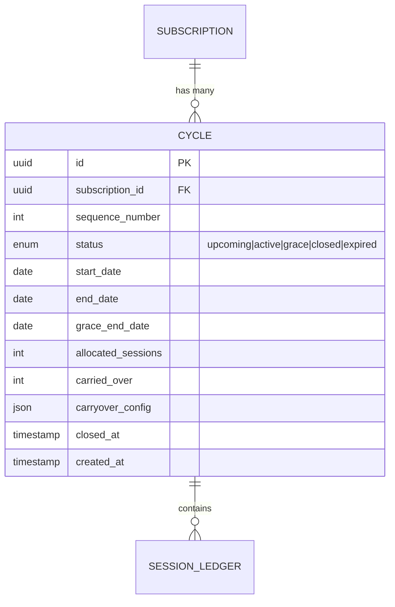
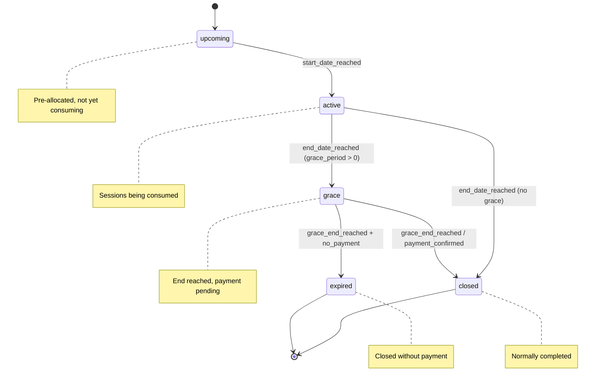
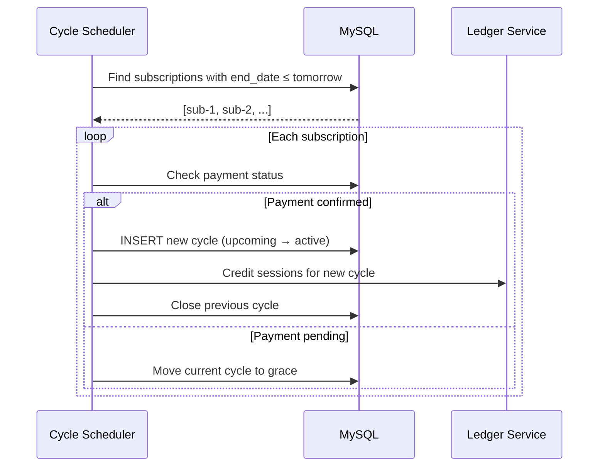
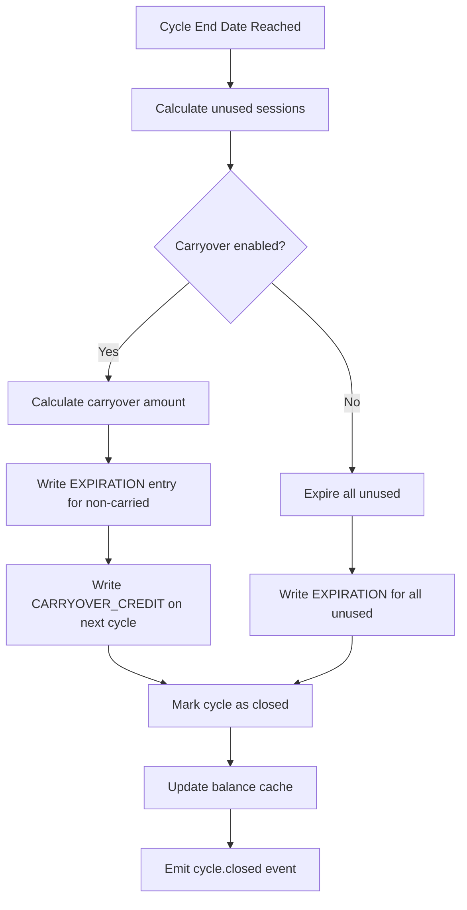

# 10 — Cycle Management

## Overview

A cycle represents a billing/usage period within a subscription. Each cycle has defined start/end dates, a session allocation, and rules for closing, carryover, and expiration.

## Cycle Entity Model



## Cycle Types by Billing Frequency

| Billing Cycle | Duration | Renewal Day |
|--------------|----------|-------------|
| Monthly | 28–31 days | Same day of month |
| Quarterly | ~90 days | Same day, every 3 months |
| Semi-annual | ~180 days | Same day, every 6 months |
| Annual | 365–366 days | Anniversary date |

### Day Normalization

If subscription started on Jan 31 with monthly billing:
- Feb cycle: Feb 1 – Feb 28 (short month adjustment)
- Mar cycle: Mar 1 – Mar 31
- Rule: If start day > days in month, use last day of month

## Cycle Lifecycle



## Cycle Creation



## Session Allocation on Cycle Start

| Plan Distribution | Allocation Logic |
|------------------|-----------------|
| Per Capita | `plan.sessions_per_cycle` credited per affiliation |
| Shared Pool | `plan.sessions_per_cycle × member_count` credited to pool |
| Hybrid | `pool_base + (per_person × count)` split accordingly |
| Unlimited | No session credit (unlimited flag on affiliation) |

## Carryover Rules

```json
{
  "carryover_enabled": true,
  "max_carryover_sessions": 10,
  "max_carryover_percentage": 50,
  "carryover_expiry_days": 30,
  "carryover_priority": "use_first"
}
```

| Rule | Description |
|------|-------------|
| `max_carryover_sessions` | Hard cap on sessions that can carry over |
| `max_carryover_percentage` | Max % of unused sessions that carry over |
| `carryover_expiry_days` | Carried sessions expire N days into next cycle |
| `carryover_priority` | `use_first` = consume carryover before new allocation |

### Carryover Calculation

```
unused = cycle_allocation - sessions_consumed
carryover = MIN(
    unused,
    max_carryover_sessions,
    FLOOR(cycle_allocation × max_carryover_percentage / 100)
)
```

### Carryover Ledger Entries

On cycle close:
```
1. EXPIRATION entry: unused - carryover (direction: out)
2. CYCLE_CREDIT on new cycle: standard allocation (direction: in)
3. CARRYOVER_CREDIT on new cycle: carryover amount (direction: in)
```

## Cycle Closing Process



## Grace Period

| Parameter | Default | Description |
|-----------|---------|-------------|
| `grace_period_days` | 7 | Days after end_date before hard expiration |
| `grace_access_allowed` | true | Whether member can still access during grace |
| `grace_session_limit` | 3 | Max sessions allowed during grace |

During grace:
- Member is notified of pending renewal
- Access is limited (configurable)
- If payment arrives, cycle closes normally and next cycle opens
- If grace expires without payment, subscription is suspended

## Expiration Rules

| Scenario | Sessions | Subscription |
|----------|----------|-------------|
| Normal close | Unused expire (minus carryover) | Continues |
| Grace expired | All remaining expire | Suspended |
| Subscription cancelled | All remaining expire immediately | Cancelled |
| Freeze mid-cycle | Sessions preserved (no expiration) | Frozen |
| Unfreeze | Remaining days proportional sessions | Continues |

## Scheduler (Cron Jobs)

| Job | Schedule | Action |
|-----|----------|--------|
| Cycle opener | Daily 00:05 | Create upcoming → active cycles |
| Cycle closer | Daily 23:55 | Process expired cycles |
| Grace checker | Daily 08:00 | Notify members in grace |
| Carryover processor | On cycle close | Calculate and credit carryovers |
| Expiration processor | On cycle close | Expire remaining sessions |

## API Endpoints

| Endpoint | Method | Description |
|----------|--------|-------------|
| `/api/v2/subscriptions/:id/cycles` | GET | List subscription cycles |
| `/api/v2/cycles/:id` | GET | Cycle detail with balances |
| `/api/v2/cycles/:id/summary` | GET | Consumed/remaining/expired stats |
| `/api/v2/cycles/current` | GET | Current cycle for affiliation |
| `/api/v2/admin/cycles/close` | POST | Force-close a cycle (admin) |
| `/api/v2/admin/cycles/extend` | POST | Extend cycle end date (admin) |
