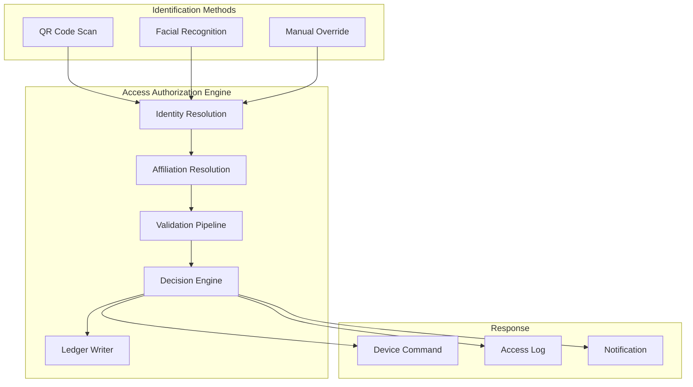
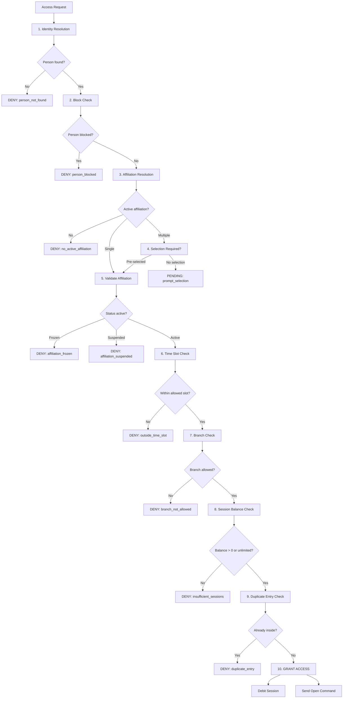

# 11 — Access Authorization (Unified Access Motor)

## Overview

The unified access motor is the central decision engine that evaluates whether a person can enter the gym. It accepts multiple identification methods (QR code, facial recognition, manual override) and produces a consistent authorization response with a device opening command.

## Architecture



## Access Request Contract

```typescript
interface AccessRequest {
  request_id: string;              // UUID, idempotency key
  device_id: string;               // Turnstile/gate identifier
  branch_id: string;               // Location identifier
  timestamp: string;               // ISO 8601
  identification: {
    method: 'qr' | 'facial' | 'manual';
    qr_payload?: string;           // Encrypted member QR data
    facial_match?: {
      person_id: string;
      confidence: number;          // 0.0 – 1.0
      liveness_passed: boolean;
    };
    manual_override?: {
      operator_id: string;
      person_id: string;
      reason: string;
    };
  };
  selected_affiliation_id?: string; // Optional pre-selection
}
```

## Access Response Contract

```typescript
interface AccessResponse {
  request_id: string;
  decision: 'granted' | 'denied' | 'pending_selection';
  person_id?: string;
  affiliation_id?: string;
  denial_reason?: DenialReason;
  device_command: {
    action: 'open' | 'deny' | 'prompt_selection';
    device_id: string;
    timeout_ms: number;
    display_message?: string;
  };
  session_info?: {
    sessions_remaining: number;
    cycle_end_date: string;
    plan_name: string;
  };
  timestamp: string;
}

type DenialReason = 
  | 'person_not_found'
  | 'no_active_affiliation'
  | 'insufficient_sessions'
  | 'outside_time_slot'
  | 'branch_not_allowed'
  | 'affiliation_frozen'
  | 'affiliation_suspended'
  | 'subscription_expired'
  | 'facial_confidence_low'
  | 'liveness_failed'
  | 'person_blocked'
  | 'device_offline'
  | 'duplicate_entry';
```

## Validation Pipeline



## Time Slot Validation

| Slot | Hours | Plans |
|------|-------|-------|
| `morning` | 06:00 – 12:00 | Economy plans |
| `afternoon` | 12:00 – 18:00 | Standard plans |
| `evening` | 18:00 – 23:00 | Premium slots |
| `all` | 06:00 – 23:00 | Full access plans |
| `off_peak` | 06:00 – 10:00, 14:00 – 17:00 | Discount plans |

## Duplicate Entry Prevention

- Check if person has an `entry` event without a matching `exit` event in the last 12 hours
- If yes, deny with `duplicate_entry` (configurable: some gyms allow re-entry)
- Exit is recorded via turnstile exit sensor or manual checkout

## Access Attempt Log

```sql
CREATE TABLE access_attempts (
    id BIGINT AUTO_INCREMENT PRIMARY KEY,
    request_id VARCHAR(36) UNIQUE NOT NULL,
    person_id VARCHAR(36),
    affiliation_id VARCHAR(36),
    device_id VARCHAR(36) NOT NULL,
    branch_id VARCHAR(36) NOT NULL,
    method ENUM('qr', 'facial', 'manual') NOT NULL,
    decision ENUM('granted', 'denied', 'pending_selection') NOT NULL,
    denial_reason VARCHAR(50),
    facial_confidence DECIMAL(4,3),
    session_debited BOOLEAN DEFAULT FALSE,
    metadata JSON,
    created_at TIMESTAMP DEFAULT CURRENT_TIMESTAMP,
    INDEX idx_person_date (person_id, created_at),
    INDEX idx_device_date (device_id, created_at),
    INDEX idx_branch_decision (branch_id, decision, created_at)
) ENGINE=InnoDB;
```

## Method-Specific Handling

### QR Code

1. Decrypt QR payload → extract `person_id` + `timestamp`
2. Validate QR not expired (max 5 minutes since generation)
3. Proceed to affiliation resolution

### Facial Recognition

1. Receive `person_id` + `confidence` from edge device
2. Validate `confidence >= threshold` (default 0.85)
3. Validate `liveness_passed == true`
4. Proceed to affiliation resolution

### Manual Override

1. Validate `operator_id` has `access_override` permission
2. Log override reason (mandatory)
3. Proceed to affiliation resolution (may skip some checks)
4. Admin overrides bypass: time slot, session balance, duplicate entry

## Performance Requirements

| Metric | Target |
|--------|--------|
| End-to-end decision latency | < 200ms (P95) |
| Database query time | < 50ms |
| Device command delivery | < 100ms |
| Throughput | 50 requests/second per branch |
| Availability | 99.9% uptime |

## API Endpoint

| Endpoint | Method | Description |
|----------|--------|-------------|
| `/api/v2/access/authorize` | POST | Main access decision endpoint |
| `/api/v2/access/attempts` | GET | Access attempt history |
| `/api/v2/access/attempts/:id` | GET | Single attempt detail |
| `/api/v2/access/presence` | GET | Currently inside members |
| `/api/v2/access/exit` | POST | Record exit event |
