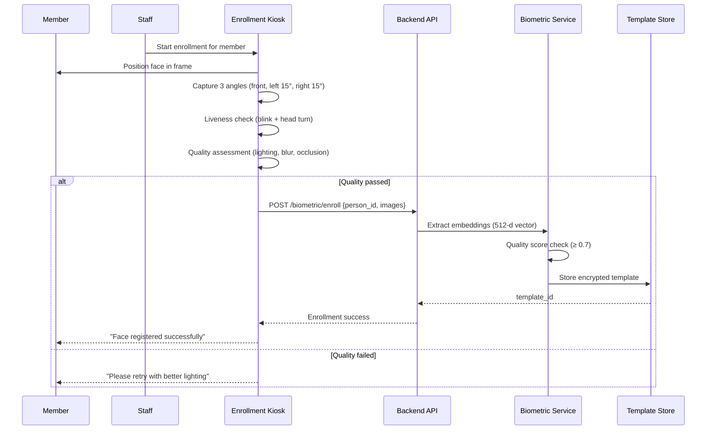
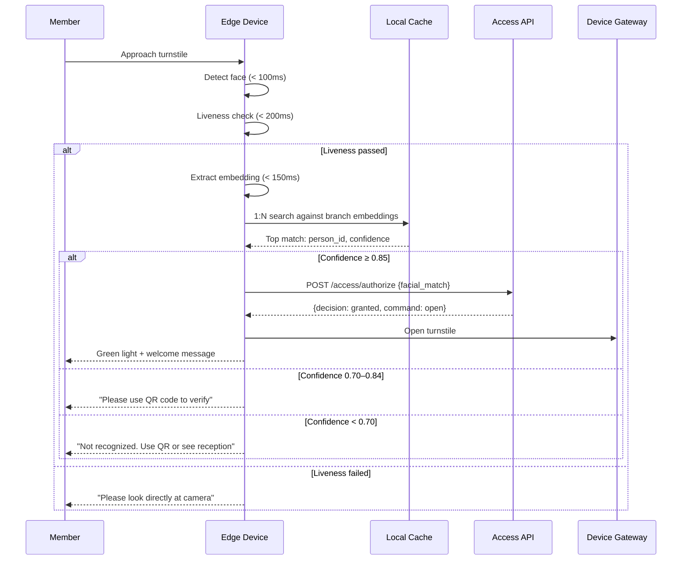
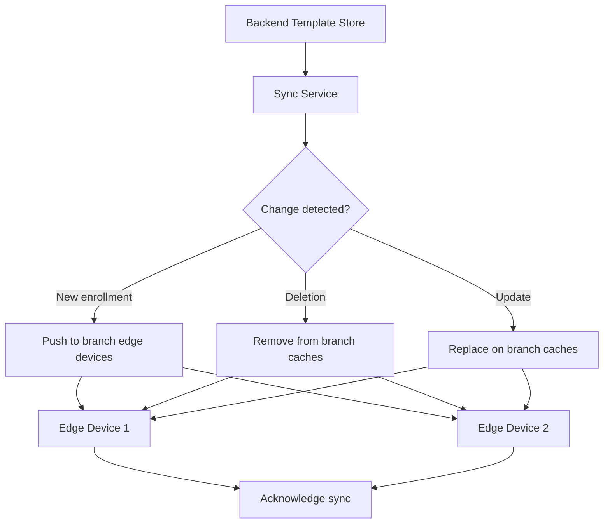
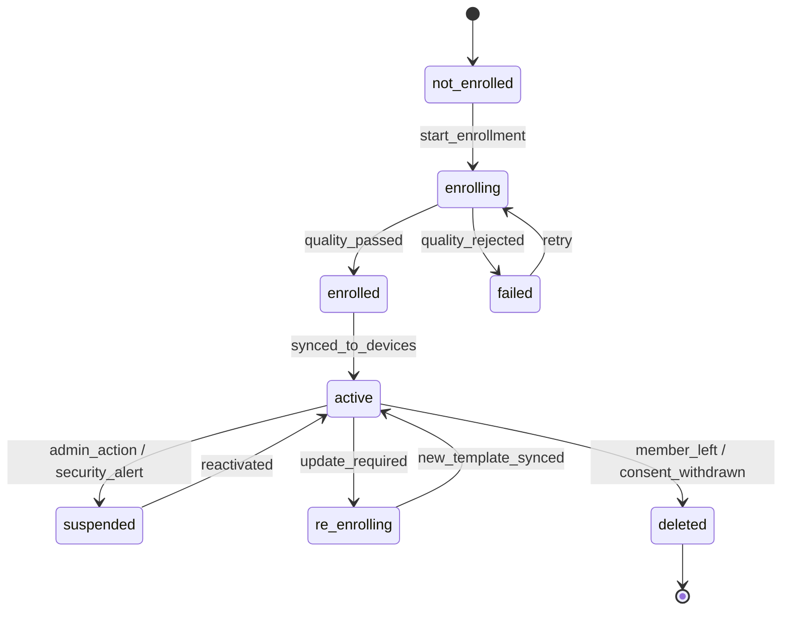

# 12 — Facial Recognition

## Overview

Facial recognition provides frictionless gym access by identifying members at entry points without physical tokens. The system uses an edge computing architecture where recognition happens on-device, and only match results (not raw biometric data) are sent to the backend.

## Architecture

```mermaid
graph TD
    subgraph Edge["Edge Device (per turnstile)"]
        CAM[Camera Module]
        GPU[Edge GPU / NPU]
        LIVE[Liveness Detector]
        EMB[Embedding Extractor]
        MATCH[1:N Matcher]
        CACHE[Local Embedding Cache]
    end
    subgraph Backend["PowerGym Backend"]
        API[Access API]
        BIO[Biometric Service]
        STORE[(Encrypted Template Store)]
        SYNC[Sync Service]
    end
    CAM --> LIVE
    LIVE --> EMB
    EMB --> MATCH
    CACHE --> MATCH
    MATCH --> API
    BIO --> STORE
    SYNC --> CACHE
    SYNC --> STORE
```



## Edge Device Specification

| Component | Requirement |
|-----------|------------|
| Camera | IR + RGB dual-sensor, 1080p minimum |
| Processor | NVIDIA Jetson Nano / Intel NCS2 equivalent |
| Liveness | 3D structured light or NIR-based |
| Storage | 32GB eMMC (encrypted at rest) |
| Network | Ethernet (primary) + WiFi (fallback) |
| Response time | < 500ms capture-to-decision |

## Enrollment Flow



### Enrollment Requirements

| Requirement | Value |
|-------------|-------|
| Minimum images | 3 (multi-angle) |
| Quality threshold | 0.7 (0–1 scale) |
| Liveness required | Yes (active challenge) |
| Consent required | Explicit opt-in with signature |
| Re-enrollment | Allowed every 6 months or on significant change |
| Staff authorization | Required to initiate enrollment |

## Recognition Flow



## Confidence Thresholds

| Threshold | Action | False Accept Rate |
|-----------|--------|-------------------|
| ≥ 0.95 | Auto-grant, no additional check | < 0.001% |
| 0.85 – 0.94 | Auto-grant (default threshold) | < 0.01% |
| 0.70 – 0.84 | Require secondary verification (QR) | < 0.1% |
| < 0.70 | Reject, manual verification needed | N/A |

Thresholds are configurable per branch and can be adjusted based on:
- Environmental conditions (lighting, camera quality)
- Security requirements (VIP areas vs. general access)
- Time of day (higher threshold at night)

## Liveness Detection

### Anti-Spoofing Methods

| Attack Vector | Detection Method |
|---------------|-----------------|
| Printed photo | 3D depth analysis (structured light) |
| Screen replay | Moiré pattern detection + IR reflection |
| Silicone mask | Skin texture analysis + thermal (optional) |
| Video deepfake | Temporal consistency + challenge-response |

### Active Liveness Challenge

```
Random selection from:
1. Blink detection (1-2 blinks within 3 seconds)
2. Head turn (slight left/right within 5 seconds)
3. Smile detection (within 3 seconds)
```

Challenge is randomized to prevent replay attacks.

## Template Storage & Sync

### Storage

| Property | Value |
|----------|-------|
| Template format | 512-dimensional float vector |
| Encryption | AES-256-GCM per template |
| Key management | Per-branch key, rotated monthly |
| Storage location | MySQL (backend) + Edge cache |
| Retention | Until member leaves + 30 days |
| Backup | Encrypted, separate from main DB backup |

### Edge Cache Sync



- Sync frequency: Real-time push + periodic full reconciliation (hourly)
- Cache size per device: Up to 10,000 templates (~20MB)
- Offline capability: Edge device works with last-synced cache for up to 24 hours

## Biometric Profile States



## Performance Metrics

| Metric | Target | Measurement |
|--------|--------|-------------|
| Detection time | < 100ms | Face detected in frame |
| Liveness check | < 200ms | Challenge completed |
| Embedding extraction | < 150ms | Vector computed |
| 1:N matching (10k templates) | < 50ms | Best match found |
| Total end-to-end | < 500ms | Face detected → decision |
| False Acceptance Rate (FAR) | < 0.01% | At threshold 0.85 |
| False Rejection Rate (FRR) | < 2% | At threshold 0.85 |

## API Endpoints

| Endpoint | Method | Permission | Description |
|----------|--------|-----------|-------------|
| `/api/v2/biometric/enroll` | POST | `staff+` | Start enrollment |
| `/api/v2/biometric/persons/:id/status` | GET | `self\|staff+` | Biometric status |
| `/api/v2/biometric/persons/:id/delete` | DELETE | `self\|admin+` | Delete template |
| `/api/v2/biometric/sync/status` | GET | `admin+` | Sync health status |
| `/api/v2/biometric/devices/:id/cache` | GET | `admin+` | Device cache info |
| `/api/v2/biometric/audit-log` | GET | `admin+` | Biometric audit trail |
