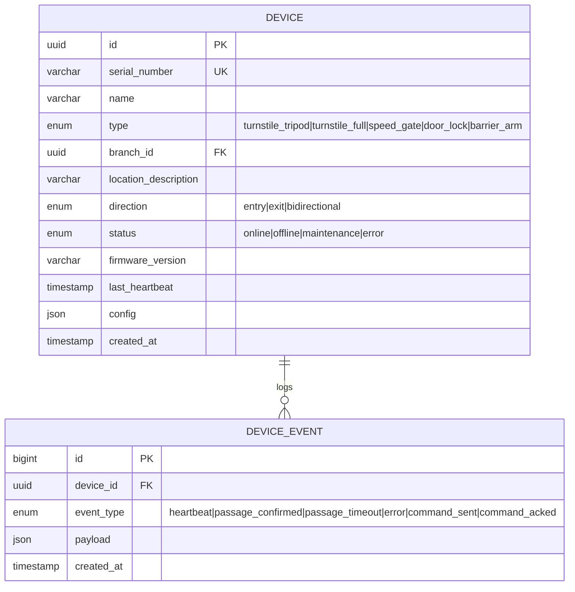
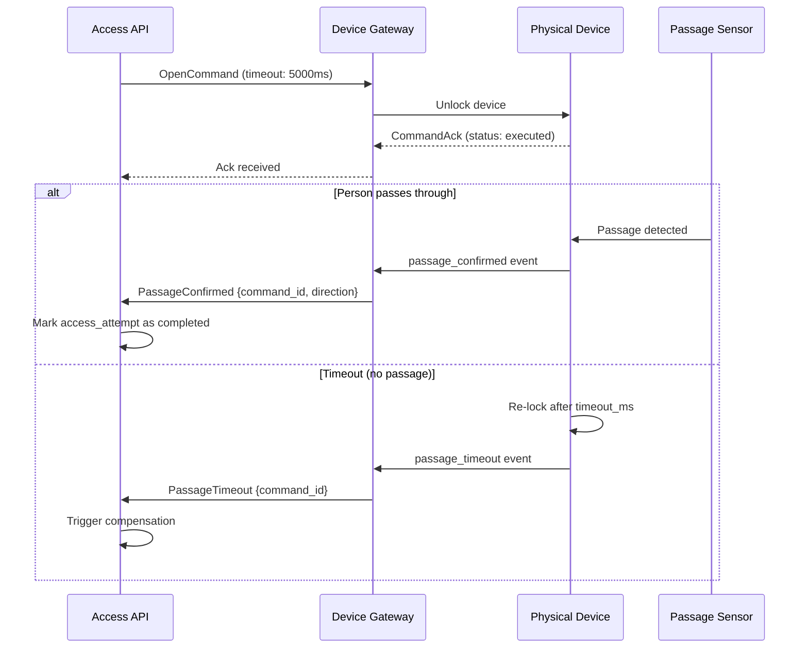
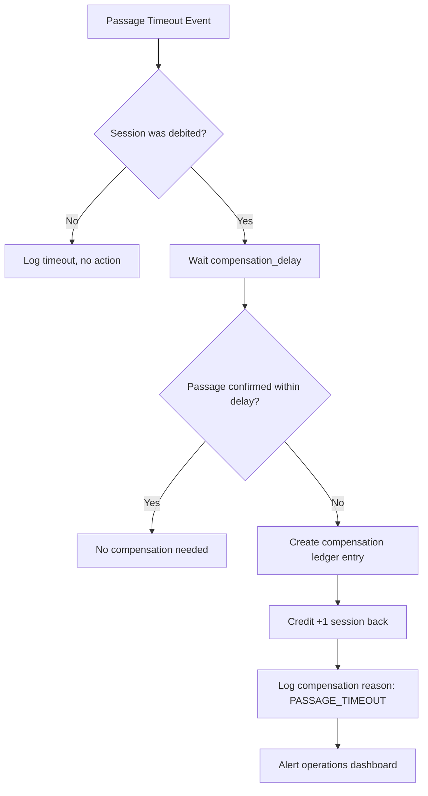
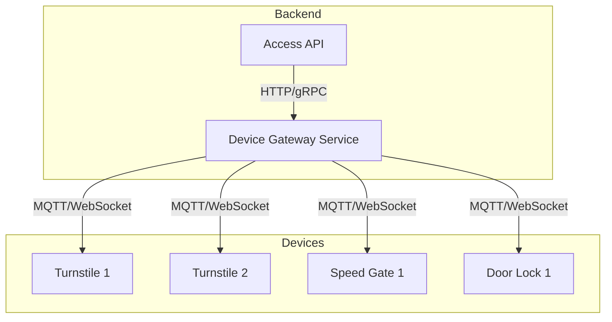

# 13 — Devices & Physical Passage

## Overview

This document defines the protocol between the PowerGym backend and physical access devices (turnstiles, gates, doors). It covers opening commands, passage confirmation, timeout handling, and compensation logic for failed passages.

## Device Types

| Type | Mechanism | Use Case |
|------|-----------|----------|
| `turnstile_tripod` | Rotating tripod arm | Main gym entrance |
| `turnstile_full` | Full-height rotation | High-security areas |
| `speed_gate` | Swing glass panels | Premium entrances |
| `door_lock` | Electric strike/mag lock | Staff areas, locker rooms |
| `barrier_arm` | Rising arm | Parking garage |

## Device Entity



## Command Protocol

### Opening Command

```typescript
interface OpenCommand {
  command_id: string;         // UUID, correlates with access_attempt
  device_id: string;
  action: 'open' | 'deny' | 'prompt';
  direction: 'entry' | 'exit';
  timeout_ms: number;         // How long device stays unlocked
  display: {
    message: string;          // "Welcome, Maria!" or "Access Denied"
    color: 'green' | 'red' | 'yellow';
    sound: 'success' | 'error' | 'attention' | 'none';
  };
  metadata: {
    person_name?: string;
    plan_name?: string;
    sessions_remaining?: number;
  };
}
```

### Command Acknowledgment

```typescript
interface CommandAck {
  command_id: string;
  device_id: string;
  status: 'received' | 'executed' | 'failed';
  error_code?: string;
  timestamp: string;
}
```

## Passage Confirmation Flow



## Passage Confirmation Contract

```typescript
interface PassageEvent {
  event_id: string;
  command_id: string;         // Correlates to opening command
  device_id: string;
  event_type: 'passage_confirmed' | 'passage_timeout' | 'tailgating_detected';
  direction: 'entry' | 'exit';
  person_count?: number;      // For tailgating detection
  timestamp: string;
}
```

## Timeout & Compensation

### Timeout Values

| Device Type | Default Timeout | Max Timeout |
|-------------|----------------|-------------|
| `turnstile_tripod` | 5,000ms | 10,000ms |
| `turnstile_full` | 7,000ms | 15,000ms |
| `speed_gate` | 4,000ms | 8,000ms |
| `door_lock` | 5,000ms | 30,000ms |
| `barrier_arm` | 10,000ms | 30,000ms |

### Compensation Logic

When a passage timeout occurs after session debit:



### Compensation Rules

| Scenario | Action | Automatic |
|----------|--------|-----------|
| Timeout, no passage | Refund session | Yes |
| Device error during open | Refund session | Yes |
| Tailgating detected | Flag for review | No |
| Multiple timeouts same person/day | Refund first, flag rest | Semi |
| Network failure (command not delivered) | No debit occurred, retry | Yes |

## Device Gateway

The device gateway is a lightweight service that maintains persistent connections to all devices.



### Communication Protocol

| Protocol | Use Case | QoS |
|----------|----------|-----|
| MQTT | Command delivery, events | QoS 1 (at least once) |
| WebSocket | Real-time dashboard status | Best effort |
| HTTP | Configuration, firmware updates | Reliable |

### Offline Handling

| Duration | Behavior |
|----------|----------|
| < 30 seconds | Queue commands, retry on reconnect |
| 30s – 5 minutes | Mark device as `offline`, alert staff |
| > 5 minutes | Redirect members to alternative device |
| > 1 hour | Escalate to maintenance team |

## Device Health Monitoring

```sql
-- Devices with no heartbeat in last 60 seconds
SELECT id, name, location_description, last_heartbeat
FROM devices
WHERE status = 'online'
  AND last_heartbeat < NOW() - INTERVAL 60 SECOND;
```

### Heartbeat Protocol

- Devices send heartbeat every 30 seconds
- Heartbeat includes: CPU temp, memory usage, queue depth, error count
- 2 missed heartbeats → mark offline
- 5 missed heartbeats → alert maintenance

## API Endpoints

| Endpoint | Method | Permission | Description |
|----------|--------|-----------|-------------|
| `/api/v2/devices` | GET | `admin+` | List all devices |
| `/api/v2/devices/:id` | GET | `staff+` | Device detail |
| `/api/v2/devices/:id/status` | GET | `staff+` | Real-time status |
| `/api/v2/devices/:id/command` | POST | `admin+` | Send manual command |
| `/api/v2/devices/:id/events` | GET | `admin+` | Event history |
| `/api/v2/devices/:id/maintenance` | POST | `admin+` | Toggle maintenance mode |
| `/api/v2/branches/:id/devices/health` | GET | `staff+` | Branch device overview |

## Tailgating Detection

| Method | Description |
|--------|-------------|
| IR beam count | Count bodies passing through beam break |
| Weight sensor | Detect multiple persons on platform |
| Camera analytics | Vision-based person counting |
| Time analysis | Abnormally long passage time |

When tailgating is detected:
1. Log event with person_count
2. Alert reception staff in real-time
3. Do NOT auto-debit additional sessions (manual resolution)
4. Capture photo evidence (if configured)
