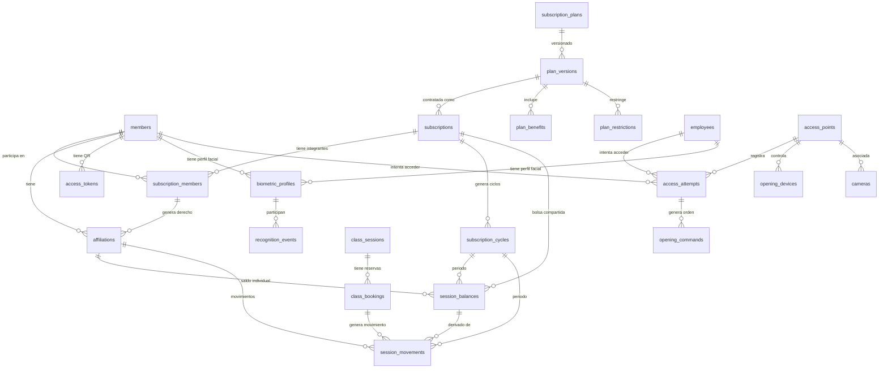

# 14 — Modelo de Datos

## ERD Principal

---

## Entidades Funcionales — Diccionario de Datos

### plan_versions (NUEVA)

| Campo | Tipo | Null | Descripción |
|-------|------|------|-------------|
| id | VARCHAR(64) | PK | Identificador único |
| plan_id | VARCHAR(64) | FK → subscription_plans.id | Plan padre |
| version_number | INT | NOT NULL | Secuencial por plan |
| name | VARCHAR(180) | NOT NULL | Nombre comercial |
| description | TEXT | NULL | Descripción |
| plan_type | VARCHAR(32) | NOT NULL | individual/family/group/corporate |
| price | DECIMAL(12,2) | NOT NULL | Precio |
| currency | VARCHAR(12) | NOT NULL DEFAULT 'USD' | Moneda |
| duration_days | INT | NOT NULL | Duración del plan |
| auto_renew | TINYINT(1) | NOT NULL DEFAULT 0 | Renovación automática |
| max_members | INT | NOT NULL DEFAULT 1 | Límite de integrantes |
| sessions_unlimited | TINYINT(1) | NOT NULL DEFAULT 1 | Sin límite de sesiones |
| sessions_per_cycle | INT | NULL | Sesiones por ciclo (si limitado) |
| cycle_frequency | VARCHAR(32) | NOT NULL DEFAULT 'monthly' | monthly/weekly/quarterly/plan_duration |
| distribution_model | VARCHAR(32) | NOT NULL DEFAULT 'individual' | shared/individual/custom |
| carryover_enabled | TINYINT(1) | NOT NULL DEFAULT 0 | Permite acumulación |
| carryover_max | INT | NULL | Máximo acumulable |
| carryover_expiry_days | INT | NULL | Caducidad de acumulados |
| extra_session_price | DECIMAL(12,2) | NULL | Precio por sesión adicional |
| consumption_priority | INT | NOT NULL DEFAULT 0 | Prioridad ante ambigüedad |
| prorate_enabled | TINYINT(1) | NOT NULL DEFAULT 0 | Prorrateo |
| grace_period_days | INT | NOT NULL DEFAULT 0 | Días de gracia |
| benefits | JSON | NULL | Servicios/zonas/sedes incluidas |
| restrictions | JSON | NULL | Horarios, zonas excluidas |
| booking_policy | JSON | NULL | Anticipación, cancelación, ausencia |
| status | VARCHAR(32) | NOT NULL DEFAULT 'active' | draft/active/archived |
| published_at | DATETIME | NULL | Fecha publicación |
| created_at | TIMESTAMP | NOT NULL | Creación |
| data | JSON | NULL | Extensible |

**PK**: id  
**UNIQUE**: (plan_id, version_number)  
**FK**: plan_id → subscription_plans(id)  
**Índices**: plan_id, status, plan_type

---

### subscriptions (NUEVA — reemplaza member_subscriptions gradualmente)

| Campo | Tipo | Null | Descripción |
|-------|------|------|-------------|
| id | VARCHAR(64) | PK | |
| plan_id | VARCHAR(64) | FK | Plan |
| plan_version_id | VARCHAR(64) | FK | Versión contratada (inmutable) |
| holder_member_id | VARCHAR(255) | FK → members.id | Titular |
| status | VARCHAR(32) | NOT NULL | pending/active/suspended/frozen/cancelled/expired |
| start_date | DATE | NOT NULL | Inicio |
| end_date | DATE | NOT NULL | Fin |
| auto_renew | TINYINT(1) | NOT NULL DEFAULT 0 | |
| price_paid | DECIMAL(12,2) | NOT NULL | Precio contratado |
| currency | VARCHAR(12) | NOT NULL DEFAULT 'USD' | |
| payment_status | VARCHAR(32) | NOT NULL DEFAULT 'pending' | pending/paid/overdue/refunded |
| max_members | INT | NOT NULL DEFAULT 1 | Límite integrantes |
| notes | TEXT | NULL | |
| created_at | TIMESTAMP | NOT NULL | |
| updated_at | TIMESTAMP | NOT NULL | |
| version | INT | NOT NULL DEFAULT 1 | Optimistic locking |
| legacy_subscription_id | VARCHAR(64) | NULL | Mapeo con member_subscriptions.id |
| data | JSON | NULL | |

**FK**: plan_version_id → plan_versions(id), holder_member_id → members(id)  
**Índices**: holder_member_id, status, plan_version_id, (status, end_date)

---

### subscription_members (NUEVA)

| Campo | Tipo | Null | Descripción |
|-------|------|------|-------------|
| id | VARCHAR(64) | PK | |
| subscription_id | VARCHAR(64) | FK | |
| member_id | VARCHAR(255) | FK → members.id | |
| role | VARCHAR(32) | NOT NULL DEFAULT 'beneficiary' | holder/admin/beneficiary |
| status | VARCHAR(32) | NOT NULL DEFAULT 'active' | active/inactive/removed |
| joined_at | DATETIME | NOT NULL | |
| left_at | DATETIME | NULL | |
| invited_by | VARCHAR(255) | NULL | |
| restrictions | JSON | NULL | Restricciones individuales |
| created_at | TIMESTAMP | NOT NULL | |
| updated_at | TIMESTAMP | NOT NULL | |

**UNIQUE**: (subscription_id, member_id, status) — evita duplicados activos  
**FK**: subscription_id → subscriptions(id), member_id → members(id)

---

### affiliations (NUEVA)

| Campo | Tipo | Null | Descripción |
|-------|------|------|-------------|
| id | VARCHAR(64) | PK | |
| member_id | VARCHAR(255) | FK → members.id | |
| subscription_id | VARCHAR(64) | FK → subscriptions.id | |
| subscription_member_id | VARCHAR(64) | FK | |
| plan_version_id | VARCHAR(64) | FK | Condiciones aplicables |
| status | VARCHAR(32) | NOT NULL | pending/active/suspended/frozen/cancelled/expired |
| role | VARCHAR(32) | NOT NULL DEFAULT 'beneficiary' | |
| is_primary | TINYINT(1) | NOT NULL DEFAULT 0 | Afiliación principal |
| start_date | DATE | NOT NULL | |
| end_date | DATE | NOT NULL | |
| benefits_override | JSON | NULL | Beneficios específicos |
| restrictions_override | JSON | NULL | Restricciones específicas |
| consumption_priority | INT | NOT NULL DEFAULT 0 | |
| created_at | TIMESTAMP | NOT NULL | |
| updated_at | TIMESTAMP | NOT NULL | |
| version | INT | NOT NULL DEFAULT 1 | |
| data | JSON | NULL | |

**FK**: member_id → members(id), subscription_id → subscriptions(id)  
**Índices**: member_id + status, subscription_id, (member_id, status, end_date)

---

### subscription_cycles (NUEVA)

| Campo | Tipo | Null | Descripción |
|-------|------|------|-------------|
| id | VARCHAR(64) | PK | |
| subscription_id | VARCHAR(64) | FK | |
| cycle_number | INT | NOT NULL | Secuencial |
| start_date | DATE | NOT NULL | Inicio del ciclo |
| end_date | DATE | NOT NULL | Fin del ciclo |
| status | VARCHAR(32) | NOT NULL | active/closed/pending |
| sessions_allocated | INT | NOT NULL DEFAULT 0 | Total asignado |
| sessions_carried_over | INT | NOT NULL DEFAULT 0 | Acumuladas |
| closed_at | DATETIME | NULL | |
| idempotency_key | VARCHAR(128) | NULL | Evita doble cierre |
| created_at | TIMESTAMP | NOT NULL | |

**UNIQUE**: (subscription_id, cycle_number), idempotency_key  
**FK**: subscription_id → subscriptions(id)

---

### session_balances (NUEVA)

| Campo | Tipo | Null | Descripción |
|-------|------|------|-------------|
| id | VARCHAR(64) | PK | |
| context_type | VARCHAR(32) | NOT NULL | affiliation/subscription (compartida) |
| context_id | VARCHAR(64) | NOT NULL | affiliation_id o subscription_id |
| cycle_id | VARCHAR(64) | FK → subscription_cycles.id | |
| included | INT | NOT NULL DEFAULT 0 | |
| carried_over | INT | NOT NULL DEFAULT 0 | |
| purchased | INT | NOT NULL DEFAULT 0 | |
| adjustments_positive | INT | NOT NULL DEFAULT 0 | |
| refunds | INT | NOT NULL DEFAULT 0 | |
| reserved | INT | NOT NULL DEFAULT 0 | |
| consumed | INT | NOT NULL DEFAULT 0 | |
| expired | INT | NOT NULL DEFAULT 0 | |
| adjustments_negative | INT | NOT NULL DEFAULT 0 | |
| available | INT | NOT NULL DEFAULT 0 | Proyección (calculado) |
| last_movement_id | VARCHAR(64) | NULL | Último movimiento procesado |
| updated_at | TIMESTAMP | NOT NULL | |
| version | INT | NOT NULL DEFAULT 1 | Optimistic locking |

**UNIQUE**: (context_type, context_id, cycle_id)  
**Índices**: cycle_id, context_id

---

### session_movements (NUEVA — LIBRO INMUTABLE)

| Campo | Tipo | Null | Descripción |
|-------|------|------|-------------|
| id | VARCHAR(64) | PK | |
| balance_id | VARCHAR(64) | FK → session_balances.id | |
| affiliation_id | VARCHAR(64) | FK → affiliations.id | |
| cycle_id | VARCHAR(64) | FK | |
| movement_type | VARCHAR(32) | NOT NULL | allocation/reservation/release/consumption/refund/purchase/carryover/expiration/adjustment_positive/adjustment_negative/compensation |
| quantity | INT | NOT NULL | Siempre positivo |
| direction | CHAR(1) | NOT NULL | '+' o '-' |
| balance_before | INT | NOT NULL | Saldo antes |
| balance_after | INT | NOT NULL | Saldo después |
| reference_type | VARCHAR(64) | NULL | class_booking/access_attempt/manual/system |
| reference_id | VARCHAR(64) | NULL | ID de la reserva, acceso, etc. |
| related_movement_id | VARCHAR(64) | NULL | Para compensaciones |
| reason | VARCHAR(512) | NULL | Motivo (obligatorio en ajustes) |
| performed_by | VARCHAR(255) | NULL | Operador |
| idempotency_key | VARCHAR(128) | NULL | |
| created_at | TIMESTAMP | NOT NULL | Inmutable |
| data | JSON | NULL | |

**UNIQUE**: idempotency_key (cuando no NULL)  
**Índices**: balance_id, affiliation_id, cycle_id, reference_type + reference_id, created_at  
**INMUTABLE**: No UPDATE, no DELETE sobre filas confirmadas.

---

### idempotency_keys (NUEVA)

| Campo | Tipo | Null | Descripción |
|-------|------|------|-------------|
| id | VARCHAR(128) | PK | La clave |
| operation | VARCHAR(64) | NOT NULL | Tipo de operación |
| result_status | INT | NOT NULL | HTTP status devuelto |
| result_body | JSON | NULL | Respuesta almacenada |
| created_at | TIMESTAMP | NOT NULL | |
| expires_at | DATETIME | NOT NULL | TTL |

**Índice**: expires_at (para limpieza)

---

### outbox_events (NUEVA)

| Campo | Tipo | Null | Descripción |
|-------|------|------|-------------|
| id | VARCHAR(64) | PK | |
| event_type | VARCHAR(64) | NOT NULL | |
| payload | JSON | NOT NULL | |
| status | VARCHAR(32) | NOT NULL DEFAULT 'pending' | pending/sent/failed |
| attempts | INT | NOT NULL DEFAULT 0 | |
| last_attempt_at | DATETIME | NULL | |
| created_at | TIMESTAMP | NOT NULL | |
| processed_at | DATETIME | NULL | |

**Índice**: status + created_at

---

### feature_flags (NUEVA)

| Campo | Tipo | Null | Descripción |
|-------|------|------|-------------|
| id | VARCHAR(64) | PK | |
| flag_key | VARCHAR(120) | NOT NULL UNIQUE | |
| enabled | TINYINT(1) | NOT NULL DEFAULT 0 | |
| scope | VARCHAR(32) | NOT NULL DEFAULT 'global' | global/branch/role/user |
| scope_value | VARCHAR(255) | NULL | |
| description | VARCHAR(512) | NULL | |
| created_at | TIMESTAMP | NOT NULL | |

---

## Entidades Biométricas y de Acceso

### biometric_profiles (NUEVA)

| Campo | Tipo | Null | Descripción | Sensibilidad |
|-------|------|------|-------------|--------------|
| id | VARCHAR(64) | PK | | Baja |
| person_type | VARCHAR(32) | NOT NULL | member/employee | Baja |
| person_id | VARCHAR(255) | NOT NULL | member_id o employee_id | Media |
| status | VARCHAR(32) | NOT NULL | pending/active/suspended/revoked | Baja |
| template_reference | VARCHAR(255) | NOT NULL | Referencia al servicio biométrico (NO la plantilla) | Alta |
| quality_score | DECIMAL(5,2) | NULL | Calidad del registro | Baja |
| enrolled_at | DATETIME | NOT NULL | | Baja |
| enrolled_by | VARCHAR(255) | NOT NULL | Operador | Baja |
| enrolled_at_branch | VARCHAR(120) | NULL | Sede | Baja |
| revoked_at | DATETIME | NULL | | Baja |
| revoked_by | VARCHAR(255) | NULL | | Baja |
| revocation_reason | VARCHAR(255) | NULL | | Baja |
| last_recognition_at | DATETIME | NULL | | Media |
| version | INT | NOT NULL DEFAULT 1 | | Baja |
| created_at | TIMESTAMP | NOT NULL | | Baja |

**Restricciones**: La plantilla real NO se almacena aquí. `template_reference` es un puntero al servicio biométrico aislado.  
**Cifrado**: `template_reference` cifrado en reposo.  
**Acceso**: Solo `biometrics.read_metadata` puede consultar; `biometrics.enroll` puede escribir.  
**Conservación**: Eliminación automática según `retention_policies`.

---

### biometric_consents (NUEVA)

| Campo | Tipo | Null | Descripción | Sensibilidad |
|-------|------|------|-------------|--------------|
| id | VARCHAR(64) | PK | | Baja |
| person_type | VARCHAR(32) | NOT NULL | | Baja |
| person_id | VARCHAR(255) | NOT NULL | | Media |
| consent_type | VARCHAR(64) | NOT NULL | facial_recognition/data_processing | Baja |
| granted | TINYINT(1) | NOT NULL | | Baja |
| granted_at | DATETIME | NULL | | Baja |
| withdrawn_at | DATETIME | NULL | | Baja |
| legal_basis | VARCHAR(120) | NULL | | Baja |
| purpose | TEXT | NULL | | Baja |
| recorded_by | VARCHAR(255) | NOT NULL | | Baja |
| ip_address | VARCHAR(128) | NULL | | Media |
| created_at | TIMESTAMP | NOT NULL | | Baja |

---

### access_points (NUEVA)

| Campo | Tipo | Null | Descripción |
|-------|------|------|-------------|
| id | VARCHAR(64) | PK | |
| name | VARCHAR(180) | NOT NULL | |
| branch | VARCHAR(120) | NOT NULL | Sede |
| zone | VARCHAR(120) | NULL | Zona del gimnasio |
| direction | VARCHAR(16) | NOT NULL DEFAULT 'entry' | entry/exit/bidirectional |
| access_methods | JSON | NOT NULL | ["qr","facial","manual"] |
| status | VARCHAR(32) | NOT NULL DEFAULT 'active' | |
| created_at | TIMESTAMP | NOT NULL | |

---

### access_attempts (NUEVA/EXTENSIÓN)

| Campo | Tipo | Null | Descripción |
|-------|------|------|-------------|
| id | VARCHAR(64) | PK | |
| access_point_id | VARCHAR(64) | FK | |
| person_type | VARCHAR(32) | NULL | member/employee/visitor/unknown |
| person_id | VARCHAR(255) | NULL | |
| method | VARCHAR(32) | NOT NULL | qr/facial/manual |
| decision | VARCHAR(32) | NOT NULL | authorized/denied/ambiguous/error |
| denial_reason | VARCHAR(120) | NULL | |
| affiliation_id | VARCHAR(64) | NULL | Afiliación usada |
| movement_id | VARCHAR(64) | NULL | Movimiento generado |
| confidence_score | DECIMAL(5,4) | NULL | Solo para facial |
| idempotency_key | VARCHAR(128) | NULL | |
| request_id | VARCHAR(80) | NULL | |
| created_at | TIMESTAMP | NOT NULL | |
| data | JSON | NULL | Contexto adicional |

**UNIQUE**: idempotency_key  
**Prohibido**: No almacenar plantillas, embeddings ni imágenes en esta tabla.

---

### opening_commands (NUEVA)

| Campo | Tipo | Null | Descripción |
|-------|------|------|-------------|
| id | VARCHAR(64) | PK | |
| access_attempt_id | VARCHAR(64) | FK | |
| device_id | VARCHAR(64) | FK → opening_devices.id | |
| status | VARCHAR(32) | NOT NULL | pending/sent/confirmed/failed/expired |
| expires_at | DATETIME | NOT NULL | Vigencia corta (5-10s) |
| sent_at | DATETIME | NULL | |
| confirmed_at | DATETIME | NULL | |
| retry_count | INT | NOT NULL DEFAULT 0 | |
| idempotency_key | VARCHAR(128) | NOT NULL | |
| created_at | TIMESTAMP | NOT NULL | |

**UNIQUE**: idempotency_key

---

## Compatibilidad con tablas existentes

| Tabla actual | Acción | Notas |
|--------------|--------|-------|
| subscription_plans | MANTENER | Se añade FK desde plan_versions |
| member_subscriptions | MANTENER (lectura) | Se migra a subscriptions+affiliations. Lectura dual durante transición |
| members | MANTENER | Sin cambios en estructura |
| class_bookings | MANTENER | Se añade campo `movement_id` nullable |
| access_tokens | MANTENER | QR sigue funcionando igual |
| class_sessions | MANTENER | Sin cambios |
| private_sessions | MANTENER | Sin cambios |
| invoices | MANTENER | Se vincula con subscriptions |

---

## Nota sobre saldo compartido vs individual

- **Bolsa compartida**: `session_balances.context_type = 'subscription'`, `context_id = subscription.id`
- **Saldo individual**: `session_balances.context_type = 'affiliation'`, `context_id = affiliation.id`
- Un ciclo puede tener AMBOS si el plan lo configura (ej: 80 sesiones compartidas + 5 sesiones personales por integrante).
