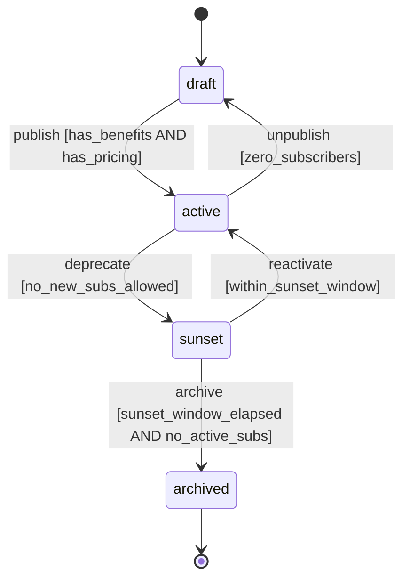
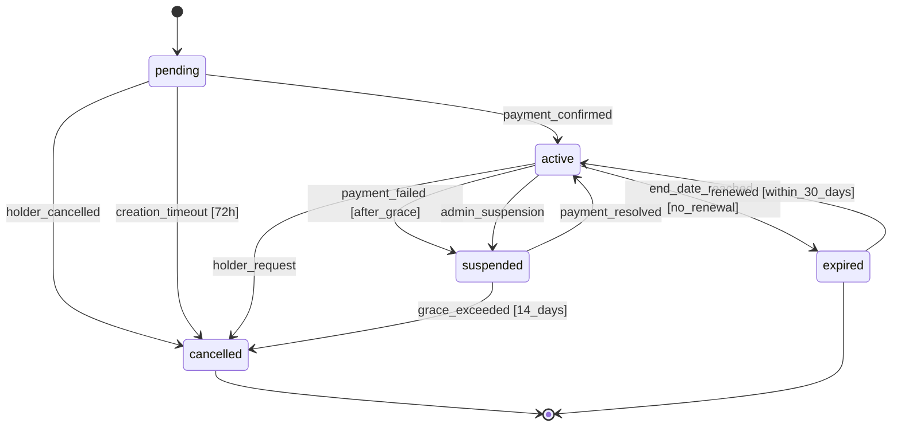
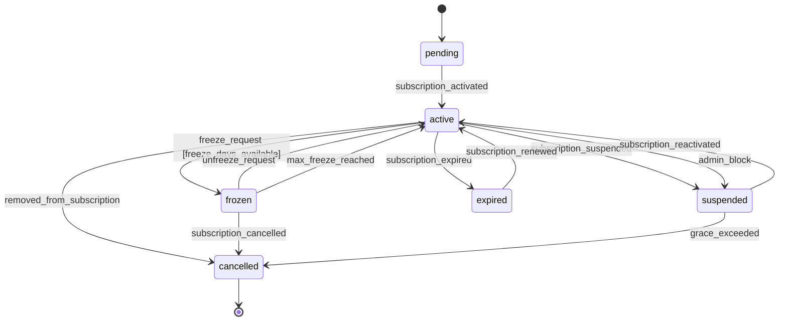
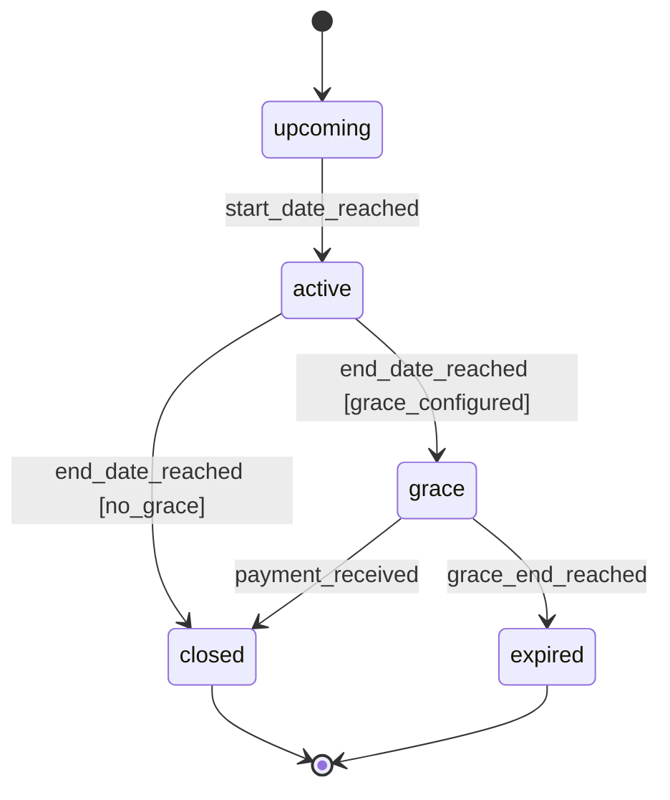
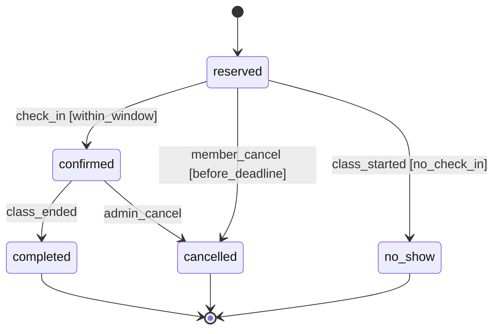
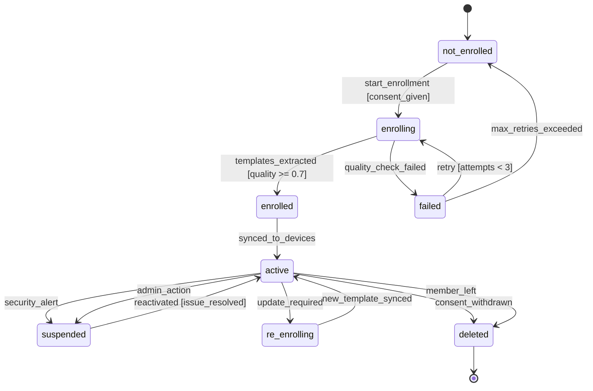
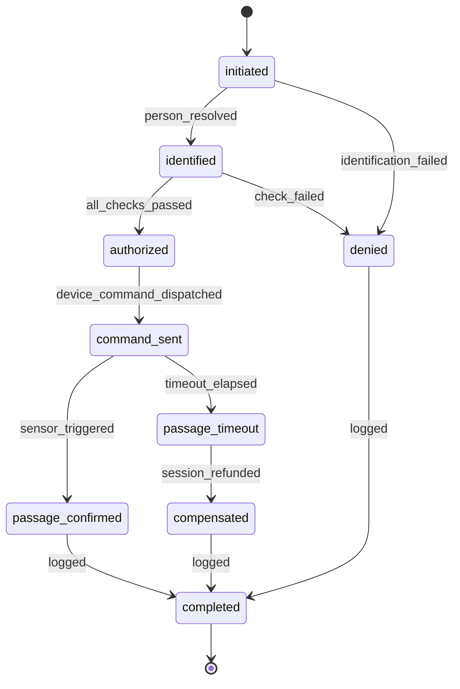
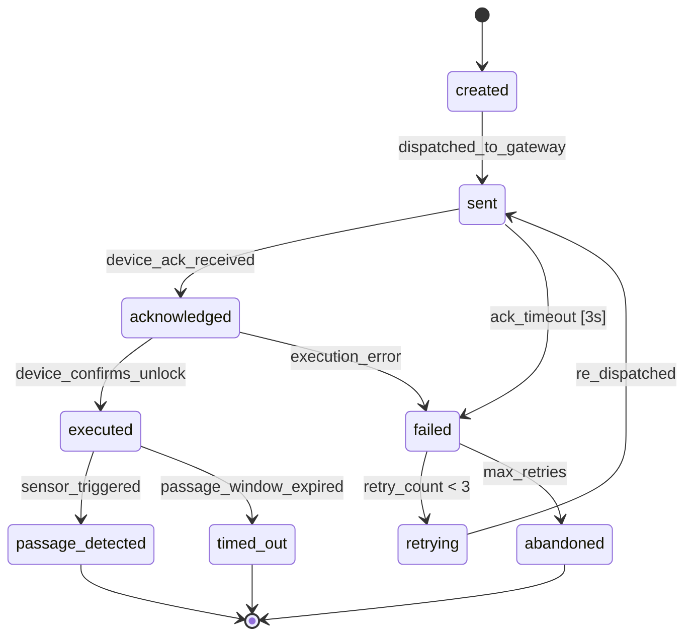

# 15 — State Machines

## Overview

This document defines the formal state machines for all major entities in the PowerGym evolution. Each state machine specifies valid states, transitions, guards (conditions), and side effects.

## 1. Plan State Machine



| Transition | Guard | Side Effect |
|-----------|-------|-------------|
| `publish` | Benefits configured, pricing set | Emit `plan.published`, visible to members |
| `deprecate` | At least one active version exists | Emit `plan.sunset`, notify current subs |
| `archive` | 30+ days in sunset, no active subscriptions | Emit `plan.archived`, remove from catalog |
| `unpublish` | No subscribers on this version | Return to editable state |
| `reactivate` | Within sunset window (30 days) | Emit `plan.reactivated`, re-list in catalog |

## 2. Subscription State Machine



| Transition | Guard | Side Effect |
|-----------|-------|-------------|
| `payment_confirmed` | Valid payment reference | Create first cycle, activate affiliations |
| `holder_cancelled` | Holder identity verified | Expire sessions, notify beneficiaries |
| `payment_failed` | Grace period (7 days) elapsed | Suspend all affiliations, notify holder |
| `admin_suspension` | Admin has permission | Suspend all affiliations, log reason |
| `payment_resolved` | Payment received | Reactivate affiliations, resume cycle |
| `renewed` | Within 30-day renewal window | Create new cycle, credit sessions |

## 3. Affiliation State Machine



| Transition | Guard | Side Effect |
|-----------|-------|-------------|
| `freeze_request` | Freeze days remaining > 0, cooldown elapsed | Pause session consumption, pause billing |
| `unfreeze_request` | Currently frozen | Resume access, recalculate remaining days |
| `removed_from_subscription` | Not the holder | Forfeit remaining sessions |

## 4. Cycle State Machine



| Transition | Guard | Side Effect |
|-----------|-------|-------------|
| `start_date_reached` | Automatic (scheduler) | Credit sessions to ledger |
| `end_date_reached` | Automatic (scheduler) | Process carryover/expiration |
| `payment_received` | Payment confirmed during grace | Normal close, create next cycle |
| `grace_end_reached` | No payment after grace days | Expire sessions, suspend subscription |

## 5. Booking State Machine



| Transition | Guard | Side Effect |
|-----------|-------|-------------|
| `reserved` | Sessions available, within booking limit | Debit session (hold) |
| `member_cancel` | > 4h before class start | Refund session |
| `no_show` | 15 min after class start, not checked in | Apply no-show penalty |
| `confirmed` | Member present at class | No additional debit |
| `admin_cancel` | Admin permission | Refund session |

## 6. Biometric Profile State Machine



| Transition | Guard | Side Effect |
|-----------|-------|-------------|
| `start_enrollment` | Written consent on file | Initialize enrollment session |
| `templates_extracted` | 3 quality images, quality ≥ 0.7 | Store encrypted template |
| `synced_to_devices` | All branch devices acknowledge | Enable facial access |
| `security_alert` | Suspicious activity detected | Disable facial, notify security |
| `consent_withdrawn` | Member request | Delete all templates, purge cache |

## 7. Access Attempt State Machine



| Transition | Guard | Side Effect |
|-----------|-------|-------------|
| `person_resolved` | Valid identification (QR/face/manual) | Load person affiliations |
| `all_checks_passed` | Pipeline validation passed | Debit session from ledger |
| `device_command_dispatched` | Device online, ack received | Start passage timer |
| `passage_confirmed` | Sensor detects passage | Mark attempt successful |
| `passage_timeout` | No sensor event within timeout_ms | Trigger compensation |
| `session_refunded` | Timeout confirmed | Credit session back |

## 8. Opening Command State Machine



| Transition | Guard | Side Effect |
|-----------|-------|-------------|
| `dispatched_to_gateway` | Device marked online | Start ack timer (3s) |
| `device_ack_received` | Valid ack from device | Clear ack timer |
| `device_confirms_unlock` | Mechanism unlocked | Start passage timer |
| `passage_window_expired` | No passage within timeout_ms | Re-lock device, start compensation |
| `max_retries` | 3 failed attempts | Alert staff, offer alternative device |

## State Persistence

All state machines persist their current state and transition history:

```sql
CREATE TABLE state_transitions (
    id BIGINT AUTO_INCREMENT PRIMARY KEY,
    entity_type ENUM('plan','subscription','affiliation','cycle','booking','biometric_profile','access_attempt','opening_command'),
    entity_id VARCHAR(36) NOT NULL,
    from_state VARCHAR(30),
    to_state VARCHAR(30) NOT NULL,
    event VARCHAR(50) NOT NULL,
    actor_id VARCHAR(36),
    metadata JSON,
    created_at TIMESTAMP DEFAULT CURRENT_TIMESTAMP,
    INDEX idx_entity (entity_type, entity_id, created_at)
) ENGINE=InnoDB;
```
