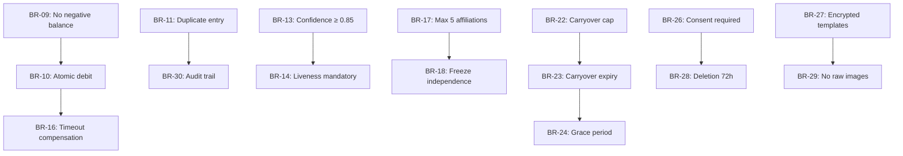

# 16 — Business Rules

## Overview

This document enumerates the 30 mandatory business rules that the evolved PowerGym system must enforce. Each rule has an ID, description, enforcement point, and consequence of violation.

## Rules Catalog

### Subscription & Plan Rules

| ID | Rule | Enforcement | Violation Consequence |
|----|------|-------------|----------------------|
| BR-01 | A person can hold at most 3 subscriptions simultaneously | `POST /subscriptions` validation | Reject creation with 409 |
| BR-02 | A person can be beneficiary in at most 5 subscriptions simultaneously | `POST /subscriptions/:id/members` | Reject addition with 409 |
| BR-03 | The holder role is unique per subscription (exactly 1) | Subscription creation | Reject if holder missing or duplicate |
| BR-04 | Only active plans can receive new subscriptions | Subscription creation | Reject with 422 if plan is sunset/archived |
| BR-05 | Subscription member count cannot exceed plan's `max_beneficiaries` | Member addition | Reject with 422, suggest upgrade |
| BR-06 | A person cannot appear in the same subscription twice | Member addition | Reject with 409 |
| BR-07 | Plan version is immutable once any subscription references it | Plan edit attempt | Reject edit, require new version |
| BR-08 | Sunset plans must remain accessible for 30 days minimum | Archive attempt | Block archive until window elapsed |

### Session & Access Rules

| ID | Rule | Enforcement | Violation Consequence |
|----|------|-------------|----------------------|
| BR-09 | Session balance cannot go negative | Debit operation | Deny access with `insufficient_sessions` |
| BR-10 | A debit must be atomic (lock → check → debit → commit) | Transaction boundary | Use SELECT FOR UPDATE, retry on deadlock |
| BR-11 | Duplicate entry prevention: no two entries without an exit within 12h | Access authorization | Deny with `duplicate_entry` |
| BR-12 | Access is denied if all affiliations for a person are non-active | Access authorization | Deny with `no_active_affiliation` |
| BR-13 | Facial recognition requires confidence ≥ 0.85 for auto-grant | Access authorization | Require secondary verification below threshold |
| BR-14 | Liveness check is mandatory for facial recognition access | Access authorization | Deny with `liveness_failed` |
| BR-15 | Manual override requires documented reason and operator permission | Access override | Log reason, flag if reason missing |
| BR-16 | Passage timeout triggers automatic session compensation | Compensation logic | Credit back within 30 seconds |

### Affiliation Rules

| ID | Rule | Enforcement | Violation Consequence |
|----|------|-------------|----------------------|
| BR-17 | Maximum 5 active affiliations per person | Affiliation activation | Reject newest affiliation activation |
| BR-18 | Freezing an affiliation does not affect other affiliations | Freeze operation | Only target affiliation state changes |
| BR-19 | Freeze cooldown: 60 days between freezes on same affiliation | Freeze request | Reject with 422, show next available date |
| BR-20 | Maximum freeze duration is plan-defined (default 30 days) | Freeze request | Auto-unfreeze at max date |
| BR-21 | Global person block suspends ALL affiliations | Admin block | Cascade suspension across all affiliations |

### Cycle & Billing Rules

| ID | Rule | Enforcement | Violation Consequence |
|----|------|-------------|----------------------|
| BR-22 | Carryover cannot exceed 50% of cycle allocation or 10 sessions (whichever is lower) | Cycle close | Expire excess, carry allowed amount |
| BR-23 | Carried-over sessions expire 30 days into new cycle if unused | Daily scheduler | Write expiration ledger entry |
| BR-24 | Grace period is 7 days after cycle end before suspension | Cycle state machine | Access limited during grace |
| BR-25 | Renewal window: 30 days after expiration to renew without losing history | Renewal attempt | After 30 days, treated as new subscription |

### Security & Biometric Rules

| ID | Rule | Enforcement | Violation Consequence |
|----|------|-------------|----------------------|
| BR-26 | Biometric enrollment requires explicit written consent | Enrollment flow | Block enrollment without consent flag |
| BR-27 | Biometric templates must be encrypted at rest (AES-256-GCM) | Storage layer | Fail deployment audit without encryption |
| BR-28 | Template deletion on consent withdrawal must complete within 72 hours | Deletion request | Compliance violation if delayed |
| BR-29 | Edge devices must not store raw facial images (only embeddings) | Edge architecture | Purge raw captures after processing |
| BR-30 | All access decisions must be logged with full audit trail | Access motor | Every attempt creates `access_attempts` record |

## Rule Interaction Matrix



## Enforcement Strategy

| Layer | Rules Enforced |
|-------|---------------|
| API Validation (Zod schemas) | BR-01 through BR-08 (input validation) |
| Service Layer (business logic) | BR-09 through BR-25 (domain logic) |
| Database Constraints | BR-03, BR-06, BR-09 (unique, check constraints) |
| Infrastructure | BR-27, BR-29 (encryption, storage policies) |
| Compliance Monitoring | BR-26, BR-28, BR-30 (audit jobs) |

## Rule Configuration

Some rules have configurable parameters stored in `system_config`:

```json
{
  "BR-01_max_holder_subscriptions": 3,
  "BR-02_max_beneficiary_subscriptions": 5,
  "BR-05_strict_enforcement": true,
  "BR-11_duplicate_entry_window_hours": 12,
  "BR-13_facial_confidence_threshold": 0.85,
  "BR-19_freeze_cooldown_days": 60,
  "BR-20_default_max_freeze_days": 30,
  "BR-22_max_carryover_sessions": 10,
  "BR-22_max_carryover_percentage": 50,
  "BR-23_carryover_expiry_days": 30,
  "BR-24_grace_period_days": 7,
  "BR-25_renewal_window_days": 30,
  "BR-28_deletion_deadline_hours": 72
}
```

## Audit & Compliance

Every rule violation is logged in `business_rule_violations`:

```sql
CREATE TABLE business_rule_violations (
    id BIGINT AUTO_INCREMENT PRIMARY KEY,
    rule_id VARCHAR(10) NOT NULL,
    entity_type VARCHAR(50) NOT NULL,
    entity_id VARCHAR(36),
    actor_id VARCHAR(36),
    context JSON,
    outcome ENUM('blocked', 'warning', 'override') NOT NULL,
    created_at TIMESTAMP DEFAULT CURRENT_TIMESTAMP,
    INDEX idx_rule_date (rule_id, created_at)
) ENGINE=InnoDB;
```
