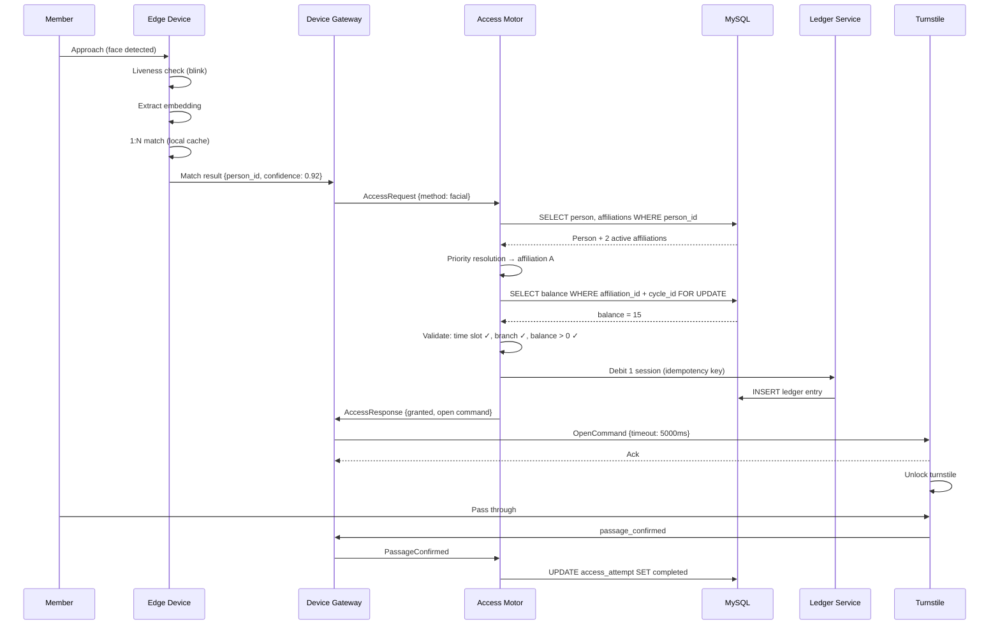
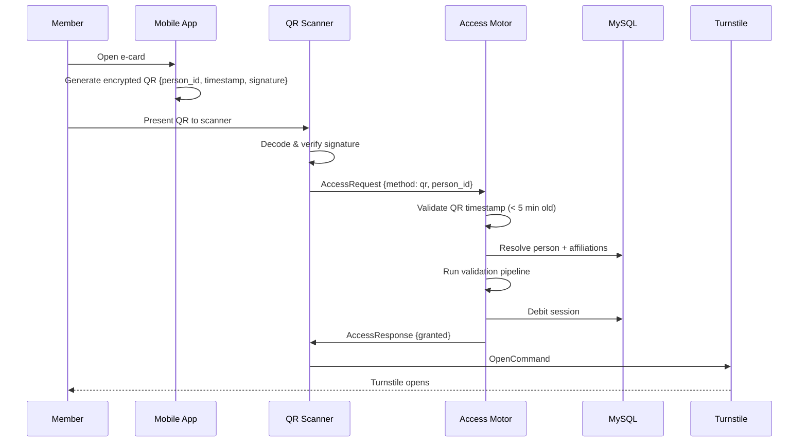
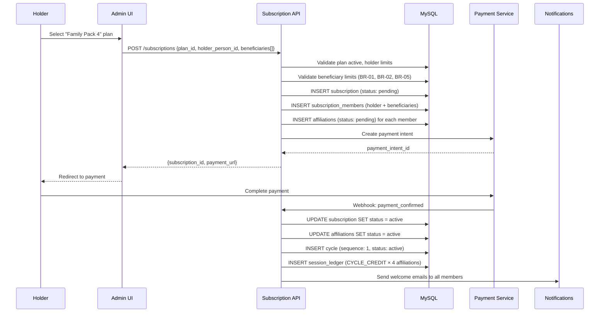
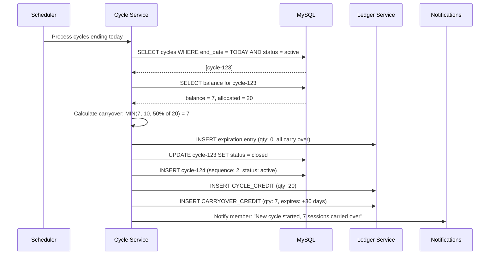
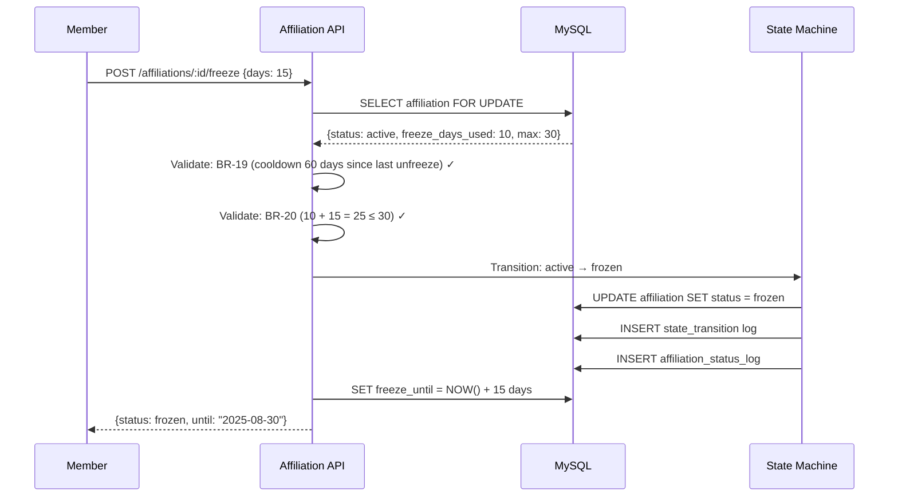
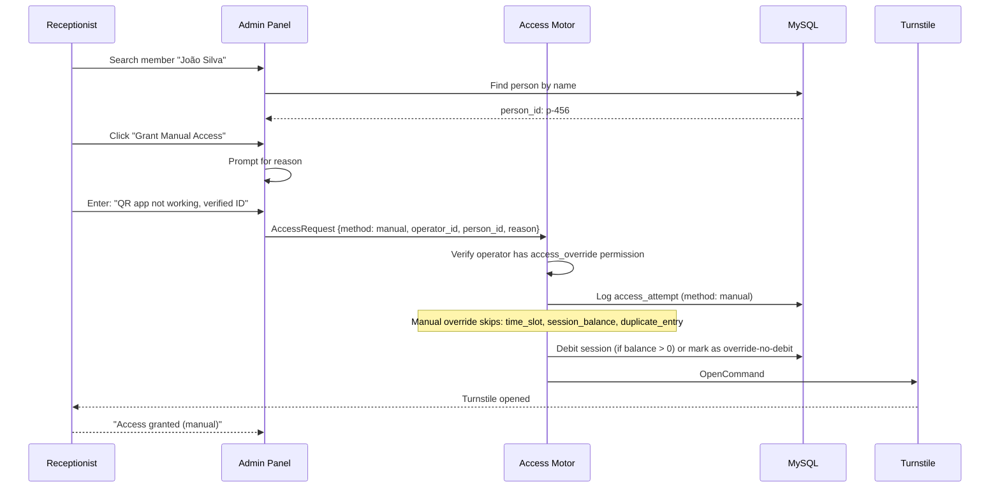
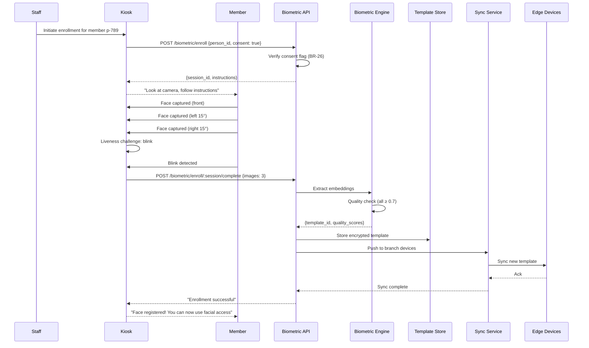
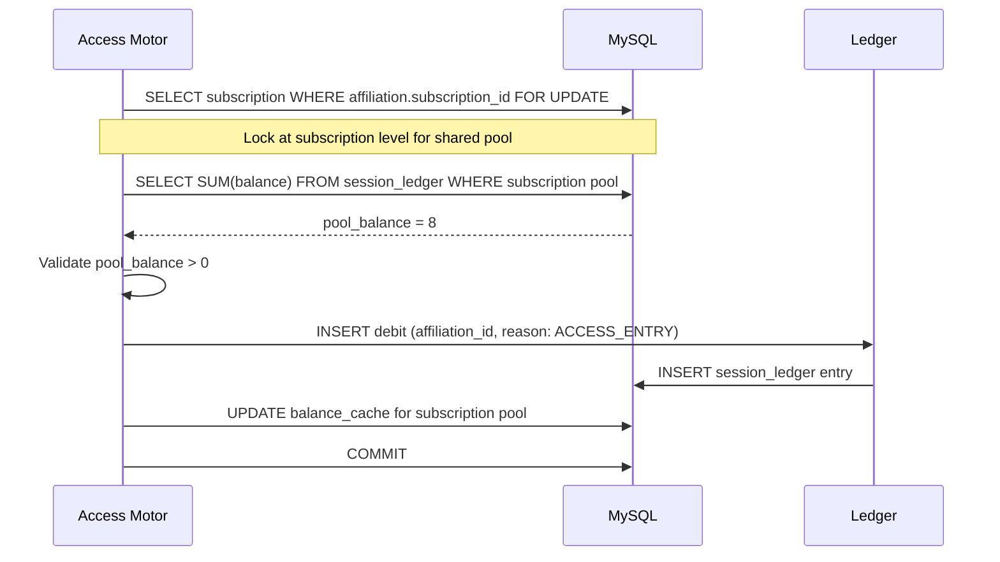
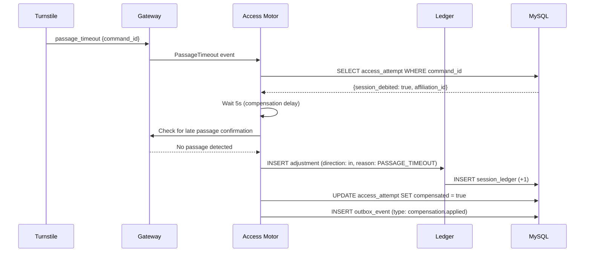
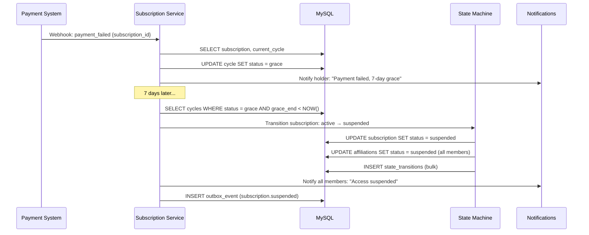

# 17 — Key Flows (Sequence Diagrams)

## Overview

This document provides Mermaid sequence diagrams for the most critical user and system flows in the evolved PowerGym system.

## 1. Member Access via Facial Recognition

## 2. Member Access via QR Code

## 3. Family Plan Subscription Creation

## 4. Cycle Renewal with Carryover

## 5. Affiliation Freeze

## 6. Manual Override Access

## 7. Biometric Enrollment

## 8. Shared Pool Session Debit

## 9. Passage Timeout Compensation

## 10. Subscription Suspension on Payment Failure

