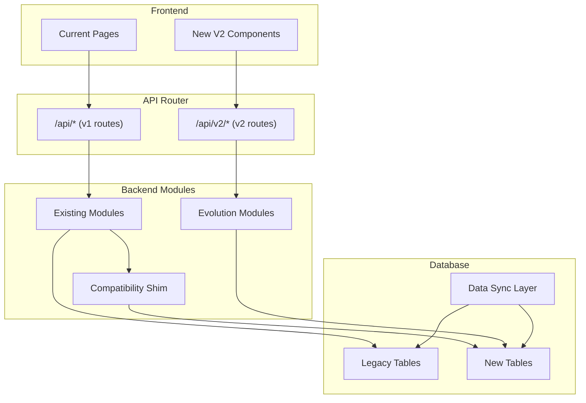
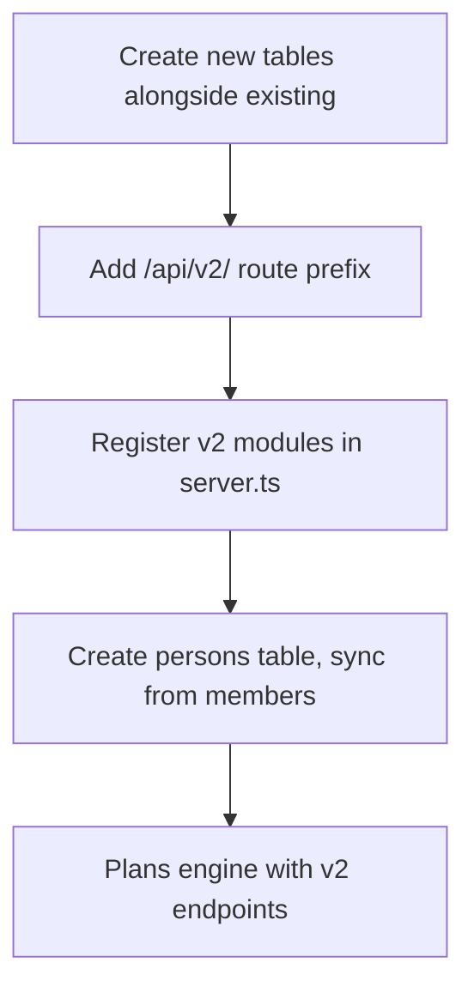
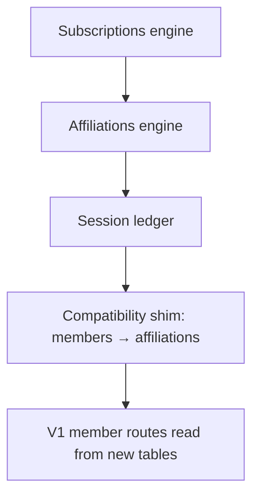
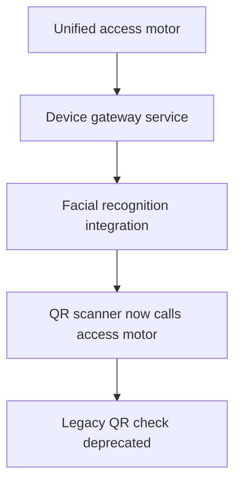
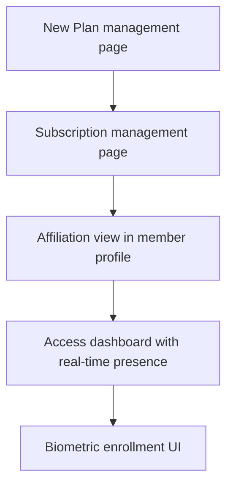

# 19 — Integration with Existing Code

## Overview

The evolution adopts the **Strangler Fig Pattern** to progressively replace the existing monolithic system without a big-bang rewrite. New functionality lives in `/api/v2/` routes while existing `/api/` routes continue to operate until migrated.

## Strangler Pattern Architecture



## Existing Module Mapping

| Existing File | Function | Evolution Target |
|--------------|----------|-----------------|
| `server/modules/index.ts` | Route registration | Add v2 module registration |
| `server/rbac.ts` | Role-based access | Extend with subscription roles |
| `server/modules/members.ts` | Member CRUD | Bridge to `persons` + `affiliations` |
| `server/modules/plans.ts` | Simple plan list | Replace with plan engine |
| `src/pages/QRScanner.tsx` | QR-only access | Unified access UI |
| `src/pages/Members.tsx` | Member management | Add affiliation views |
| `src/pages/Plans.tsx` | Plan display | Plan configuration UI |
| `src/lib/membershipApi.ts` | Membership API client | Add v2 API client layer |

## Integration Phases

### Phase 1: Foundation (Non-Breaking)



Changes to existing code:
- `server.ts`: Add v2 module registration call
- `server/modules/index.ts`: Register evolution modules
- No changes to existing v1 routes

### Phase 2: Subscriptions & Affiliations



Shim layer:
```typescript
// server/compat/memberBridge.ts
export async function getMemberStatus(memberId: string, pool: Pool) {
  // First try new model
  const affiliations = await getActiveAffiliations(memberId, pool);
  if (affiliations.length > 0) {
    return { status: 'active', source: 'v2' };
  }
  // Fallback to legacy
  const [rows] = await pool.query('SELECT status FROM members WHERE id = ?', [memberId]);
  return { status: rows[0]?.status || 'inactive', source: 'v1' };
}
```

### Phase 3: Access Control



QR Scanner migration:
- Current: `QRScanner.tsx` → `/api/members/:id` (status check)
- New: `QRScanner.tsx` → `/api/v2/access/authorize` (full validation)
- Transition: Feature flag `USE_V2_ACCESS=true` switches behavior

### Phase 4: UI Migration



## Feature Flags

```typescript
// server/featureFlags.ts
export const FEATURE_FLAGS = {
  USE_V2_PLANS: process.env.FF_V2_PLANS === 'true',
  USE_V2_ACCESS: process.env.FF_V2_ACCESS === 'true',
  USE_V2_SUBSCRIPTIONS: process.env.FF_V2_SUBSCRIPTIONS === 'true',
  FACIAL_RECOGNITION_ENABLED: process.env.FF_FACIAL === 'true',
  SESSION_LEDGER_ENABLED: process.env.FF_SESSION_LEDGER === 'true',
};
```

## Server.ts Integration Point

```typescript
// In server.ts startServer() function, after existing module registration:

import { registerEvolutionModules } from "./server/evolution/modules";

// After: registerApplicationRouteModules(app, () => pool, { apiCache });
registerEvolutionModules(app, () => pool, {
  apiCache,
  featureFlags: FEATURE_FLAGS,
});
```

## New Directory Structure

```
server/
├── modules/              (existing v1 modules)
├── evolution/
│   ├── modules.ts        (v2 route registration)
│   ├── plans/
│   │   ├── routes.ts
│   │   ├── service.ts
│   │   └── validation.ts
│   ├── subscriptions/
│   │   ├── routes.ts
│   │   ├── service.ts
│   │   └── validation.ts
│   ├── affiliations/
│   │   ├── routes.ts
│   │   ├── service.ts
│   │   └── stateMachine.ts
│   ├── access/
│   │   ├── routes.ts
│   │   ├── motor.ts
│   │   ├── pipeline.ts
│   │   └── deviceGateway.ts
│   ├── ledger/
│   │   ├── routes.ts
│   │   ├── service.ts
│   │   └── balanceCache.ts
│   ├── biometric/
│   │   ├── routes.ts
│   │   ├── service.ts
│   │   └── syncService.ts
│   ├── cycles/
│   │   ├── routes.ts
│   │   ├── service.ts
│   │   └── scheduler.ts
│   └── compat/
│       ├── memberBridge.ts
│       └── planBridge.ts
```

## Database Coexistence

| Legacy Table | New Table(s) | Sync Strategy |
|-------------|-------------|---------------|
| `members` | `persons`, `affiliations` | Write-through on member create/update |
| `plans` (flat) | `plans` (versioned) | One-time migration + v2 engine |
| None | `subscriptions` | New, no legacy equivalent |
| None | `session_ledger` | New, no legacy equivalent |
| None | `access_attempts` | New, replaces simple QR log |
| None | `devices` | New, no legacy equivalent |
| `audit_logs` | `audit_logs` + `state_transitions` | Existing table preserved, new one added |

## RBAC Extension

Current roles: `super_admin`, `admin`, `manager`, `trainer`, `receptionist`, `staff`, `client`

New permission contexts:
```typescript
// server/evolution/rbac-extension.ts
export const V2_PERMISSIONS = {
  // Existing system roles still work
  ...EXISTING_PERMISSIONS,
  
  // New subscription-context permissions
  'subscription.holder': ['manage_members', 'view_billing', 'cancel'],
  'subscription.admin': ['manage_members', 'view_billing'],
  'subscription.beneficiary': ['view_own', 'book_classes'],
  
  // New system permissions
  'access.override': ['receptionist', 'manager', 'admin', 'super_admin'],
  'biometric.enroll': ['receptionist', 'manager', 'admin', 'super_admin'],
  'device.manage': ['admin', 'super_admin'],
};
```

## Rollback Safety

Each phase can be rolled back independently:
- **Feature flags** disable new behavior instantly
- **Database tables** are additive (never alter existing tables in early phases)
- **API versioning** allows v1 and v2 to coexist indefinitely
- **Shim layer** ensures v1 reads can pull from either source
