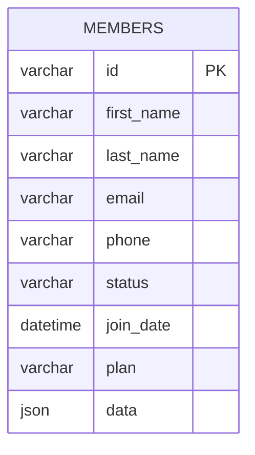
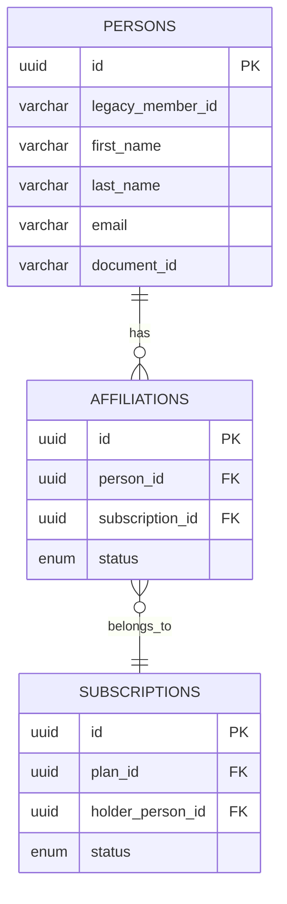
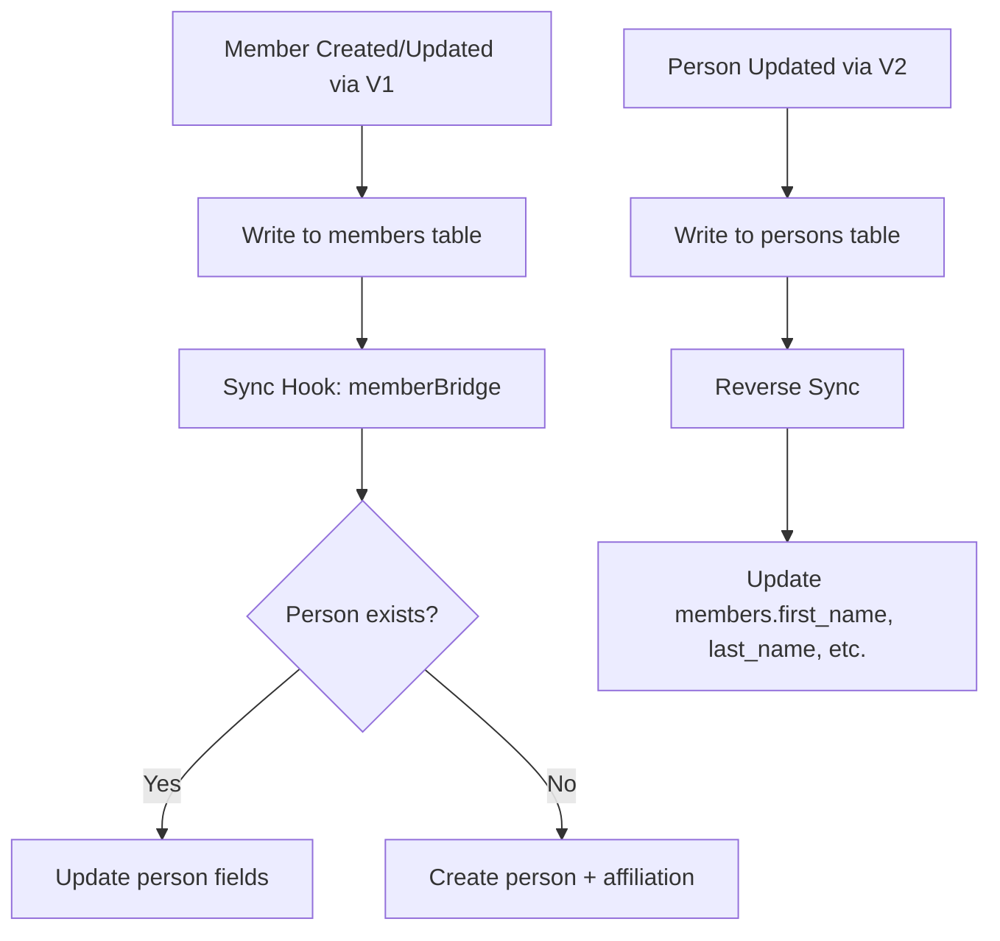

# 20 — Data Migration Strategy

## Overview

This document defines the migration from the current flat `members` + `plans` model to the new normalized model with `persons`, `subscriptions`, `affiliations`, `cycles`, and `session_ledger`. The migration is non-destructive, reversible, and runs in phases.

## Current Data Model



The `members.data` JSON field currently holds subscription info, plan details, and access history in an unstructured format.

## Target Data Model (Simplified)



## Migration Phases

### Phase 0: Schema Creation (Non-Destructive)

```sql
-- Create new tables alongside existing ones
CREATE TABLE persons (
    id CHAR(36) PRIMARY KEY DEFAULT (UUID()),
    legacy_member_id VARCHAR(255) UNIQUE,
    first_name VARCHAR(100),
    last_name VARCHAR(100),
    email VARCHAR(255),
    phone VARCHAR(50),
    document_id VARCHAR(50),
    status ENUM('active', 'inactive', 'blocked') DEFAULT 'active',
    created_at TIMESTAMP DEFAULT CURRENT_TIMESTAMP,
    updated_at TIMESTAMP DEFAULT CURRENT_TIMESTAMP ON UPDATE CURRENT_TIMESTAMP,
    INDEX idx_email (email),
    INDEX idx_document (document_id),
    INDEX idx_legacy (legacy_member_id)
) ENGINE=InnoDB DEFAULT CHARSET=utf8mb4 COLLATE=utf8mb4_unicode_ci;
```

No existing tables are modified. All new tables are additive.

### Phase 1: Data Copy (Members → Persons)

```sql
-- Migration script: 001_migrate_members_to_persons.sql
INSERT INTO persons (id, legacy_member_id, first_name, last_name, email, phone, status, created_at)
SELECT 
    UUID() as id,
    m.id as legacy_member_id,
    m.first_name,
    m.last_name,
    m.email,
    m.phone,
    CASE 
        WHEN m.status = 'active' THEN 'active'
        WHEN m.status = 'inactive' THEN 'inactive'
        ELSE 'inactive'
    END as status,
    COALESCE(m.join_date, m.created_at) as created_at
FROM members m
WHERE NOT EXISTS (
    SELECT 1 FROM persons p WHERE p.legacy_member_id = m.id
);
```

### Phase 2: Plan Migration

```sql
-- Migration script: 002_migrate_plans.sql
-- Extract unique plan names from members.plan and create plan entries
INSERT INTO plans (id, code, name, type, version, status, benefits, pricing, created_at)
SELECT 
    UUID(),
    UPPER(REPLACE(plan_name, ' ', '_')) || '_V1',
    plan_name,
    'individual',
    1,
    'active',
    JSON_OBJECT('sessions_per_cycle', 30, 'allowed_time_slots', JSON_ARRAY('all')),
    JSON_OBJECT('cycle_price', 0, 'currency', 'BRL'),
    NOW()
FROM (SELECT DISTINCT plan as plan_name FROM members WHERE plan IS NOT NULL AND plan != '') sub;
```

### Phase 3: Subscription & Affiliation Creation

```sql
-- Migration script: 003_create_subscriptions.sql
-- For each active member, create a subscription + affiliation
INSERT INTO subscriptions (id, plan_id, holder_person_id, status, start_date, billing_cycle, created_at)
SELECT 
    UUID(),
    pl.id,
    p.id,
    CASE WHEN m.status = 'active' THEN 'active' ELSE 'expired' END,
    COALESCE(m.join_date, m.created_at),
    'monthly',
    NOW()
FROM members m
JOIN persons p ON p.legacy_member_id = m.id
JOIN plans pl ON pl.name = m.plan
WHERE m.plan IS NOT NULL;

-- Create subscription_members
INSERT INTO subscription_members (id, subscription_id, person_id, role, status, joined_at)
SELECT UUID(), s.id, s.holder_person_id, 'holder', s.status, s.start_date
FROM subscriptions s;

-- Create affiliations
INSERT INTO affiliations (id, person_id, subscription_id, status, effective_from)
SELECT UUID(), sm.person_id, sm.subscription_id, sm.status, sm.joined_at
FROM subscription_members sm;
```

### Phase 4: Initial Cycle & Ledger Seeding

```sql
-- For active subscriptions, create a current cycle
INSERT INTO cycles (id, subscription_id, sequence_number, status, start_date, end_date, allocated_sessions)
SELECT 
    UUID(),
    s.id,
    1,
    'active',
    DATE_FORMAT(NOW(), '%Y-%m-01'),
    LAST_DAY(NOW()),
    JSON_EXTRACT(pl.benefits, '$.sessions_per_cycle')
FROM subscriptions s
JOIN plans pl ON pl.id = s.plan_id
WHERE s.status = 'active';

-- Seed initial session credit
INSERT INTO session_ledger (entry_id, affiliation_id, cycle_id, movement_type, quantity, direction, reason_code, effective_at)
SELECT 
    UUID(), a.id, c.id, 'credit', c.allocated_sessions, 'in', 'CYCLE_CREDIT', c.start_date
FROM affiliations a
JOIN subscriptions s ON s.id = a.subscription_id
JOIN cycles c ON c.subscription_id = s.id AND c.status = 'active'
WHERE a.status = 'active';
```

## Sync Strategy During Transition



### Dual-Write Period

During the transition, both models are kept in sync:

| Operation | V1 Effect | V2 Effect |
|-----------|-----------|-----------|
| Create member (v1) | INSERT members | Sync → INSERT persons + affiliation |
| Update member (v1) | UPDATE members | Sync → UPDATE persons |
| Update person (v2) | Reverse sync → UPDATE members | UPDATE persons |
| Create subscription (v2) | No v1 effect | INSERT subscription + affiliation |
| Delete member (v1) | Soft delete members | Sync → cancel affiliation |

## Validation & Verification

### Pre-Migration Checks

```sql
-- Count members to migrate
SELECT COUNT(*) as total, 
       SUM(CASE WHEN status = 'active' THEN 1 ELSE 0 END) as active,
       COUNT(DISTINCT plan) as unique_plans
FROM members;

-- Identify problematic data
SELECT id, email, plan FROM members 
WHERE email IS NULL OR plan IS NULL OR plan = '';
```

### Post-Migration Verification

```sql
-- Verify all members have corresponding persons
SELECT m.id FROM members m
LEFT JOIN persons p ON p.legacy_member_id = m.id
WHERE p.id IS NULL;
-- Expected: 0 rows

-- Verify active members have active affiliations
SELECT p.id, p.legacy_member_id FROM persons p
JOIN members m ON m.id = p.legacy_member_id AND m.status = 'active'
LEFT JOIN affiliations a ON a.person_id = p.id AND a.status = 'active'
WHERE a.id IS NULL;
-- Expected: 0 rows

-- Verify session balances are positive for active affiliations
SELECT a.id, COALESCE(SUM(CASE WHEN sl.direction='in' THEN sl.quantity ELSE -sl.quantity END), 0) as balance
FROM affiliations a
LEFT JOIN session_ledger sl ON sl.affiliation_id = a.id
WHERE a.status = 'active'
GROUP BY a.id
HAVING balance <= 0;
```

## Rollback Procedures

| Phase | Rollback Action | Data Loss |
|-------|----------------|-----------|
| Phase 0 | DROP new tables | None (no data yet) |
| Phase 1 | DELETE FROM persons | None (members untouched) |
| Phase 2 | DELETE FROM plans (v2) | None (members.plan still has data) |
| Phase 3 | DELETE FROM subscriptions, affiliations | None (members untouched) |
| Phase 4 | DELETE FROM cycles, session_ledger | None |

**Key guarantee:** The `members` table is NEVER modified during migration. It remains the source of truth until Phase 5 (final cutover), which is only executed after full validation.

## Timeline

| Step | Duration | Risk |
|------|----------|------|
| Phase 0: Schema creation | 1 minute | None |
| Phase 1: Members → Persons | 5 min (per 10k members) | Low |
| Phase 2: Plan migration | 1 minute | Low |
| Phase 3: Subscriptions | 10 min (per 10k) | Medium |
| Phase 4: Cycles + Ledger | 5 min (per 10k) | Medium |
| Validation | 30 minutes | None |
| Dual-write activation | Feature flag flip | Low |
| V1 deprecation | After 30 days stable | High (irreversible) |

## Data Integrity Constraints

```sql
-- Add after migration, before going live with v2
ALTER TABLE persons ADD CONSTRAINT chk_person_email CHECK (email REGEXP '^[^@]+@[^@]+$');
ALTER TABLE affiliations ADD CONSTRAINT fk_aff_person FOREIGN KEY (person_id) REFERENCES persons(id);
ALTER TABLE affiliations ADD CONSTRAINT fk_aff_sub FOREIGN KEY (subscription_id) REFERENCES subscriptions(id);
ALTER TABLE session_ledger ADD CONSTRAINT fk_ledger_aff FOREIGN KEY (affiliation_id) REFERENCES affiliations(id);
ALTER TABLE session_ledger ADD CONSTRAINT chk_quantity_positive CHECK (quantity > 0);
```
