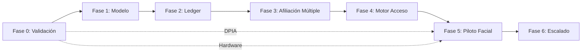

# 21 — Despliegue por Fases

## Fase 0 — Validación Técnica (1-2 semanas)

**Criterios de entrada**: Acceso a staging con MySQL real.

| Tarea | Responsable | Criterio de salida |
|-------|-------------|-------------------|
| Ejecutar CI completo (`npm run verify:ci`) | Dev | 144/144 tests pass |
| Levantar staging idéntico a producción | DevOps | App funcional |
| Confirmar esquema MySQL real vs master schema | Dev | Sin discrepancias |
| Confirmar estado de Firebase | Dev | Documentado como residual o activo |
| Confirmar endpoints QR funcionan | QA | Generación + validación OK |
| Medir carga actual (requests/min, conexiones) | DevOps | Baseline documentada |
| DPIA y evaluación jurídica biométrica | Legal | Informe entregado |
| Evaluar hardware de cámaras disponible | Infraestructura | Especificaciones documentadas |

**Feature flags**: Ninguno (fase de validación).  
**Rollback**: No aplica.  
**Riesgo**: Descubrir inconsistencias que bloqueen fases posteriores.

---

## Fase 1 — Modelo Compatible (3-4 semanas)

**Criterios de entrada**: Fase 0 completada.

| Tarea | Detalle |
|-------|---------|
| Crear tablas nuevas | plan_versions, subscriptions, subscription_members, affiliations, subscription_cycles, session_balances, session_movements, idempotency_keys, outbox_events, feature_flags |
| Crear migration_mappings | Tabla de mapeo old→new |
| Migrar subscription_plans → plan_versions | Backfill: cada plan actual genera una versión "v1" |
| Migrar member_subscriptions → subscriptions + affiliations | Backfill en modo sombra (escritura dual) |
| API de lectura de nuevas entidades | GET endpoints con flag |
| Validar conteos | member_subscriptions.count == subscriptions.count |

**Feature flags**: `ENABLE_NEW_SUBSCRIPTION_MODEL` (default: false)  
**Compatibilidad**: El sistema sigue leyendo/escribiendo `member_subscriptions`. Las tablas nuevas se llenan en paralelo.  
**Rollback**: Desactivar flag, ignorar tablas nuevas (no se eliminan).  
**Métricas**: Discrepancia entre modelo viejo y nuevo = 0.

---

## Fase 2 — Libro de Sesiones (3-4 semanas)

**Criterios de entrada**: Fase 1 validada, discrepancia = 0.

| Tarea | Detalle |
|-------|---------|
| Implementar session_movements + session_balances | CRUD transaccional |
| API de movimientos | Asignación, reserva, consumo, devolución |
| Idempotencia | idempotency_keys funcional |
| Planes limitados | Solo para grupo piloto interno |
| Integrar con class_bookings | Reserva genera movimiento |
| Ciclos y reinicio | subscription_cycles + proceso de cierre |

**Feature flags**: `ENABLE_SESSION_LEDGER` (por sede o por plan)  
**Compatibilidad**: Planes actuales (ilimitados) no generan movimientos. Solo planes nuevos limitados usan el ledger.  
**Rollback**: Desactivar flag. Los movimientos quedan para auditoría pero no bloquean.  
**Métricas**: Saldo reconcilia con movimientos; cero saldos negativos.

---

## Fase 3 — Afiliación Múltiple (2-3 semanas)

**Criterios de entrada**: Fase 2 estable en piloto.

| Tarea | Detalle |
|-------|---------|
| UI para gestionar afiliaciones | Página Members ampliada |
| API de selección de afiliación | Prioridad configurable |
| Integración con QR | Token QR vinculado a afiliación |
| Planes multiusuario | Familiar/grupal disponibles |
| UI para gestionar integrantes | Alta/baja de subscription_members |

**Feature flags**: `ENABLE_MULTI_AFFILIATION`, `ENABLE_MULTI_USER_PLANS`  
**Rollback**: Desactivar flags. Las afiliaciones existentes funcionan como individuales.  
**Métricas**: Una actividad = una sola afiliación; sin doble consumo.

---

## Fase 4 — Motor Unificado de Acceso (2-3 semanas)

**Criterios de entrada**: Fase 3 activa para usuarios piloto.

| Tarea | Detalle |
|-------|---------|
| Crear AccessAuthorizationService | Servicio interno |
| Migrar validación QR actual al motor | Mismo resultado, nueva arquitectura |
| access_attempts, access_points | Tablas y API |
| Antirrepetición configurable | Cooldown entre accesos |
| Validación manual | Endpoint para recepción |
| Auditoría unificada | Todos los métodos registran igual |

**Feature flags**: `ENABLE_UNIFIED_ACCESS` (por access_point)  
**Compatibilidad**: `/api/membership/validate-access` sigue funcionando. Internamente llama al nuevo motor.  
**Rollback**: Revertir validate-access al código original.  
**Métricas**: Latencia QR ≤ 200ms; cero accesos sin registro.

---

## Fase 5 — Piloto Facial (4-6 semanas)

**Criterios de entrada**: Fase 4 estable; DPIA aprobada; hardware disponible; proveedor seleccionado.

| Tarea | Detalle |
|-------|---------|
| Desplegar nodo edge en una sede | 1 cámara, 1 punto de acceso |
| Servicio biométrico aislado | Almacenamiento de plantillas |
| Alta facial (enrollment) | Con consentimiento obligatorio |
| biometric_profiles, biometric_consents | Tablas |
| Reconocimiento en tiempo real | Detección → identificación → autorización |
| Prueba de vida pasiva | Anti-spoofing básico |
| Fallback a QR | Siempre disponible |
| Grupo voluntario | Máximo 50 personas |

**Feature flags**: `ENABLE_FACIAL_ACCESS` (por sede y access_point)  
**Compatibilidad**: QR sigue siendo el método primario. Facial es adicional.  
**Rollback**: Desactivar flag; revocar perfiles; volver a QR exclusivo.  
**Métricas**: Falsos positivos < 0.1%; latencia facial < 3s; 100% de accesos tienen fallback.

---

## Fase 6 — Escalado (6-8 semanas)

**Criterios de entrada**: Piloto validado ≥ 30 días sin incidentes.

| Tarea | Detalle |
|-------|---------|
| Edge por sede | Múltiples sedes |
| Varias cámaras por sede | Entradas, zonas |
| Broker o cola duradera | Reemplazar polling/outbox básico |
| Alta disponibilidad | Failover del servicio biométrico |
| Monitoreo y alertas | Dashboard operativo |
| Calibración de umbrales | Por sede y condiciones |
| opening_commands + dispositivos | Integración con cerraduras/torniquetes |

**Feature flags**: Por sede y dispositivo.  
**Rollback**: Por sede (desactivar facial en una sede sin afectar otras).  
**Métricas**: Disponibilidad ≥ 99.5%; reconexión RTSP < 10s; eventos/segundo sostenidos.

---

## Diagrama de dependencias entre fases

