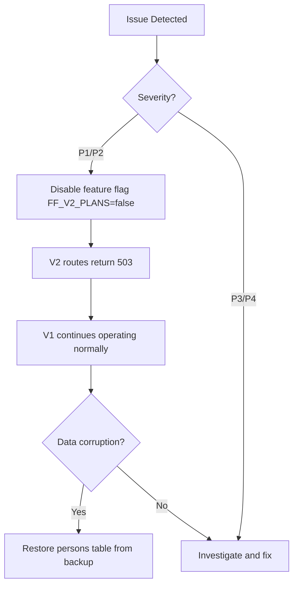
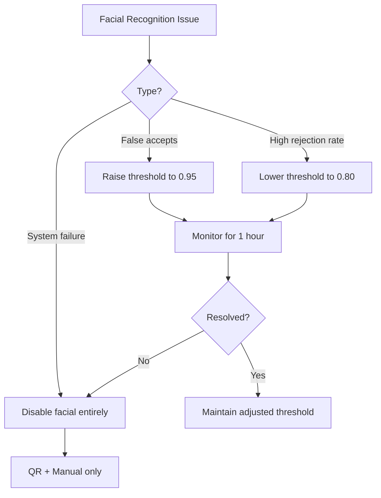

# 22 — Rollback Plan

## Overview

Every phase of the evolution has a documented rollback procedure. Rollbacks are designed to be safe, tested, and executable within defined time windows. The guiding principle: **new tables are additive, feature flags control behavior, no existing tables are modified until final cutover**.

## Rollback Decision Matrix

| Severity | Criteria | Action | Time to Execute |
|----------|----------|--------|-----------------|
| P1 Critical | Data corruption, access denied for all | Immediate rollback | < 5 minutes |
| P2 High | Feature broken for >10% users | Rollback within 1 hour | < 15 minutes |
| P3 Medium | Non-critical feature degraded | Fix forward or rollback next window | < 30 minutes |
| P4 Low | Cosmetic/minor UX issue | Fix forward | N/A |

## Phase-by-Phase Rollback Procedures

### Phase 1: Foundation (Plans Engine + Persons Table)



**Rollback steps:**
1. Set `FF_V2_PLANS=false` in environment
2. Restart application (zero-downtime if using rolling deploy)
3. V1 routes continue serving from `members` table
4. New tables remain in place (no data loss)
5. Fix issue, re-enable flag when ready

**Rollback time:** < 2 minutes (env var change + restart)

### Phase 2: Subscriptions & Affiliations

**Rollback steps:**
1. Set `FF_V2_SUBSCRIPTIONS=false`
2. Disable dual-write sync hook in `memberBridge.ts`
3. V1 member management operates on `members` table only
4. New subscriptions/affiliations data preserved but inactive
5. Members created during v2 period have `members` row (sync was bidirectional)

**Verification after rollback:**
```sql
-- Confirm no orphaned members (created only in v2)
SELECT p.id FROM persons p
LEFT JOIN members m ON m.id = p.legacy_member_id
WHERE p.legacy_member_id IS NULL;
-- If rows exist, create missing members records
```

### Phase 3: Session Ledger & Cycles

**Rollback steps:**
1. Set `FF_SESSION_LEDGER=false`
2. Access check reverts to simple `members.status = 'active'` check
3. Session consumption stops being tracked
4. Cycles scheduler cron disabled
5. Existing ledger data preserved for analysis

**Impact assessment:**
- Members with depleted sessions can access again (no enforcement)
- Acceptable for short periods (< 1 week)

### Phase 4: Access Motor (Unified Access)

**Rollback steps:**
1. Set `FF_V2_ACCESS=false`
2. QR Scanner page reverts to calling `/api/members/:id`
3. Device gateway continues heartbeats but stops receiving commands
4. Manual access still possible via reception

**Critical consideration:** If turnstiles are integrated, fallback mode must be defined:
- Option A: Turnstiles default to **open** (fire safety compliant)
- Option B: Turnstiles respond to **QR-only** via local controller
- Option C: Staff manually operates gates

### Phase 5: Facial Recognition



**Rollback steps:**
1. Set `FF_FACIAL=false`
2. Edge devices continue operating but match results are ignored by backend
3. Members must use QR code or manual override
4. Biometric data remains encrypted in store (no deletion needed)
5. Re-enable when fix deployed

**Rollback time:** < 1 minute (flag only)

## Database Rollback Procedures

### Table-Level Rollback

```sql
-- Phase 1 rollback: Remove persons data (keeps table structure)
TRUNCATE TABLE persons;

-- Phase 2 rollback: Remove subscription data
SET FOREIGN_KEY_CHECKS = 0;
TRUNCATE TABLE subscription_members;
TRUNCATE TABLE affiliations;
TRUNCATE TABLE subscriptions;
SET FOREIGN_KEY_CHECKS = 1;

-- Phase 3 rollback: Remove ledger data
TRUNCATE TABLE session_ledger;
TRUNCATE TABLE balance_cache;
TRUNCATE TABLE cycles;

-- Phase 4 rollback: Remove access data
TRUNCATE TABLE access_attempts;
TRUNCATE TABLE opening_commands;

-- Phase 5 rollback: Remove biometric data
TRUNCATE TABLE biometric_templates;
TRUNCATE TABLE biometric_profiles;
```

### Point-in-Time Recovery

For data corruption that requires full restoration:
1. Identify corruption timestamp from audit logs
2. Use daily backup + binlog replay to restore to pre-corruption state
3. Re-run migration scripts for affected tables only

```bash
# Restore from backup
mysql -u $DB_USER -p $DB_NAME < backups/backup-2025-07-15T00-00-00.sql

# Replay binlog up to corruption point
mysqlbinlog --stop-datetime="2025-07-15 14:30:00" /var/log/mysql/binlog.000042 | mysql -u $DB_USER -p $DB_NAME
```

## Feature Flag Quick Reference

| Flag | Controls | Default | Rollback Action |
|------|----------|---------|-----------------|
| `FF_V2_PLANS` | V2 plans engine | `false` | Set to `false` |
| `FF_V2_SUBSCRIPTIONS` | Subscriptions + affiliations | `false` | Set to `false` |
| `FF_SESSION_LEDGER` | Session tracking | `false` | Set to `false` |
| `FF_V2_ACCESS` | Unified access motor | `false` | Set to `false` |
| `FF_FACIAL` | Facial recognition | `false` | Set to `false` |
| `FF_DUAL_WRITE` | Bidirectional data sync | `false` | Set to `false` |
| `FF_DEVICE_GATEWAY` | Hardware device control | `false` | Set to `false` |

## Communication Plan

| When | Who | Channel | Message |
|------|-----|---------|---------|
| Rollback initiated | Ops team | Slack #ops-alerts | "Rollback Phase X initiated: [reason]" |
| Rollback complete | Ops team | Slack #ops-alerts | "Rollback complete. V1 operating normally." |
| Member-facing impact | Support team | In-app notification | "Access method temporarily limited to QR code" |
| Post-mortem scheduled | Engineering lead | Email | Within 24 hours of rollback |

## Rollback Testing Schedule

| Test | Frequency | Method |
|------|-----------|--------|
| Feature flag disable | Every deploy | Automated smoke test |
| Phase rollback drill | Monthly | Staging environment |
| Database restore drill | Quarterly | Restore to test environment |
| Full rollback simulation | Before each phase launch | Production-like environment |

## Rollback Metrics

Track these to evaluate rollback health:

| Metric | Target |
|--------|--------|
| Time from decision to rollback complete | < 5 min (P1), < 15 min (P2) |
| Members affected during rollback window | 0 (feature flags are instant) |
| Data loss during rollback | 0 rows in existing tables |
| Post-rollback verification time | < 10 minutes |
