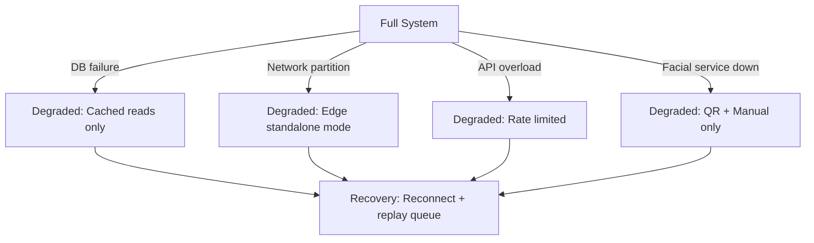

# 24 — Non-Functional Requirements

## Overview

This document defines performance, availability, scalability, and capacity requirements for the evolved PowerGym system.

## Performance Requirements

### Response Time Targets

| Operation | P50 | P95 | P99 | Hard Limit |
|-----------|-----|-----|-----|-----------|
| Access authorization (total) | 100ms | 200ms | 500ms | 1,000ms |
| Facial recognition (edge) | 300ms | 450ms | 600ms | 800ms |
| Session balance query | 20ms | 50ms | 100ms | 200ms |
| Ledger write (debit) | 30ms | 80ms | 150ms | 300ms |
| Plan catalog listing | 50ms | 100ms | 200ms | 500ms |
| Subscription creation | 100ms | 300ms | 500ms | 1,000ms |
| Device command delivery | 50ms | 100ms | 200ms | 500ms |
| Member profile load | 30ms | 80ms | 150ms | 300ms |

### Throughput Targets

| Scenario | Requirement |
|----------|------------|
| Peak access requests (per branch) | 50 req/sec |
| Peak access requests (system-wide) | 200 req/sec |
| Concurrent API users | 500 |
| Concurrent facial matching (per device) | 1 match/sec |
| Ledger writes (system-wide) | 100 entries/sec |
| Background job processing | 1,000 events/min |

### Database Performance

| Metric | Target |
|--------|--------|
| Query execution (simple) | < 10ms |
| Query execution (joins) | < 50ms |
| Transaction duration (access debit) | < 100ms |
| Lock wait time | < 2 seconds P99 |
| Connection pool utilization | < 80% |
| Deadlock rate | < 5/hour |

## Availability Requirements

### Uptime Targets

| Component | SLA | Monthly Downtime Budget |
|-----------|-----|------------------------|
| Access authorization API | 99.9% | 43.8 minutes |
| Member-facing APIs | 99.5% | 3.6 hours |
| Admin APIs | 99.0% | 7.2 hours |
| Facial recognition (per device) | 99.0% | 7.2 hours |
| Device gateway | 99.9% | 43.8 minutes |
| Database | 99.95% | 21.9 minutes |

### Degradation Modes

| Mode | Capabilities Retained | Capabilities Lost |
|------|----------------------|-------------------|
| DB failure | Health checks, static responses | All data operations |
| Edge standalone | Local facial matching | Real-time session debit |
| API overload | Priority access requests | Non-critical admin ops |
| Facial down | QR access, manual override | Frictionless facial access |

### Recovery Time Objectives

| Component | RTO | RPO |
|-----------|-----|-----|
| Application server | 2 minutes | 0 (stateless) |
| Database | 5 minutes | 1 minute (binlog) |
| Edge devices | 30 seconds (reboot) | 24 hours (cache) |
| Template sync | 5 minutes | Last sync point |

## Scalability Requirements

### Current Capacity

| Metric | Current | Target (1 year) | Target (3 years) |
|--------|---------|-----------------|-------------------|
| Members | ~500 | 5,000 | 20,000 |
| Branches | 1 | 3 | 10 |
| Devices per branch | 0 | 4 | 8 |
| Daily access events | ~200 | 5,000 | 20,000 |
| Ledger entries/month | 0 | 150,000 | 600,000 |
| Biometric templates | 0 | 3,000 | 15,000 |

### Scaling Strategy

| Component | Horizontal | Vertical | Notes |
|-----------|-----------|----------|-------|
| API servers | ✅ Stateless | ✅ | Add instances behind LB |
| Database | ❌ (single primary) | ✅ | Read replicas for reporting |
| Edge devices | ✅ Per turnstile | N/A | Independent units |
| Template cache | ✅ Per device | ✅ RAM | Up to 10K templates/device |
| Background jobs | ✅ Worker pool | ✅ | Partition by branch |

### Database Sizing

| Table | Growth Rate | 1-Year Size | Index Strategy |
|-------|-------------|-------------|----------------|
| `session_ledger` | 150K/month | ~2M rows, 500MB | Partition by cycle_id |
| `access_attempts` | 5K/day | ~2M rows, 400MB | Partition by month |
| `state_transitions` | 1K/day | ~400K rows, 100MB | Index on entity_type+id |
| `outbox_events` | 5K/day (archival) | ~50K active rows | Purge after delivery |
| `biometric_templates` | Slow growth | ~15K rows, 50MB | Primary key only |

## Capacity Planning

### Infrastructure Requirements

| Component | Minimum (Launch) | Recommended (Growth) |
|-----------|-----------------|---------------------|
| API Server | 1 vCPU, 1GB RAM | 2 vCPU, 4GB RAM |
| Database | 2 vCPU, 4GB RAM, 50GB SSD | 4 vCPU, 8GB RAM, 200GB SSD |
| Edge Device | ARM Cortex-A72, 4GB RAM | NVIDIA Jetson Nano, 4GB |
| Network (per device) | 10 Mbps | 100 Mbps |
| Backup storage | 50GB | 200GB |

### Connection Limits

| Pool | Size | Max Wait |
|------|------|----------|
| API → Database | 20 connections | 5 seconds |
| Background jobs → Database | 5 connections | 10 seconds |
| Device gateway → MQTT broker | 100 connections | N/A (persistent) |

## Monitoring & Alerting

### Key Metrics

| Metric | Warning | Critical |
|--------|---------|----------|
| API response time P95 | > 500ms | > 1,000ms |
| Error rate (5xx) | > 1% | > 5% |
| DB connection pool usage | > 70% | > 90% |
| Disk usage | > 70% | > 85% |
| Access denial rate | > 10% | > 25% |
| Device offline count | > 1 | > 3 |
| Queue depth (outbox) | > 50 | > 200 |
| Facial match latency P95 | > 600ms | > 800ms |

### Observability Stack

| Layer | Tool | Purpose |
|-------|------|---------|
| Metrics | Application counters | Business KPIs |
| Logging | Structured JSON logs | Debugging, audit |
| Tracing | Request ID propagation | End-to-end latency |
| Alerting | Threshold-based rules | Incident detection |
| Dashboards | Real-time panels | Operational visibility |

## Security Non-Functionals

| Requirement | Target |
|-------------|--------|
| Encryption at rest | AES-256 for biometric, database TDE |
| Encryption in transit | TLS 1.3 (all connections) |
| Session timeout | 8 hours (JWT expiry) |
| Brute force protection | 15 attempts/15min lockout |
| Audit log retention | 2 years minimum |
| Biometric data retention | Membership duration + 30 days |
| Backup encryption | AES-256 |
| Vulnerability scan frequency | Weekly automated, quarterly manual |
