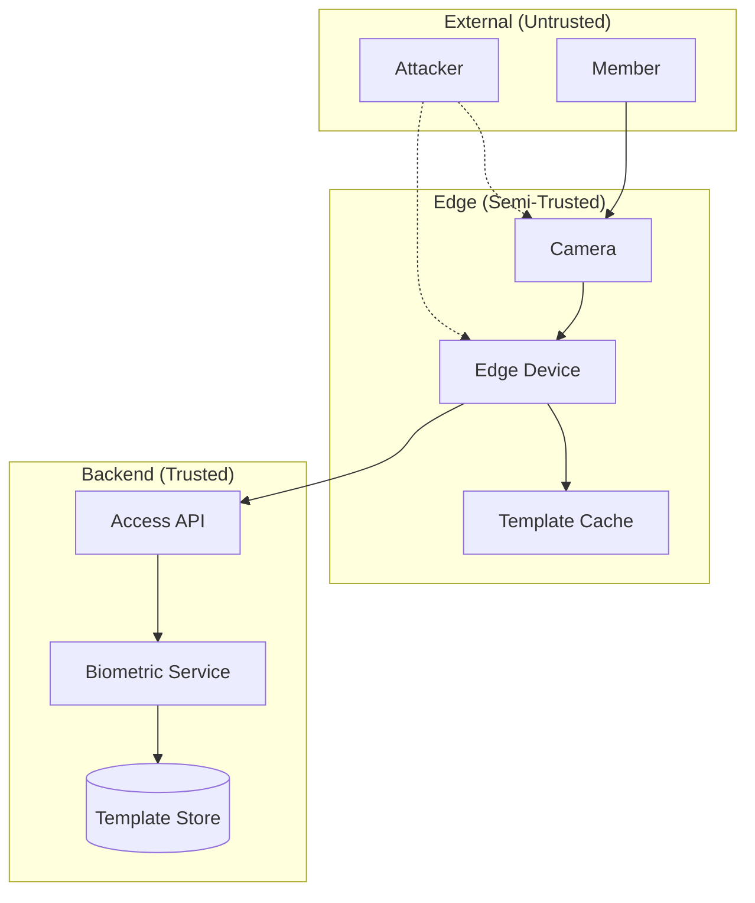

# 25 — Biometric Threat Model

## Overview

This document identifies threats specific to the facial recognition and biometric components of the evolved PowerGym system, following the STRIDE methodology.

## System Boundary



## STRIDE Analysis

### S — Spoofing Identity

| Threat ID | Threat | Attack Vector | Likelihood | Impact | Risk |
|-----------|--------|---------------|-----------|--------|------|
| S-01 | Photo presentation attack | Print member's photo, show to camera | High | High | Critical |
| S-02 | Video replay attack | Play video of member on screen | Medium | High | High |
| S-03 | 3D mask attack | Custom silicone mask | Low | High | Medium |
| S-04 | Deepfake real-time attack | AI-generated face on display | Low | High | Medium |
| S-05 | Stolen template injection | Inject forged template into edge cache | Very Low | Critical | Medium |

**Controls:**

| Threat | Control | Implementation |
|--------|---------|----------------|
| S-01 | 3D depth detection | Structured light / stereo camera |
| S-02 | Screen detection (moiré) + IR reflection | NIR camera sensor |
| S-03 | Active liveness challenge | Random blink/head-turn requirement |
| S-04 | Temporal consistency check | Frame-to-frame analysis |
| S-05 | Signed template distribution | Ed25519 signatures on sync payloads |

### T — Tampering

| Threat ID | Threat | Attack Vector | Likelihood | Impact | Risk |
|-----------|--------|---------------|-----------|--------|------|
| T-01 | Template modification on edge | Physical access to edge device storage | Low | Critical | High |
| T-02 | Cache poisoning via sync | MITM on sync channel | Very Low | Critical | Medium |
| T-03 | Confidence score manipulation | Modify edge software to always return 1.0 | Low | Critical | High |
| T-04 | Enrollment image substitution | Replace enrollment images before processing | Very Low | High | Low |

**Controls:**

| Threat | Control | Implementation |
|--------|---------|----------------|
| T-01 | Encrypted storage + TPM | AES-256-GCM, key in TPM |
| T-02 | mTLS + signed payloads | Certificate pinning between edge↔backend |
| T-03 | Firmware integrity verification | Signed firmware, boot attestation |
| T-04 | Staff-supervised enrollment | Enrollment requires staff presence + audit log |

### R — Repudiation

| Threat ID | Threat | Attack Vector | Likelihood | Impact | Risk |
|-----------|--------|---------------|-----------|--------|------|
| R-01 | Member denies access event | "I wasn't there, system is wrong" | Medium | Medium | Medium |
| R-02 | Staff denies manual override | No record of override | Low | Medium | Low |

**Controls:**

| Threat | Control | Implementation |
|--------|---------|----------------|
| R-01 | Immutable access log + confidence score | access_attempts with facial_confidence |
| R-02 | Mandatory reason + operator_id | Override without reason rejected |

### I — Information Disclosure

| Threat ID | Threat | Attack Vector | Likelihood | Impact | Risk |
|-----------|--------|---------------|-----------|--------|------|
| I-01 | Template extraction from edge device | Physical theft of device | Medium | Critical | High |
| I-02 | Biometric data leak from backend | SQL injection / backup exposure | Low | Critical | High |
| I-03 | Raw facial images persisted | Bug in edge purge logic | Medium | High | High |
| I-04 | Template reverse engineering | Extract face from embedding | Very Low | Medium | Low |

**Controls:**

| Threat | Control | Implementation |
|--------|---------|----------------|
| I-01 | Full-disk encryption + remote wipe | LUKS + MDM capability |
| I-02 | Encryption at rest + access audit | AES-256-GCM, column-level |
| I-03 | Automated purge verification | Cron job verifies no raw images exist |
| I-04 | Non-reversible embeddings | Use models designed for irreversibility |

### D — Denial of Service

| Threat ID | Threat | Attack Vector | Likelihood | Impact | Risk |
|-----------|--------|---------------|-----------|--------|------|
| D-01 | Camera blinding (IR flood) | External IR source pointed at camera | Medium | Medium | Medium |
| D-02 | Edge device overload | Rapid face presentations | Low | Medium | Low |
| D-03 | Backend API flood | Fake access requests from compromised device | Low | High | Medium |
| D-04 | Sync service overwhelm | Massive enrollment/deletion burst | Very Low | Medium | Low |

**Controls:**

| Threat | Control | Implementation |
|--------|---------|----------------|
| D-01 | IR anomaly detection + fallback to QR | Camera self-diagnostics |
| D-02 | Rate limiting on face detection (1/sec) | Edge firmware throttle |
| D-03 | Device authentication + rate limiting | mTLS + 50 req/sec per device cap |
| D-04 | Queue-based sync with backpressure | Bounded queue, reject overflow |

### E — Elevation of Privilege

| Threat ID | Threat | Attack Vector | Likelihood | Impact | Risk |
|-----------|--------|---------------|-----------|--------|------|
| E-01 | Edge device compromise → backend access | Exploit edge OS vulnerability | Low | Critical | High |
| E-02 | Template admin access escalation | Exploit biometric API permission gap | Very Low | Critical | Medium |
| E-03 | Self-enrollment without staff | Bypass staff requirement | Medium | High | High |

**Controls:**

| Threat | Control | Implementation |
|--------|---------|----------------|
| E-01 | Least-privilege device credentials | Device tokens can only call access/authorize |
| E-02 | Permission matrix with explicit deny | `biometric.enroll` requires `staff+` role |
| E-03 | Enrollment flow requires staff session token | Kiosk validates staff JWT before starting |

## Risk Summary Matrix

```mermaid
quadrantChart
    title Threat Risk Assessment
    x-axis Low Likelihood --> High Likelihood
    y-axis Low Impact --> High Impact
    quadrant-1 Monitor
    quadrant-2 Critical (Mitigate Now)
    quadrant-3 Accept
    quadrant-4 Mitigate
    S-01: [0.8, 0.9]
    S-02: [0.6, 0.8]
    T-01: [0.3, 0.95]
    T-03: [0.3, 0.9]
    I-01: [0.5, 0.9]
    I-02: [0.3, 0.95]
    I-03: [0.5, 0.8]
    D-01: [0.5, 0.5]
    E-01: [0.3, 0.9]
    E-03: [0.5, 0.8]
```

## Security Testing Requirements

| Test Type | Frequency | Scope |
|-----------|-----------|-------|
| Penetration testing (biometric bypass) | Annually | Edge devices + API |
| Liveness detection effectiveness | Quarterly | All attack vectors |
| Template encryption audit | Semi-annually | Storage + transit |
| Device physical security audit | Annually | All branches |
| Access log integrity verification | Monthly | Automated |
| Privilege escalation testing | Quarterly | API + edge |

## Incident Response

| Scenario | Response | Escalation |
|----------|----------|-----------|
| Confirmed spoofing attack | Disable facial for victim, investigate | Security team + police |
| Template data breach | Rotate encryption keys, notify affected | CISO + legal + DPO |
| Edge device stolen | Remote wipe, revoke certificates | Ops team |
| Mass false accepts (threshold drift) | Raise threshold to 0.95, audit | Security team |
| Enrollment fraud detected | Suspend biometric profile, audit staff | HR + security |
