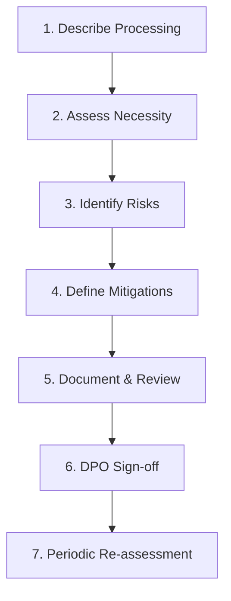
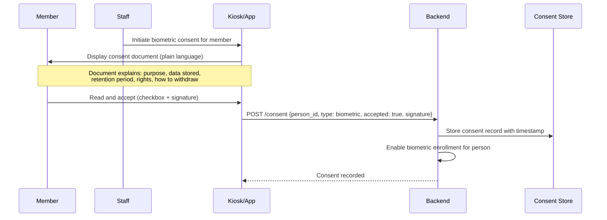
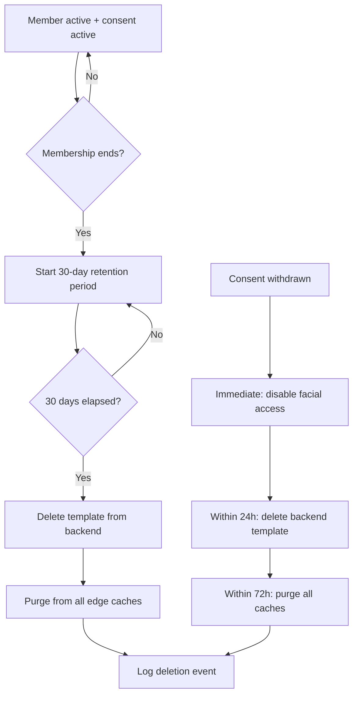

# 26 — Privacy & Legal Requirements

## Overview

Facial recognition and biometric data processing require strict compliance with data protection regulations. This document covers DPIA considerations, consent mechanisms, retention policies, and legal requirements applicable to PowerGym's biometric system.

## Applicable Regulations

| Regulation | Jurisdiction | Key Requirements |
|-----------|-------------|-----------------|
| LGPD (Lei Geral de Proteção de Dados) | Brazil | Consent, purpose limitation, data minimization |
| GDPR (if EU members) | European Union | Explicit consent for biometric, DPIA required |
| Marco Civil da Internet | Brazil | Data retention, user rights |
| Brazilian Consumer Code | Brazil | Transparency, clear contracts |

## Data Protection Impact Assessment (DPIA)

### DPIA Triggers

Biometric data processing triggers a mandatory DPIA under LGPD Article 38 because:
1. Processing of **sensitive personal data** (biometric)
2. **Large-scale** processing (hundreds/thousands of members)
3. **Systematic monitoring** of publicly accessible areas

### DPIA Components



### Processing Description

| Aspect | Description |
|--------|-------------|
| **Purpose** | Frictionless gym access control |
| **Legal basis** | Explicit consent (LGPD Art. 11, II, a) |
| **Data subjects** | Gym members who opt-in |
| **Data categories** | Facial embeddings (512-d vectors), enrollment photos (temporary), match confidence scores |
| **Recipients** | Edge devices (encrypted cache), backend system (encrypted store) |
| **Retention** | Membership duration + 30 days post-cancellation |
| **International transfers** | None (all processing local) |

### Risk Assessment

| Risk | Likelihood | Severity | Residual Risk (after controls) |
|------|-----------|----------|-------------------------------|
| Unauthorized access to templates | Medium | High | Low (encryption + access control) |
| Purpose creep (surveillance) | Low | High | Low (technical limitations + audit) |
| Discrimination (algorithm bias) | Low | High | Low (bias testing + fallback methods) |
| Data breach notification failure | Low | Medium | Low (automated breach detection) |
| Consent validity challenge | Medium | Medium | Low (explicit documented consent) |

## Consent Framework

### Consent Requirements

| Requirement | Implementation |
|-------------|---------------|
| **Free** | Biometric is optional; QR access always available |
| **Informed** | Plain-language explanation of processing |
| **Specific** | Consent only for access control, not other purposes |
| **Unambiguous** | Active opt-in checkbox + digital signature |
| **Revocable** | One-click withdrawal via app or reception |

### Consent Collection Flow



### Consent Record

```sql
CREATE TABLE consent_records (
    id BIGINT AUTO_INCREMENT PRIMARY KEY,
    person_id CHAR(36) NOT NULL,
    consent_type ENUM('biometric_enrollment', 'biometric_processing', 'data_retention') NOT NULL,
    version VARCHAR(10) NOT NULL,  -- Consent form version
    status ENUM('active', 'withdrawn') NOT NULL DEFAULT 'active',
    granted_at TIMESTAMP NOT NULL,
    withdrawn_at TIMESTAMP NULL,
    withdrawal_reason TEXT,
    ip_address VARCHAR(45),
    device_info VARCHAR(255),
    staff_witness_id CHAR(36),
    signature_hash VARCHAR(64),  -- SHA-256 of digital signature
    created_at TIMESTAMP DEFAULT CURRENT_TIMESTAMP,
    INDEX idx_person_type (person_id, consent_type),
    INDEX idx_status (status)
) ENGINE=InnoDB;
```

### Consent Withdrawal

| Step | Action | Timeline |
|------|--------|----------|
| 1 | Member requests withdrawal (app/reception) | Immediate |
| 2 | Disable facial access for member | Immediate |
| 3 | Delete backend template | Within 24 hours |
| 4 | Purge from all edge device caches | Within 72 hours |
| 5 | Confirm deletion to member | Within 72 hours |
| 6 | Retain consent record (proof of prior consent) | Indefinite |

## Data Minimization

### What We Store

| Data | Stored | Location | Retention |
|------|--------|----------|-----------|
| Facial embedding (512-d vector) | ✅ Yes | Backend (encrypted) + Edge (encrypted cache) | Membership + 30 days |
| Enrollment photos (raw images) | ❌ No | Temporary (processing only) | Deleted after extraction |
| Match confidence scores | ✅ Yes | Access attempts log | 2 years |
| Liveness check results | ✅ Yes | Access attempts log | 2 years |
| Video feed recordings | ❌ No | Not stored | N/A |
| Facial landmarks/geometry | ❌ No | Not separately stored | N/A |

### What We DON'T Store

- Raw facial images after embedding extraction
- Video recordings of access attempts
- Facial geometry or feature measurements
- Any biometric data of non-consenting members
- Third-party (non-member) facial data

## Retention Policy



| Data Type | Retention Period | Deletion Trigger |
|-----------|----------------|-----------------|
| Biometric template | Membership + 30 days | Membership end or consent withdrawal |
| Consent records | Indefinite | Never (legal proof) |
| Access attempt logs | 2 years | Automated purge job |
| Enrollment session logs | 1 year | Automated purge job |
| Edge device cache | Until sync removes | Backend-triggered purge |

## Data Subject Rights (LGPD)

| Right | Implementation | SLA |
|-------|---------------|-----|
| **Access** (Art. 18, II) | Export personal + biometric data summary | 15 days |
| **Correction** (Art. 18, III) | Re-enrollment if data inaccurate | Immediate |
| **Deletion** (Art. 18, VI) | Full template deletion | 72 hours |
| **Portability** (Art. 18, V) | Export in open format (not applicable for biometric) | 15 days |
| **Information** (Art. 18, I) | Transparency report on processing | Immediate (in-app) |
| **Revocation** (Art. 18, IX) | Consent withdrawal | Immediate effect |
| **Opposition** (Art. 18, IV) | Opt-out of biometric entirely | Immediate |

## Legal Agreements

### Required Documents

| Document | Purpose | Audience |
|----------|---------|----------|
| Privacy Policy | Overall data processing transparency | All members |
| Biometric Consent Form | Specific consent for facial recognition | Opt-in members |
| Staff Processing Agreement | Staff handling biometric data | Employees |
| Vendor DPA | Edge device manufacturer obligations | Third parties |
| Incident Response Plan | Breach notification procedures | Internal |

### Biometric Consent Form Contents

1. Identity of controller (PowerGym entity)
2. DPO contact information
3. Specific purpose (access control only)
4. Legal basis (explicit consent)
5. Data stored (embedding only, no photos)
6. Retention period (membership + 30 days)
7. Data sharing (edge devices only, no third parties)
8. Rights of the data subject
9. How to withdraw consent
10. Consequences of withdrawal (QR/manual access only)
11. Security measures applied
12. Complaint mechanism (ANPD contact)

## Compliance Monitoring

| Check | Frequency | Owner |
|-------|-----------|-------|
| Consent validity audit | Monthly | DPO |
| Retention policy compliance | Weekly (automated) | System |
| Access rights request SLA | Per request | Support team |
| Edge device cache audit | Weekly | Ops team |
| DPIA review | Annually or on significant change | DPO + Legal |
| Staff training completion | Quarterly | HR |
| Vendor compliance verification | Annually | Legal |

## Breach Notification

Under LGPD Article 48:

| Step | Action | Timeline |
|------|--------|----------|
| 1 | Detect and contain breach | Immediate |
| 2 | Assess risk to data subjects | Within 24 hours |
| 3 | Notify ANPD (Brazilian DPA) | "Reasonable time" (target: 72 hours) |
| 4 | Notify affected members | "Reasonable time" (target: 72 hours) |
| 5 | Document incident and remediation | Within 7 days |
| 6 | Implement preventive measures | Within 30 days |
