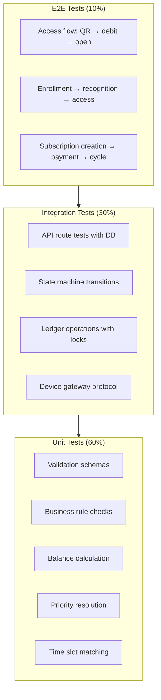
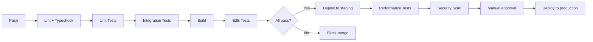

# 28 — Test Plan

## Overview

This document defines the test strategy, types, coverage targets, and tooling for the PowerGym evolution. Testing is layered to catch issues at the appropriate level with fast feedback loops.

## Test Pyramid



## Test Types

### 1. Unit Tests

| Area | What to Test | Framework |
|------|-------------|-----------|
| Validation | Zod schemas for all API inputs | Node test runner |
| Business rules | Each BR-xx rule in isolation | Node test runner |
| Balance calculation | Ledger sum with various entries | Node test runner |
| Priority resolution | Affiliation selection algorithm | Node test runner |
| Time slot matching | Slot validation logic | Node test runner |
| State machines | Valid/invalid transitions | Node test runner |
| Carryover calculation | Various scenarios | Node test runner |
| Idempotency key handling | Duplicate detection | Node test runner |

**Coverage target:** 90% line coverage for business logic modules

### 2. Integration Tests

| Area | What to Test | Setup |
|------|-------------|-------|
| API routes | Full request/response with DB | Test DB + supertest |
| Ledger concurrency | Parallel debits with locks | Multiple connections |
| State transitions | Multi-step flows with persistence | Test DB |
| Device gateway | Command/ack/timeout protocol | Mock device |
| Migration scripts | Data migration correctness | Fresh DB + seed data |
| Dual-write sync | V1 ↔ V2 data consistency | Both table structures |

**Coverage target:** All API endpoints, all state machine paths

### 3. End-to-End Tests

| Flow | Steps |
|------|-------|
| Member access (QR) | Login → Generate QR → Authorize → Debit → Open |
| Member access (facial) | Match → Authorize → Debit → Open → Confirm passage |
| Subscription lifecycle | Create → Pay → Activate → Use → Renew |
| Enrollment flow | Consent → Capture → Extract → Sync → First access |
| Cycle management | Create → Credit → Consume → Close → Carryover |
| Freeze/unfreeze | Freeze → Verify blocked → Unfreeze → Verify access |

### 4. Performance Tests

| Test | Tool | Target |
|------|------|--------|
| Access authorization latency | k6/Artillery | P95 < 200ms |
| Concurrent access requests | k6 | 50 req/sec sustained |
| Ledger write throughput | Custom script | 100 writes/sec |
| Database under load | sysbench | Connection pool saturation |
| Edge matching latency | Device benchmark | < 50ms for 10K templates |

### 5. Security Tests

| Test | Scope | Frequency |
|------|-------|-----------|
| Authentication bypass | All V2 endpoints | Per release |
| Authorization escalation | Subscription role checks | Per release |
| SQL injection | All query parameters | Per release |
| Rate limiting effectiveness | Auth + sensitive endpoints | Monthly |
| Biometric spoofing | Liveness detection | Quarterly |
| Template encryption validation | Storage layer | Monthly |

### 6. Chaos/Resilience Tests

| Scenario | Expected Behavior |
|----------|-------------------|
| Kill database mid-transaction | Transaction rolled back, no partial writes |
| Edge device disconnected | Standalone mode, queue events |
| API restart during access flow | Idempotency key prevents double-debit |
| Outbox consumer crashes | Events replayed on restart |
| Clock skew between edge and backend | Timestamp validation with ±30s tolerance |

## Test Data Strategy

### Seed Data

```typescript
// tests/fixtures/seed.ts
export const TEST_PLANS = {
  individual: { id: 'plan-ind-test', sessions: 20, type: 'individual' },
  family: { id: 'plan-fam-test', sessions: 40, type: 'family', max_beneficiaries: 4 },
  corporate: { id: 'plan-corp-test', sessions: 100, type: 'corporate' },
};

export const TEST_PERSONS = {
  holder: { id: 'person-holder-test', name: 'Test Holder' },
  beneficiary1: { id: 'person-ben1-test', name: 'Test Beneficiary 1' },
  beneficiary2: { id: 'person-ben2-test', name: 'Test Beneficiary 2' },
};
```

### Test Database

- Isolated test database per test run (or transaction-wrapped)
- Migrations applied fresh before each suite
- Seed data inserted in `beforeAll`
- Cleanup in `afterAll`

## Test Organization

```
tests/
├── unit/
│   ├── validation/
│   │   ├── planSchema.test.ts
│   │   ├── subscriptionSchema.test.ts
│   │   └── accessRequest.test.ts
│   ├── business-rules/
│   │   ├── sessionRules.test.ts
│   │   ├── affiliationRules.test.ts
│   │   └── cycleRules.test.ts
│   ├── services/
│   │   ├── balanceCalculation.test.ts
│   │   ├── priorityResolution.test.ts
│   │   ├── carryoverCalculation.test.ts
│   │   └── timeSlotMatcher.test.ts
│   └── state-machines/
│       ├── subscription.test.ts
│       ├── affiliation.test.ts
│       └── cycle.test.ts
├── integration/
│   ├── api/
│   │   ├── plans.routes.test.ts
│   │   ├── subscriptions.routes.test.ts
│   │   ├── affiliations.routes.test.ts
│   │   ├── access.routes.test.ts
│   │   └── ledger.routes.test.ts
│   ├── concurrency/
│   │   ├── parallelDebit.test.ts
│   │   ├── sharedPool.test.ts
│   │   └── deadlockRecovery.test.ts
│   ├── migration/
│   │   └── dataMigration.test.ts
│   └── device/
│       └── gatewayProtocol.test.ts
├── e2e/
│   ├── accessFlow.test.ts
│   ├── subscriptionLifecycle.test.ts
│   ├── enrollmentFlow.test.ts
│   └── cycleManagement.test.ts
├── performance/
│   ├── accessLatency.k6.ts
│   └── ledgerThroughput.k6.ts
├── security/
│   ├── authBypass.test.ts
│   ├── rbacEscalation.test.ts
│   └── injection.test.ts
└── fixtures/
    ├── seed.ts
    ├── factories.ts
    └── helpers.ts
```

## CI/CD Integration



### CI Pipeline Targets

| Stage | Max Duration | Failure Action |
|-------|-------------|----------------|
| Lint + Typecheck | 2 minutes | Block PR |
| Unit tests | 3 minutes | Block PR |
| Integration tests | 5 minutes | Block PR |
| E2E tests | 10 minutes | Block merge |
| Performance tests | 15 minutes | Warning (non-blocking) |
| Security scan | 5 minutes | Block deploy |

## Coverage Targets

| Module | Line Coverage | Branch Coverage |
|--------|--------------|----------------|
| Business rules | 95% | 90% |
| State machines | 100% (all transitions) | 100% |
| API validation | 90% | 85% |
| Ledger operations | 95% | 90% |
| Access motor | 95% | 90% |
| Overall | 80% | 75% |

## Testing Biometric Components

| Component | Test Approach |
|-----------|--------------|
| Embedding extraction | Mock with pre-computed vectors |
| 1:N matching | Unit test with known template set |
| Liveness detection | Integration test with labeled samples |
| Edge-backend protocol | Mock edge device simulator |
| Template sync | Integration test with test cache |
| Confidence threshold | Parameterized tests across range |
