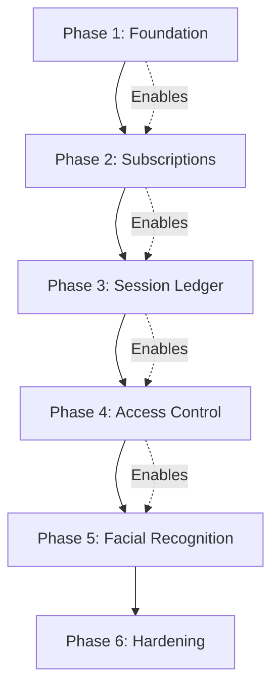

# 29 — Prioritized Backlog

## Overview

Backlog organized by implementation phase. Each item has an estimated complexity, dependencies, and acceptance criteria reference.

## Phase 1: Foundation (Weeks 1–4)

| # | Story | Complexity | Dependencies | AC Reference |
|---|-------|-----------|-------------|--------------|
| 1.1 | Create `persons` table and migration from `members` | M | None | — |
| 1.2 | Create `plans` table with versioning support | M | None | AC-Plans |
| 1.3 | Plan CRUD API (draft/publish/sunset/archive) | L | 1.2 | AC-Plans |
| 1.4 | Plan benefits/restrictions/pricing configuration | M | 1.2 | AC-Plans |
| 1.5 | Feature flag infrastructure | S | None | — |
| 1.6 | V2 route registration in server.ts | S | 1.5 | — |
| 1.7 | Data migration script: members → persons | M | 1.1 | — |
| 1.8 | Plan migration from flat to versioned | M | 1.2, 1.7 | — |
| 1.9 | Unit tests: plan validation, state machine | M | 1.3 | — |
| 1.10 | Integration tests: plan API routes | M | 1.3 | — |

## Phase 2: Subscriptions & Affiliations (Weeks 5–8)

| # | Story | Complexity | Dependencies | AC Reference |
|---|-------|-----------|-------------|--------------|
| 2.1 | Create subscription tables (subscriptions, subscription_members) | M | 1.2 | — |
| 2.2 | Subscription CRUD API | L | 2.1 | AC-Subscriptions |
| 2.3 | Multi-user member management (add/remove beneficiaries) | L | 2.2 | AC-Subscriptions |
| 2.4 | Subscription state machine | M | 2.2 | AC-Subscriptions |
| 2.5 | Create affiliation tables | M | 2.1 | — |
| 2.6 | Affiliation state machine (freeze/unfreeze/suspend) | L | 2.5 | AC-Affiliations |
| 2.7 | Multiple affiliations per person | M | 2.5 | AC-Affiliations |
| 2.8 | Priority resolution algorithm | M | 2.7 | AC-Affiliations |
| 2.9 | Business rules BR-01 through BR-08 enforcement | L | 2.2, 2.3 | BR-01–08 |
| 2.10 | Dual-write compatibility shim (members ↔ persons) | L | 1.7, 2.5 | — |
| 2.11 | Unit tests: subscription rules, affiliation logic | M | 2.4, 2.6 | — |
| 2.12 | Integration tests: subscription + affiliation APIs | L | 2.2, 2.6 | — |

## Phase 3: Session Ledger & Cycles (Weeks 9–12)

| # | Story | Complexity | Dependencies | AC Reference |
|---|-------|-----------|-------------|--------------|
| 3.1 | Create session_ledger table | M | 2.5 | — |
| 3.2 | Create cycles table | M | 2.1 | — |
| 3.3 | Cycle state machine (upcoming/active/grace/closed) | M | 3.2 | AC-Cycles |
| 3.4 | Session credit on cycle start | M | 3.1, 3.3 | AC-Ledger |
| 3.5 | Session debit with SELECT FOR UPDATE | L | 3.1 | AC-Ledger |
| 3.6 | Idempotency key mechanism | M | 3.5 | AC-Ledger |
| 3.7 | Balance cache (materialized) | M | 3.1 | — |
| 3.8 | Shared pool distribution model | L | 3.5 | AC-Ledger |
| 3.9 | Carryover calculation and execution | M | 3.3 | AC-Cycles |
| 3.10 | Cycle scheduler (cron jobs) | M | 3.3 | — |
| 3.11 | Outbox pattern implementation | L | 3.5 | — |
| 3.12 | Business rules BR-09 through BR-16 | L | 3.5 | BR-09–16 |
| 3.13 | Concurrency tests: parallel debits, deadlock recovery | L | 3.5, 3.8 | — |
| 3.14 | Integration tests: ledger + cycle APIs | L | 3.4, 3.5 | — |

## Phase 4: Unified Access Control (Weeks 13–16)

| # | Story | Complexity | Dependencies | AC Reference |
|---|-------|-----------|-------------|--------------|
| 4.1 | Access motor (validation pipeline) | XL | 3.5, 2.8 | AC-Access |
| 4.2 | QR code access integration (v2) | M | 4.1 | AC-Access |
| 4.3 | Manual override with audit | M | 4.1 | AC-Access |
| 4.4 | Access attempt logging | M | 4.1 | — |
| 4.5 | Time slot validation | S | 4.1 | AC-Access |
| 4.6 | Branch restriction validation | S | 4.1 | AC-Access |
| 4.7 | Duplicate entry prevention | M | 4.1 | AC-Access |
| 4.8 | Device gateway protocol (command/ack) | L | 4.1 | — |
| 4.9 | Passage confirmation handling | M | 4.8 | — |
| 4.10 | Passage timeout compensation | M | 4.9, 3.6 | AC-Ledger |
| 4.11 | Device health monitoring | M | 4.8 | — |
| 4.12 | Business rules BR-11 through BR-16 | L | 4.1 | BR-11–16 |
| 4.13 | E2E tests: full access flow | L | 4.1–4.10 | — |

## Phase 5: Facial Recognition (Weeks 17–22)

| # | Story | Complexity | Dependencies | AC Reference |
|---|-------|-----------|-------------|--------------|
| 5.1 | Biometric profile state machine | M | 2.5 | AC-Biometric |
| 5.2 | Consent management (record/withdraw) | M | 5.1 | AC-Biometric |
| 5.3 | Enrollment API | L | 5.1, 5.2 | AC-Biometric |
| 5.4 | Template storage (encrypted) | L | 5.3 | — |
| 5.5 | Edge device template sync service | XL | 5.4 | — |
| 5.6 | Facial access integration with access motor | L | 4.1, 5.5 | AC-Access |
| 5.7 | Confidence threshold configuration | M | 5.6 | — |
| 5.8 | Liveness check protocol | L | 5.6 | — |
| 5.9 | Template deletion on consent withdrawal | M | 5.2, 5.4 | AC-Biometric |
| 5.10 | Business rules BR-26 through BR-30 | L | 5.1–5.9 | BR-26–30 |
| 5.11 | Privacy compliance automation (retention, purge) | L | 5.4, 5.9 | — |
| 5.12 | Edge device simulator for testing | L | 5.5 | — |
| 5.13 | Security tests: spoofing, template protection | L | 5.6, 5.8 | — |

## Phase 6: Hardening & Migration (Weeks 23–26)

| # | Story | Complexity | Dependencies | AC Reference |
|---|-------|-----------|-------------|--------------|
| 6.1 | Performance optimization (balance cache, indexes) | M | 3.7 | — |
| 6.2 | Full data migration execution (production) | L | 1.7, 1.8 | — |
| 6.3 | V1 route deprecation (behind feature flag) | M | All phases | — |
| 6.4 | Monitoring dashboards | M | All phases | — |
| 6.5 | Alerting configuration | M | 6.4 | — |
| 6.6 | Load testing (production-like) | L | All phases | — |
| 6.7 | Security penetration testing | L | All phases | — |
| 6.8 | Documentation and runbook creation | M | All phases | — |
| 6.9 | Rollback drill execution | M | All phases | — |
| 6.10 | Staff training materials | M | All phases | — |

## Complexity Legend

| Size | Story Points | Estimated Duration |
|------|-------------|-------------------|
| S (Small) | 1–2 | 1–2 days |
| M (Medium) | 3–5 | 3–5 days |
| L (Large) | 8–13 | 1–2 weeks |
| XL (Extra Large) | 13–21 | 2–3 weeks |

## Priority Rationale

Each phase builds on the previous:
1. **Foundation** — Schema and plan engine (no breaking changes)
2. **Subscriptions** — Multi-user model (new tables, no v1 impact)
3. **Ledger** — Session tracking (prerequisite for access control)
4. **Access** — Unified motor (replaces QR-only)
5. **Facial** — Biometric access (builds on access motor)
6. **Hardening** — Production readiness
